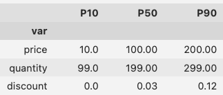

# Software and related downloads

## Link to Google Drive folder

[The folder](https://drive.google.com/drive/folders/1bDfH8M8n68QsmhXeHoXwhE8ft7qWMl2j?usp=drive_link) contains both class project submissions and compressed files of class software

## Software links on Github

1. **Decision Table visualizer**

Python code to create a static html display of a Decision Table from a csv file.
[project zip file]({{ site.baseurl }}/sw/dtree.zip)  

2. **"Brier" fair scoring web page**

A static html page that computes scores from probabilities entered for true-false questions. 
[Web page zip file]({{ site.baseurl }}/sw/brier.zip)

3. **Excel Tools for Value of Information**

Three spreadsheets that for binary variables. They calculate Bayes rule, Value of complete information and value of incomplete information.
[Excel workbook]({{ site.baseurl }}/sw/excel/VOI_sheets.xlsx)

4. **Naive Bayes classifier Python notebook**

A "jupyter" notebook that creates a classifier from a dataset. The tables it creates can be used as evidence nodes in a CDN probability model
[Jupyter notebook zip file]({{ site.baseurl }}/sw/naive_bayes.tar.gz)

5. **Wine emulator to run Windows SW on the Mac**

The Genie software is PC-native, so to run it on the Mac you first need to install the `WINE` emulator. This is done at the command line in the terminal.  First you install Homebrew then you use Homebrew to install WINE. Get Homebrew by following the instructions here https://brew.sh.Then all you have to do is type this into a Terminal window: 

> brew install --cask wine-stable

6. **Genie Bayes network and influence diagram solving software**

The Genie software is a sophisticated influence diagram (CDN) solver that can handle networks with up to hundreds of nodes. An academic version is downloadable from [BayesFusion.com](https://download.bayesfusion.com/files.html?category=Academia)
You will need to install a PC emulator such as WINE if you want to run it on the Mac. 

7. **Tornado Diagram Generator**

[A python script](sw/tornado.zip) that converts a csv spreadsheet file into a tornado diagram.  The spreadsheet input looks like this:
 

