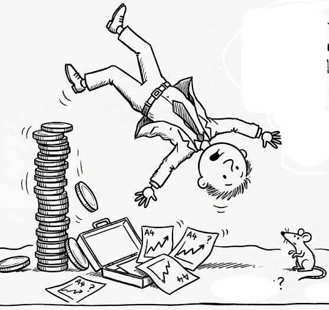
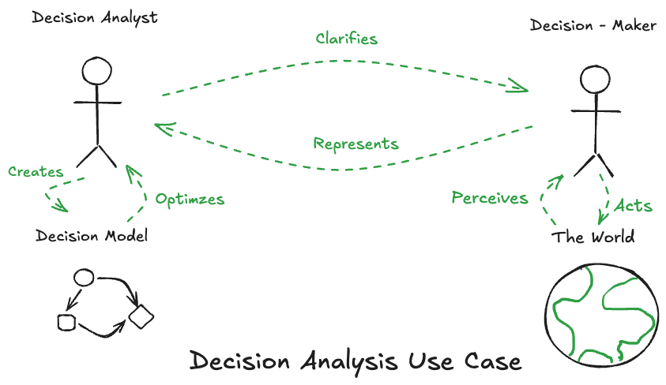
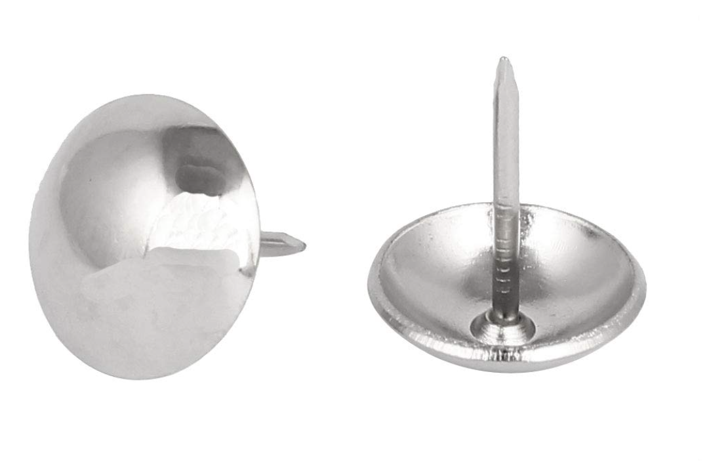

Course: MS&E 152 summer 2026
Sequence: Week 1, Lecture 1
Date: Monday, June 22nd 2026
Topic: Introduction to Decision Analysis
#### Links:
Course website: https://stanford-msande152.github.io/summer26/
Canvas: https://canvas.stanford.edu/courses/228284
Course Survey: [https://PollEv.com/surveys/Y1dcrDL1jNv3KTowA75SF/respond](https://pollev.com/surveys/Y1dcrDL1jNv3KTowA75SF/respond "https://PollEv.com/surveys/Y1dcrDL1jNv3KTowA75SF/respond")

 

----

# Title: Lecture 1, What is means to decide

### What you will learn
- What is Decision Analysis
- Review of the syllabus: The course details
- How we define the term "decision"
## Today's Class schedule
- Lecture
- About this class
- Short break
- Second lecture
- Class deal - bidding
----

## I. What Decision Analysis is about - 

### A. As a discipline 

#### A branch of engineering analysis 

- How to act rationally.  
- A technique to align one's _means_ (what one can control) with ones _ends_ (what one desires). 
- The exercise of "Actional Thought." 

> Making important decisions often requires treating major uncertainties, long time horizons, and complex value issues. To deal with such problems, the discipline of decision analysis was developed. The discipline comprises the philosophy, theory, methodology, and professional practice necessary to formalize the analysis of important decisions.  (Howard 1983)

#### Principled

We build on a treasury of theory, in probability, preferences, and the psychology of how we actually make choices. In the real world there is no such thing as true certainty.  Hence keeping our beliefs current and updated with what we discover is necessary. 

-  How  Economic theory can be put to practical use.
 - A "framework of frameworks":   Most decision self-help methods are derivatives of it. 

This is an audacious idea, and still controversial!  

#### Normative
An application of ideas from economics and how they can be applied **normatively**. This means "Turning economics upside down"

Descriptive
: What is.
Normative 
: What ought to be. 

#### Deliberative vs pattern matching 
Most all of our activity as humans is determined by habit, driven by emotion, in response to our immediate perceptions. Deliberative activity is driven by reason. Rational reasoning is an ideal to be pursued. 

Decision theory is driven by two engines of theory: 
- **Means ends analysis**- act in a way that achieves one's goals.  This is individual rationality, of thought leading to action. 
- **Adaptive Belief Updating** Uncertainty and information are two sides of a coin. 
How we update our beliefs is also the question of how data can be best applied as evidence.  For this we apply the algebra of probability. When combined with decision making this gives us a way to value information.

#### Quantitative
Decision analysis is based on the bold claim that it is possible to combine personal judgment and facts (data) consistently, by making precise distinctions and quantifying values.  It is a technique for quantifying both data-derived and judgmental information in a common framework.

This leads to a principled way to define the best choice among alternatives when one does not have access to known outcomes. There is a distinction between a "good decision" and "good outcomes", so that one is not necessarily identified with the other. 

### B. As a practice:

#### Use case
> *Decision analysis is the profession concerned with helping individuals make decisions. (Howard, Op. Res, 1980)*

> *Decision analysis specifies the **alternatives, information, and preferences** of the decision-maker and then finds the logically implied decision. (Howard 1983)*

The analyst works with a decision maker to *elicit* their beliefs, and to *encode* their decision situation. 

### C. What makes DA possible?  (What will you gain by taking this course)

#### Origin story 
- Developed here at Stanford, purportedly from a practical challenge
- History of over 50 years of application
- Still evolving as it bumps into data driven methods and generative AI.

#### Why is it worth doing? 
Descriptive research in psychology shows that when a decision's outcomes are distant and uncertain people are poor at decision making in comparison with principled analytic methods. The mistakes we make in deciding can be corrected by appeal to rational choice. So the theory we apply compares how psychological understanding of human decision making deviates from a rational model. 

This is the proper way to address "one shot" choices: Those without precedent, that are unique since they occur just once.  Decision Analysis exemplifies prudence and moderation.

We introduce a precise unequivocal language for communication about beliefs, choices and preferences for the people involved in the decision making process.

It will refine how you think about decisions in your life. 
"Clarity of action"  leads to the elimination of regret and worry over choices to be made. 

#### Why is this hard? 
The contribution of Kahneman's book "Thinking Fast and Slow" reveals how our brains have two modes to thought. "Thinking fast" keeps us alive and out of danger. "Thinking slow" uses our reasoning facilities when the best thing to do is not obvious.  But "thinking slow" wouldn't be appropriate in threatening situations, when time is of the essence.

Decision analysis, as deliberation, is the essence of "thinking slow."
"Deliberative thinking is to humans as swimming is to cats." as Kahnaman says. You only do it under duress.  Deliberative thought involves conjecture about how things might be. As humans we have a unique ability to imagine the future by considering hypotheticals.  To make this plain this class will imagine the hypothetical "clairvoyant" to answer kinds of "what if" questions.  Also necessary is the design of alternatives.  One critical aspect is to expand one's consideration of unanticipated events, and unconsidered alternatives. 

When thinking descriptively the tenets of the theory serve as assumptions from which the theory is derived. In a normative setting, the tenets can be viewed as skills one learns to quantify one's beliefs. For instance if, for purposes of the theory one assumes that beliefs function as probabilities, to put the theory to use to make decisions, one needs to learn how one should "calibrate" one's beliefs to be able to express them as probabilities. A beneficial consequence of this is a principled method by which beliefs can be combined with data.   This changes one's way of thinking and gives new insight.  To think rationally is a learned skill.

#### Where it has been successful.   
 - In analysis of public policy decisions.  Contamination of the planet Mars by space exploration
 - In business strategic corporate investments and risk management for resource extraction, and drug development decisions. 
 - In business portfolio analysis of innovation
 - In personalized medicine. 
 - In the development of Probabilistic AI - field of graphical models, and its influence on statistical methods / machine learning / data science.
 - In giving clarity to people in their personal lives.

What DA can do that AI cannot.

Implications for personal decision making - concept of _Decision Quality._ 

#### Connection to Philosophy

Tie-in with ethics - put in context with the history of philosophy of ethics. 

#### Limitations
  To understand what the practice can and cannot do, we must be aware of its limits, as with any theory. We will discover that as much as decision analysis can change how you approach things in your life, there are decisions that are not amenable to the method. 

### D. Decision Analysis Modeling 

Fundamental to much of engineering is the use of logical, mathematical relationships to create models of the world. The purpose of applying decision theory is to address how models apply to making changes in the world.  In this way it looks at the world causally.  This can be applied broadly in a way that unifies multiple modelling approaches from various analytic fields. 

By emphasizing the logic and the reasoning involved, DA models generate an explanation of their results.  As opposed to "black box" methods, DA's are "white box" models.  The model **is** its own explanation. We will see that the way of diagramming a decision model as an "influence diagram" forms a bridge between visualization and computation. 

Referring to the use case in the introduction, we see how the model is not to be confused with the real world, much as  a "map is distinguished from the territory it represents."  It is attributed to Einstein who said, "models must be as complicated as necessary but no more than that." What the model offers is precision by framing the world in a new language of distinctions about decision, uncertainty, and value and how they are quantified. 

## II. Course details 

See the online syllabus about assignments, grading, deadlines, and class policy. 

- Classroom etiquette - a safe place.  
- Clear distinction between judgments about arguments and opinions a person holds and our judgment of the person. 

Summary of what the course covers 

## III. What a decision is, and what it is not. 

Just like other fields that adopt common terms (e.g. "heat" in thermodynamics, "abnormal" in psychology, "disease" in medicine ), we take common terms and give them specific, precise meanings. 

Decision 
: A decision requires making a choice among a set of uncertain prospects, or **alternatives**. 
We speak of a decision's alternatives before the decision is made, and the *choice*, or *act* after one alternative is chosen.  A decision has at least two alternatives. The set of alternatives are "either-ors" Only one can be chosen.  "Do nothing" is always one alternative. 

> A decision is an *irrevocable allocation of resources,* irrevocable in the sense that it is impossible or extremely costly to change back to the situation that existed before making the decision. (Howard 1966)

Why this definition?  So to best model the connection between alternatives, uncertainties and outcomes. 

**Examples**
So buying, selling, moving, or modifying physical or financial resources constitute decisions. 

In this sense, a mental commitment, intention or a state of mind - to make a resolution - is not (yet) a decision. 

A policy or plan is not a decision, but when implemented may result in decisions. 

We can build machines we engineer (think software) that make decisions.

Observation
: A decision that reveals, acquires, or collects information 

Does the act of finding new information - a new fact - count as a decision? Implicitly, *yes*. Because once something is known it cannot conveniently be unknown, so it is irrevocable, and because it can be traded and valued it is a resource.  

The *decision maker* is one with the agency, who can commit to making the decision.  Things one cannot control are not considered as decisions. One has to recognize when a decision is possible. It might come from seeing an opportunity that exposes possible choices. Or it might be forced upon one. 

**Modelling a decision**
We identify a decision as the jumping off point for creating the "basis" to frame the analysis. The analysis may start by asking the decision maker *"What is your decision? "*  The model thus only contains things that are relevant or _material_ to the decision. This is used to simplify the model. 

Developing a comprehensive, realistic set of alternatives is a creative effort in the design of a decision model.

The design choices by the Decision Analyst to create the model are not considered to be "decisions" in the sense used here.
#### Evaluating what is a Good decision

- The distinction between a good decision and a good outcome. 

- Sunk cost
: When thinking of consequences, those that have already happened are not relevant. One doesn't "throw good money after bad."

## IV. Activity - the thumbtack deal

The two resting positions for a thumbtack.   Head up (left) and Head down ( right)

I - the class instructor - are offering you a deal to bid on. I'm offering you a lottery whose prize is a \$100 bill.  I will auction this deal to the member of the class who is the highest bidder. The winner of the auction will pay the amount they bid to "own" the deal that entitles them to place a bet on the outcome of the toss of a thumbtack. If the fair toss of the thumbtack is favorable, they receive the prize - a \$100 bill. If not they receive nothing,  _for real_. This is a desirable deal that will belong to the student who is willing to pay the most for it in open auction.

The basic concepts of decision-making under uncertainty are demonstrated by this exercise involving a **Real exchange of resources under uncertainty** with
elements of uncertainty, information, preferences,
and alternatives.

Bidding takes place today. Payment occurs at the beginning of Wednesday's class.  The "Thumbtack bet" deal will be resolved at the end of the class.

## V. Key terms

decision, alternative, choice, act

model, normative

good outcome

## Curious?  Things to explore 

© John Mark Agosta & Stanford University
