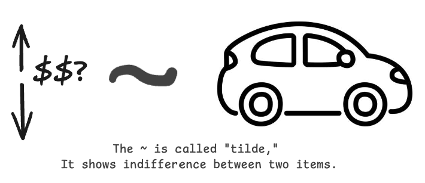

Course: MS&E 152 summer 2026
Sequence: Week 1, Lecture 2
Date: Monday, June 24th 2026
Topic: Introduction to Decision Analysis
#### Links:
Course website: https://stanford-msande152.github.io/summer26/
Canvas: https://canvas.stanford.edu/courses/228284

-----

# Title:  Defining Events

### What you will learn

How to structure an event tree for a decision problem

## Class schedule
- Quiz - "Decisions" 
- Lecture I: How do we describe a decision situation?
- Lecture II: Prices
- Short break
- Lecture III: The decision analysis process
- Distribute HW1
- Resolve the Class Deal
- ----

## I. How do we describe a decision situation?

We need a language in which to translate the aspects of the situation into the decision model. Our decision-maker comes with vague issues that we need to structure into a solvable problem. 

### Creating Distinctions

#### possibilities 

_How do we represent the future?_

The need for a new, precise language that is consistent with common usage, but makes crisp concepts. Here's the dilemma:  There are an infinite number of possibilities if we think about the future.  Thinking of what has happened and what will or can happen - the quandary of infinities of "Possible worlds". The finest grained "elemental outcomes" can be refined without limit.  

Probability of what has happened == 1 
Probability of what will happen = 0!

To solve this dilemma, we think of _distinctions_ that define _events_.
Thought experiment:  An proper distinction is so specific that an hypothetical person called a "clairvoyant" would know, just based on the distinction whether the event will have occurred or not.
#### ...and events
We'll build all components of the model out of "events" as primitives for describing the world. For instance, _events_ are what we apply probabilities to.

A **statement** or a **proposition** is something that is either true or false. A proposition creates a **distinction**: a 'crisp' yes/no question about the world. A proposition at a specific point in time defines an _event_. (Use the proposition $G$ to label the event.)

> _A distinction partitions possibilities into events. The partition is mutually exclusive and collectively exhaustive._  

#### Combining "elemental" events
 Propositions can be combined by the _event algebra_: AND, OR, NOT to derive more events. Propositions can be combined to create finer partitions out of their distinctions. Adding distinctions to create finer partitions defines events with multiple **states**. The number of states is the _degree_ of the event.

#### Variables 
We capture the notion of an event before it occurs as a _variable_.  A variable comprises all possible states of an event. It is drawn as a node (a circle) in the event tree.  Binary variables are simple (yes, no) distinctions.  Compound distinction can have of higher degree can have multiple states.  States can be an ordered (eg. rank or interval ) or unordered scale 

In models we will identify three kinds of variables: _uncertainties, decisions, and outcomes. Think of this as the "three legged stool" for modeling a decision situation. Each variable is created from one or more distinctions.  The states of a variable are mutually exclusive and exhaustive.

**Decision "events"**
"A decision anticipates a choice of possible futures" (FODA p. 62)
The _choices_ of a decision are its states,  As with all events it is defined by a distinction.  The "events" of decision are  called _alternatives_
(To ponder - what does it mean for a decision's alternatives to be exhaustive?)

**Outcomes**
An event tree shows the _paths_ through a sequence of events. A sequence is a conjunction of events.  The terminal events at the _leaves_ of the tree are **outcomes**. The labels applied to the termination of a sequence of events. 

**An event tree for events** $B \ \text{AND}\  G$

When describing the future, "prospective" outcomes are called "prospects."

Numbers, generally "measures" can be applied to label outcomes. E.g. the dollar value realized by that outcome. 

**Uncertainties**

We quantify uncertainty  by assigning probabilities to events. 

> If at some future time the event is **observed** then it becomes "certain." So uncertain variables that are not observed (e.g. whose values are not known may be reordered in time (Are partially ordered))

The possibilities spanned by variable - its _states_  The temporal sequence of events can be represented in a tree.  The tree shows the evolution of the decision-maker over time. Changing the temporal order of variables changes the node ordering in the tree. The full set of outcomes at the end of the tree preserve the "mutually exclusive and collectively exhaustive" property. 

Can we diagram the tree for the class deal? 

### II. Prices

When estimating a price, one reduces an uncertainty to a known value.  Consider the process of making a bid, for example on a used car.  The condition of the car isn't completely known, and the process of making a bid reduces it to a certain quantity. 

### Indifference
<<<<<<< HEAD

=======

>>>>>>> 810fc5c792bca8c41d6c9171eff506067624f035

To value something (an object, a deal, an alternative),  we compare it to something of known value.  A common example is when we set a price for an item, either for buying (acquiring) the item, or selling ( relinquishing) the item.  Consider the thought experiment of adjusting known value (think dollars) until there is parity between the item to be valued and the known value. The ability to make judgments about indifference is key to valuing items and determining preferences. In setting a price a person determines their **certain equivalent** for the item. 

These are personal judgments. They depend on the preferences and beliefs of the person (e.g. the decision-maker) who makes them. It is actually an indispensable skill to learn how to make such judgments.  In the context of a negotiation such a judgment forms a persons _reservation price_.  Consider a buyer and seller, each with their own reservation price, not known to the other party. (FODA calls these the PIBP and PISP) _For the trade to succeed, the seller's reservation price must be below the buyer's reservation price._ The actual price at which the trade occurs -- the _market price_-- will be somewhere between the two prices. The market price reflects the "exchange value", as opposed to the "use value" determined by a person's preferences. 

It is possible that something's "use value" is less than zero, hence it's price would be negative (something you'd pay to get rid of.)

Since a person is indifferent between the item and an equivalent certain value, it is reasonable that their buying and selling price for the item are the same.  If offered their "certain equivalent" the person would be willing to swap it with the item and vice versa, assuming their is no "friction" that creates a _transaction cost._ (This pair of hypothetical transactions FODA calls the "cycle of ownership". )

This equivalence between buying and selling is an instantaneous, zero-transaction cost equivalence.  It could also be violated if the value of the transaction is so large relative to the wealth of the individual as to affect their preferences. 

## III. The decision analysis process

_A conceptual view_  See J. Matheson & R. Howard (1968) "An Introduction to Decision Analysis" (  RODA p, 27ff))

The logical progression of building a model
    Note - "data free" aspects - the promise of combining judgment and data
    Why Modeling process?  The tenets / skills of choosing - (list them) are achieved "for free" if one adheres to the process / method. 

All mathematical modeling processes share similar methods. 
![[DA_process.png]]

What's the point? 
    Best choice / Rational action / "Clarity of Action"  If the process is followed the tenets are achieved!  This is not guaranteed with other "analysis" methods in general. 

1. What is our decision?
    _formulation_   Going from vague issues and concerns to a solvable problem. You, the decision analyst are standing in front of a blank whiteboard, in front of your client.  This is a scoping task, to find the boundaries of the "system" and the level (operational, tactical, strategic) to include. As various aspects of the model are identified it clarifies which aspects are relevant or not. What needs to be included to make the model complete? 

2. How do we quantify the problem?
    _Deterministic Evaluation_ How will we value the outcomes, typically in terms of tradeoffs to be made. To build the model we need to create variables from distinctions relevant to the decision alternatives.  Could be both direct and indirect effects.  Here's where we choose a valuation model, e.g. of profit, survival, health, social value.  What are the decision-maker's preferences? 

    _Probabilistic Analysis_  We elicit probabilities over uncertain events. How do we address biases such as overconfidence, in judgment. Probabilities can be "run through" the value model to estimate probabilities faced by different alternatives. 

3. How is the decision sensitive to changes in the model?
    _Ranking alternatives_ We can run the model to evaluate each alternative and generate recommendations. Exploring how the model output changes as different inputs are changed provides insights into both the contents of the model and its recommendations. This often leads to reconsidering the formulation.  "Rinse and repeat."

    _Information sensitivity_ The model can be used for applying available data to the analysis and for evaluating the value of further information gathering. One poses questions such as "If one could collect data to reduce uncertainties, or make adjustments in response to such knowledge, what would be the value?" 

> A complete analysis removes all the decision-maker's regrets, by illuminating the best they are likely to achieve by all their possible actions.  We call this **clarity of action**. 

The decision maker should be satisfied that  given what they face, they have considered everything they could.

### Decision making in an organization

Applying decision making among teams or groups, such as to an entire organization.  We treat the organization as if it faces an agree-upon set of alternatives, has reached consistent beliefs, and shares values to be achieved.  This adds another dimension to the analysis, and calls upon a broad set of topics in organizational and behavioral aspects that go beyond this class. 

An organization that acts like an individual decision maker is acting rationally. This leads to the organization matching its actions to its intended outcomes. 

Recommended best decision depending on the situation is a **policy**. 

#### Falling short of making the best decision

H. Simon - "satisfying"  using their repertoire of "standard operating procedures" to fulfill a task. 

(Example of the Cuban missile crisis.  
1. US. Navy blockading Soviet ships on high seas
2. Russian intelligence delegating missile site construction.)

The impossibility of complete rationality (Limits of computation / )

Decisions at different levels in th organization.  

Conflicting incentives. Mid level managers who prioritize their careers over the success of the organization. 

#### Evaluating decisions

We need a way to evaluate decisions in cases when outcomes are not available 

We apply the six criteria of **Decision Quality:**
1. Solve the right problem
2. Creatively address the range of alternatives
3. Search out relevant information to inform uncertainties.  
4. Clearly distinguish values as consequences of decision alternatives
5. Apply solid reasoning.  Use a rational approach
6. Commit to implement the results. 

## IV. Class Activity

Resolution of the deal. 

---

## Key terms

- Distinctions
- Possibilities
- The "Clairvoyant"
- Propositions
- Events
- Partitions
- Variables
- Observable
- Outcomes
- Event Tree
- States
- Indifference
- Buying and Selling Reservation Prices
- Market price
- Decision Analysis Process
- Clarity of Action
- Decision Quality
## Homework 1, due Monday, June 29th

Come to the Class Discussion section on Thursday to review the Homework. 

## Files, references

Course Notes §1.1 Possibilities and Distinctions (§1.1–1.1.15)

Optional readings, FODA Chapters 2, 37, 38

## Curious?  Things to explore 

Building trees in python with GraphViz

© John Mark Agosta & Stanford University
