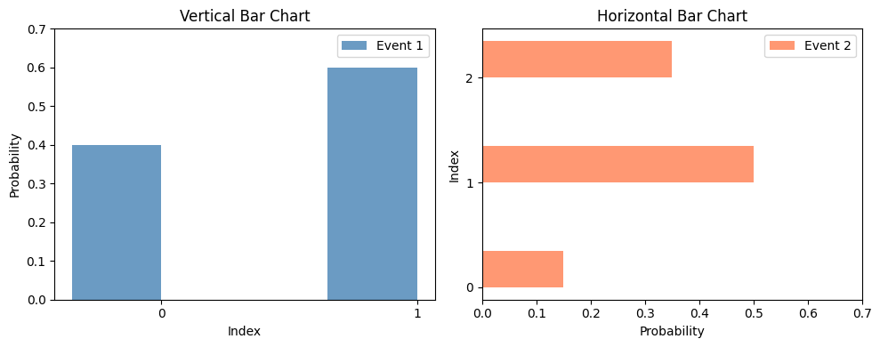
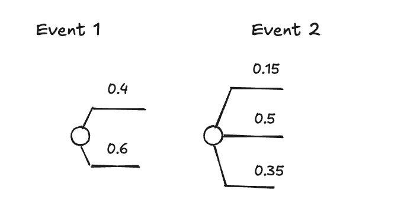
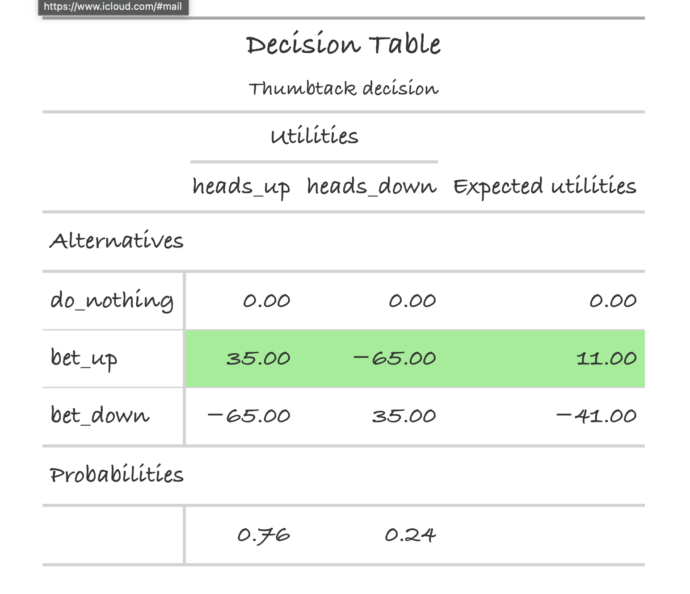
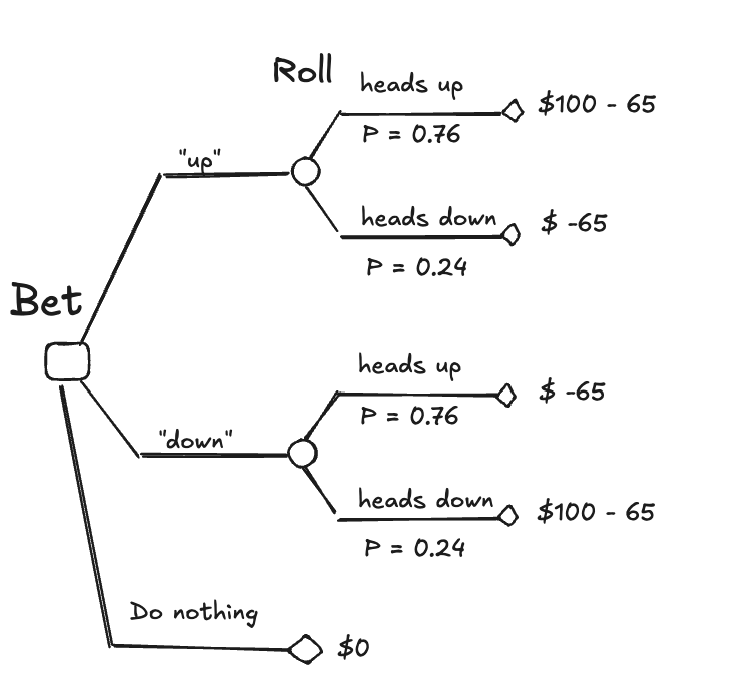

Course: MS&E 152 summer 2026
Sequence: Week 2, Lecture 1
Date: Monday, June 29th 2026
Topic:  Finding Probability
#### Links:
Course website: https://stanford-msande152.github.io/summer26/
Canvas: https://canvas.stanford.edu/courses/228284

-----

# Title:  Finding Probability

### What you will learn
 Applying probability to decisions

## Class schedule
- Quiz
- Lecture: revisiting the class deal
- Lecture: probability trees
- Short break
- Lecture: Origins of probability
- Class activity: Calibration
- ----

## I. Revisiting the class deal
The exercise of auctioning off a chance to win $100 illustrates several important aspects of judgment about probability and making a decision. What in terms of decision analysis did we learn from this?

- Uncertain "deals" can be bought and sold.
- Prices on uncertain "deals" implicitly derive from probabilities. In such valuations we assume "no fun in gambling". 
- The probabilities originate from a person's judgment
- Assuming "equally probable" outcomes ("principle of indifference") is not always the case.
- Different people can have different probabilities for the same event, depending on their *state of information.* 
- Once an event's outcome is known it is no longer uncertain and it's probability *collapses* to one. 
- Probabilities apply to uncertain events only:  Decisions made when facing uncertainty *do not* have probabilities applied to them. 
- Information that reveals the "state of the deal" - what is bet on, has the possibility of changing the deal owner's decision. (Due to people having different states of information.)
- We can ascribe a value to such information, that sets a maximum price at which the owner would be willing to pay for knowing the state of the deal. 

## II. Probability trees

How we derive $\mathbf{P}(A) = 1 - \mathbf{P}(A^c)$ from the rules of probability. 

1. Since $A \cup A^c = \Omega$, it follows $1 = \mathbf{P}(\Omega)  =  \mathbf{P}(A \cup A^c)$.
2. Since $A \cup A^c = \emptyset$,  it we can apply "finite additivity" to get $\mathbf{P}(A) + \mathbf{P}(A^c) = 1$.
3. Hence $\mathbf{P}(A) = 1 - \mathbf{P}(A^c)$.

This can be called the *splitting rule.*

#### Event probabilities at a branch
In a probability tree each  branch is labelled by the conditional probability of it's event state.  A 'unit' of probability ("certainty") is distributed over the branches of the node, applying a fractional number to each. This is called a *probability distribution.*

Applied to an event tree, these distributions look like this:

#### Computing the terminal probabilities of outcomes

By "stacking" the event's probability trees, we create a tree with successive splits, labelled with the conditional probabilities of the splits.  The terminal nodes of the tree contain the "elemental probabilities" of the succession of the events along each path through the tree.  These represent the *conjunction* of the path's events, e.g. $E_1 \cap E_2 \cdots$. the case that each event along the path has occurred. 

To compute each of the terminal node probabilities **we reason "horizontally"**:  The tree applies the multiplication rule by going down any path to the terminal node.  

To compute the combination of terminal nodes probabilities **we reason "vertically"**:  The addition rule lets us combine probabilities of terminal nodes to obtain compound event probabilities.

### Adding decisions and outcomes to the tree.
#### The Decision Table

The decision table lists terminal events and their elemental probabilities in each column, and decision alternatives in each row.  The cells of the table are the sums of the values along the path to that combination of an alternative and an event outcome.  

This decision table for the Class Deal assumes the bidder believes the probability of a successful bid = 76%.  The bidder offered $65 to play; in the case where he called the outcome correctly he gained $100, so his net gain is $35.  Otherwise the outcome is that he simply loses $65. 

Knowing his belief about the outcome of the deal we can compute the equivalent indifferent dollar amount for each of his alternatives.   Highlighted in green we see that "bet up" is preferred over "bet down", which makes sense since he believes "heads up" is the more likely outcome.  "Bet down's" value is less than doing nothing, so he prefers not to enter bidding for the deal to betting against his belief. 

### Decision tables as decision-probability trees. 

The decision table represents a decision-probability tree. The decision table converts directly into a two event tree, with the decision node preceding the deal outcome node. 

Solving a decision tree by "Rolling back" the tree. TBD

## III. The origins of probability

In European philosophy the idea of probability arises relatively late. 
- 1200s - Fibonacci: Introduced Hindu/Arabic numerals to replace Roman numerals
- 1500s - Cardano:  First counted outcomes in "games of chance" using "principle of indifference"
- 1700s - Pascal and others - "Pascal's wager"
- 1713 - Bernoulli *Ars Conjectandi* : First use of the term _probability_ to as a numeric quantity
-
A rigorous mathematical approach to probability only appears in the 20th century
 
## IV. A calibrated probability

If we are to use probabilities to inform our decisions they need to be "accurate."  What does it mean for a probability to be accurate?  This problem was developed to rate weathermans' forecasts. A forecast that always gives the same probability (e.g. of rain) can be entirely "accurate" but useless - a trivial prediction.  The better the prediction tracks changes in weather from day to day, the better it is. 

We need a way to rate how well the prediction tracks the variation in the weather.  The answer is a scoring rule that penalizes answers that are over confident, while at the same time rewards answers more if they tend to be right.  An answer provided that is "certainly wrong" receives a larger penalty than a  answer claimed certainly correct. 

## Class Activity

This is an exercise to see how well your probability sense is calibrated.  The following are hard questions, and you are not expected to know the answers.   For each question choose one option, _then assign a number for your confidence in your answer from 5 ( complete ignorance) to 10 ( complete certainty)._

We will score everyone's answers using a *proper scoring rule,* so you can measure how well your probability estimates are calibrated. 

| Test question                                | 2 options                                                        | Score? |
| -------------------------------------------- | ---------------------------------------------------------------- | ------ |
| 1. Which is higher?                          | a) Eiffel Tower in Paris b) Empire state building in New York |        |
| 2. Which is larger?                          | a) Croatia b) Czech Republic                                  |        |
| 3. Who was born first?                       | a) Jesus Christ b) Shakyamuni Buddha                          |        |
| 4. Who is older?                             | a) William - Prince of Wales b) Kate - Princess of Wales      |        |
| 5. Which has the larger population?          | a) Luxembourg b) Iceland                                      |        |
| 6. Which movie received higher iMDB ratings? | a) Godfather 2 b) Paddington 2                                |        |
| 7. Which is bigger?                          | a) Venus b) Earth                                             |        |
| 8. Which is further north?                   | a) Rome b) New York City                                      |        |
| 9. Who died first?                           | a) Beethoven b) Napoleon                                      |        |
| **TOTAL**                                    |                                                                  |        |
|                                              |                                                                  |        |

| Confidence (5 is complete ignorance "don't know", 10 is "am certain") | 5   | 6   | 7   | 8   | 9   | 10  |
| --------------------------------------------------------------------- | --- | --- | --- | --- | --- | --- |
| score for being correct                                               | 0   | 9   | 16  | 21  | 24  | 25  |
| score (penalty) for being incorrect                                   | 0   | -11 | -24 | -39 | -56 | -75 |

Higher scores are better.  A negative score indicates over confident answers, and poorly calibrated judgment about probabilities. 

(This example is from D. Spiegelhalter, (2024) "The Art of Uncertainty", Norton, p. 36 )

## Key terms

deal
probability tree
"Rolling back"
principle of indifference
decision table
decision-probability tree
calibration
proper scoring rule

## Files, references

## Curious?  Things to explore 

© John Mark Agosta & Stanford University