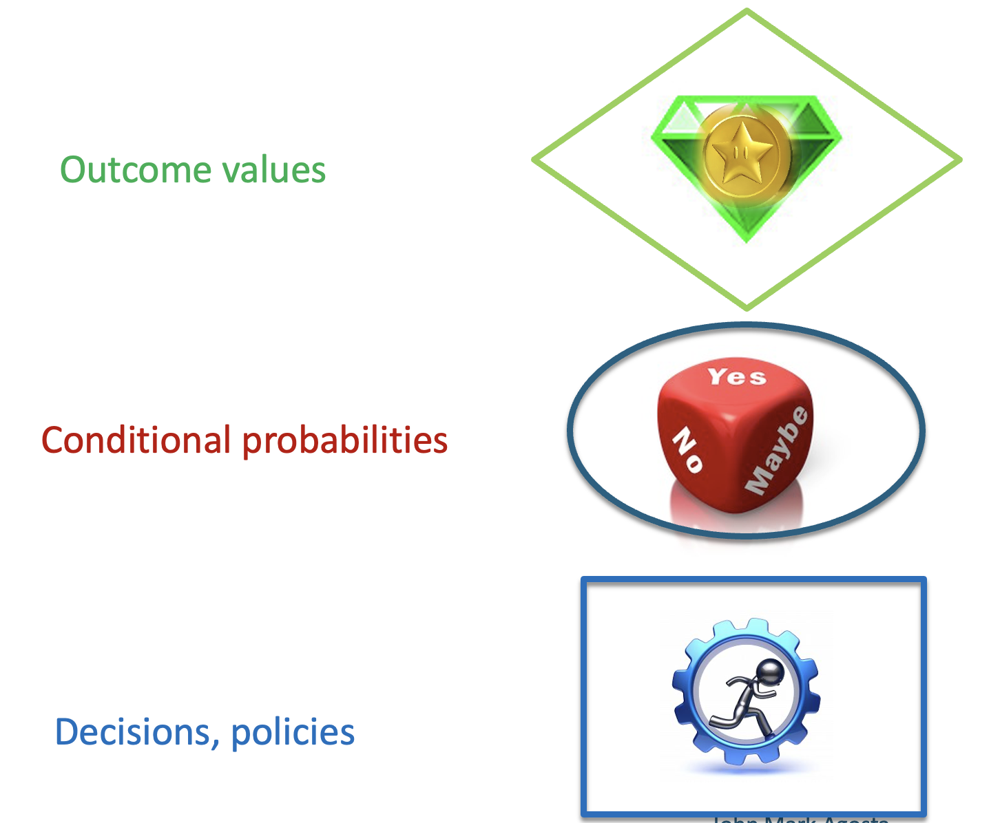
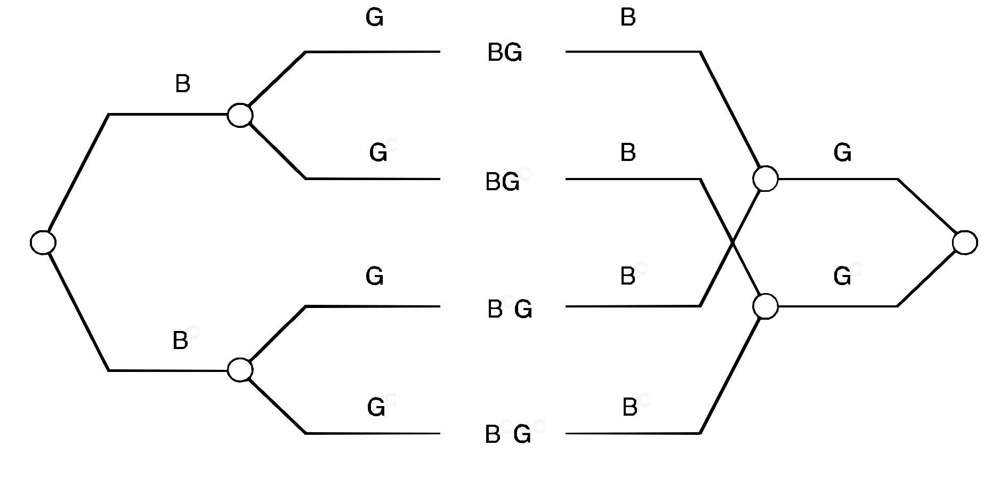
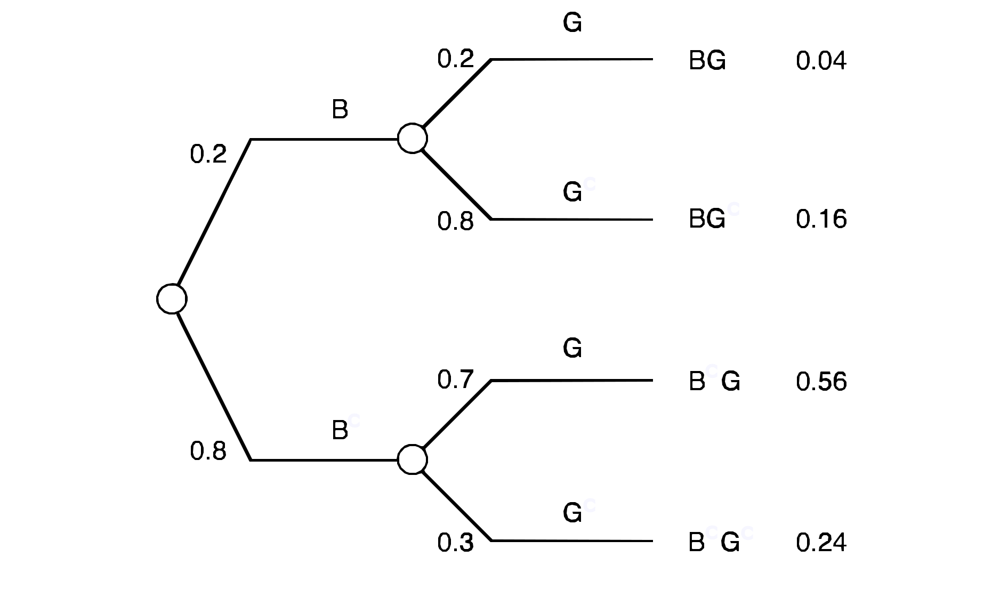
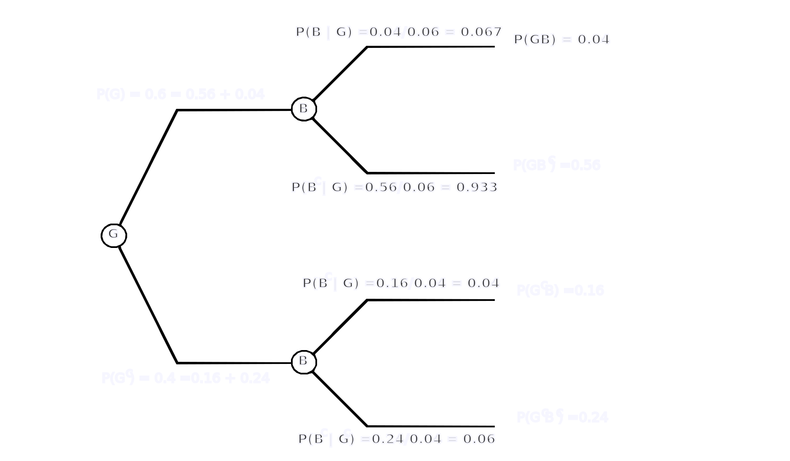
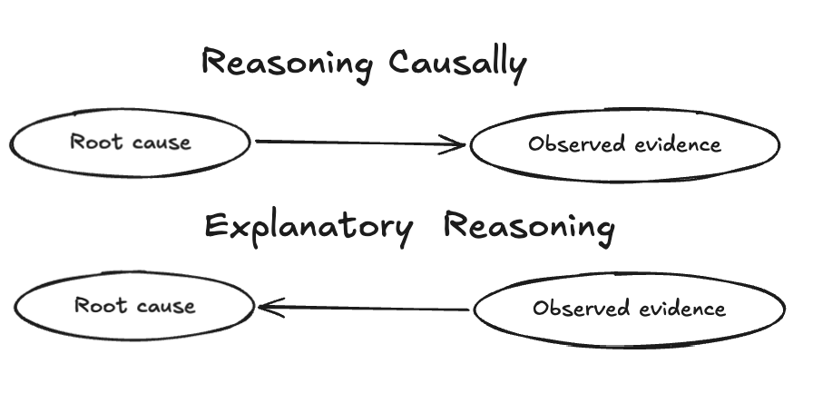

Course: MS&E 152 summer 2026
Sequence: Week 2, Lecture 2
Date: Monday, July 1st 2026
Topic: Introduction to Decision Analysis
#### Links:
Course website: https://stanford-msande152.github.io/summer26/
Canvas: https://canvas.stanford.edu/courses/228284

-----

# Title: Decision - Probability Tree operations

### What you will learn
What one can represent with Trees, and how to manipulate them. 
(This lecture follows the Primary Text Section 1.2 - 1.2.4)

## Class schedule
- Lecture: Decision - Probability  Trees
- Lecture: order of events
- Short break
- Lecture: Relevance and Cause
- 2nd Homework
- ----

## I.  Review of Decision - Probability  Trees

Terms
- The parts of a tree: 
	-Root, branch, leaf, node, terminal nodes, outgoing and incoming arcs
- Three kinds of nodes:
	-Decision, Uncertain ( probability) and Outcome (value) nodes.
- Path or trajectory,  consisting of previous and subsequent events. Nodes that are before, prior, predecessors, or prior to others, and vice versa. 
- Labelling 
	- branches with events, choices,  & conditional probabilities
	- terminals with outcome values & elemental probabilities

Note: The common term for "Decision-Probability Tree" is just _Decision Tree_

In a decision when is "do nothing" the complement to a choice? (The confusion in Quiz 2.)

## II.  The order of events in a tree.

What  is the meaning of changing event orderings along a path?  
- It changes the conditionings of the probabilities of the nodes. (We see this when we "flip" nodes in the tree. )
- It changes information known at a decision, by placing the node for the earlier event  ("upstream of")  of the decision node. We use this to compute value of information -- the difference in value with and without the information. 

Note: *Placing a node before another node does not necessarily mean that the information is "used" at a subsequent node!* The decision tree is ambiguous about this. As we saw, it is possible that the conditional probabilities on subsequent events are identical (e.g. do not depend) on different branches of a node. Sometimes the previous node is _relevant_ and sometimes not.  If two events are probabilistically independent (we usually just say "independent") of each other they are _irrelevant._
#### What it means to know something when making a decision

We speak of "having information" on which to base the decision.  Then the choice one makes is a function of the observed information at the time of the decision.  The event that is observed reveals its state - the certain outcome of the previous event.  When a decision depends on knowing previous events the decision function is called a *policy.*

#### Ordering uncertain events. 
Events in a tree need not be ordered  temporally. When we "flip" nodes in a tree we change the the probability conditioning of which event is conditioned on which. 

#### Common confusions between conditioning orderings

In natural language we often are not specific about the conditioning of probabilities when speaking of two  dependent ("correlated") events. We tend to be vague about the distinction. For instance when associating a headache, $H$ (a common occurrence) with brain tumors $B$ (a rare, serious diagnosis) there is a vast difference between and  $\mathsf{P}(H \ |\ B)$ -- a number close to 1 -- and $\mathsf{P}(B \ |\ H)$ -- a reassuringly rare possibility.    Just saying "headaches accompany brain tumors" is exasperatingly imprecise.  We need to use precise probability terms in such cases. 

#### "Flipping" conditionings

By probability algebra, we see a conditional probability's the two orderings are related: 

$$ \mathsf{P}(A \ |\ B)\mathsf{P}(B) =  \mathsf{P}(B \ |\ A)\mathsf{P}(A) $$
This expression is typically written as

$$ \mathsf{P}(A \ |\ B) =  \frac{\mathsf{P}(B \ |\ A)\mathsf{P}(A)}{\mathsf{P}(B)} $$
called _Bayes Rule. _

The calculation of Bayes Rule is equivalent to re-ordering two probability events in tree. Here's an example of "flipping" a two node tree.  We do it by recognizing the correspondence between  the terminal nodes of the tree and the tree with the events re-ordered.  Both trees have the same terminal nodes but in a different order as this Figure shows.  Matching terminal nodes have identical elemental probabilities by which we will be able to assign the conditional probabilities to the flipped tree. 

On the left we see the original tree, with event order $B G$, and on the right we see the mirror image of the tree with the event order flipped $G B$.  To make the correspondence between terminal nodes the flipped tree branches have been re-drawn so they overlap. 

Here is the original tree with event conditional probabilities and elemental probabilities filled in for the terminal nodes:

#### The flipped tree

Once we know the elemental probabilities, the entire set of conditional probabilities can be calculated. The probability at each node is simply the sum of the elemental probabilities emanating from it.  That makes sense since the root node probability includes the sum of all elemental  probabilities and by the "splitting rule" we know for the root node they should sum to one.  

As for the conditional probabilities on event branches, we normalize the sum of elemental probabilities on that branch by the sum of probabilities emanating from it.  So for example, the topmost branch in this diagram belongs to the node $B$ with terminals that sum to $0.04 + 0.56 = 0.6.$ We  use this value -- the value of the branch that arrives at $B$ to normalize the branches that leave $B$ to get the conditional $\textsf{P}( B | G)$ as shown.  The conditional probabilities of the other three branches are computed similarly. 

Note that this method to calculating the flipped conditional probabilities is identical to calculating them using Bayes Rule!
### III. Relevance applies to both directions

Relevance means that the probability of an event depends on its predecessors in the tree. 
Although the conditional probabilities before and after reversing the event orders are different, if two events are dependent given one ordering, they will also be dependent given the reversed order. Probabilistically relevance is described by probabilistic dependence.  We say "B is dependent on A" if

$$ \textsf{P}(B) \ne \textsf{P}(B\ |\ A)$$
It follows that probabilistic _independence_ means that the these two probability terms are equal. 

 > $\textsf{P}(B) =  \textsf{P}(B\ |\ A)$ if and only if $\textsf{P}(A) =  \textsf{P}(A\ |\ B)$

This follows directly from Bayes Rule. 
#### Cause distinguishes direction of relevance

A simple example of thinking causally is when one event physically determines another.  "A dead car battery *causes* a car to not start. " "A fire reduces a log to ashes." More generally, natural language is replete with causal references. "I'm starving so I want to eat now." In fact it is hard to imagine how we can express things without invoking cause.   Causal expressions go beyond just physical phenomena - they are a fundamental aspect of our understanding of the world. 

Explanations are typically expressed by referring to causes.  We often explain our belief about the appearance of B by claiming A caused it.  Knowing that fire causes smoke we can _explain_ the appearance of smoke by the presence of a fire.  So when we seek an explanation we reach for a cause.  

For instance, a medical diagnosis determines the _cause_ of a set of symptoms. When the doctor explains a diagnosis they refer to what caused the symptoms. 

For precision a cause can be encoded by a conditional probability, to express exactly how likely would the effect of the cause be observed. Hence in the process of constructing a probability to encode a belief, we may appeal to causes.  This of course is something we can capture in a probability tree!  However there is an important caution in associating causes and probabilities. Associations observed in data, such as statistical correlations may be consequences of a cause, _but one cannot infer a causal connection just from such an association._ The argument goes from cause to association, but not from association to concluding the existence of a cause.  This admonition is often stated as "Correlation does not imply causation."

## Key terms

- Decision Tree
	- Root, branch, leaf, node, terminal nodes, outgoing and incoming arcs
	- Decision, Uncertain ( probability) and Outcome (value) nodes.
- Path or trajectory,  consisting of previous and subsequent events. Nodes that are before, prior, predecessors; prior or previous to others, and vice versa. 
- Labelling terminals with outcome values & elemental probabilities
- conditional probabilities v/s elemental probabilities
- relevant, irrelevant events
- probabilistically dependent, probabilistically independent
- observing information, decision functions, policies
- Bayes Rule
## Homework2 , due July 6th 

## Files, references

## Curious?  Things to explore 

© John Mark Agosta & Stanford University