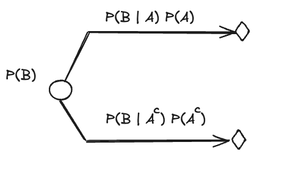

Course: MS&E 152 summer 2026
Sequence: Week 3, Lecture 1
Date: Monday, July 6th 2026
Topic: Introduction to Decision Analysis
#### Links:
Course website: https://stanford-msande152.github.io/summer26/
Canvas: https://canvas.stanford.edu/courses/228284

-----

# Title:  Making decisions with trees

### What you will learn

How to determine the best choice for a decision in a decision tree.

## Class schedule
- Lecture
- About this class
- Short break
- Second lecture
- Class activity
- ----

## I. Expected value

To find which alternatives are preferred, first a way we need a way to ascribe values to the alternatives' terminal node prospects, secondly a way to combine the values for all the prospects of an alternative. 

### Probability distributions, revisited

###  Derivation of the law of total probability

Divide and conquer: Derivation from event and complements 

A distributive law (there are two) in Boolean algebra, for union and intersection is

$$ X \cap (Y \cup Z) = (X \cap Y) \cup (X \cap Z)$$
This gives us the expression of how to partition an event $B$ using another event $A:$

$$ B = B\cap \Omega = B \cap (A \cup A^C) = (B \cap A) \cup (B \cap A^c)$$
Since the two right hand side terms are mutually exclusive, by Finite Additivity , 

$$\textsf{P}(B) = \textsf{P}(B \cap A) +  \textsf{P}(B \cap A^c)$$
which by the definition of conditional probability is
$$\textsf{P}(B) = \textsf{P}(B \ |\  A)\textsf{P}(A)  +  \textsf{P}(B\ |\  A^c)\textsf{P}(A^c)$$
The law of Total Probability generalizes to any number of partitions of the event $A$.

This is just what we did when we assigned conditional probabilities to branches in a tree from the elemental probabilities. 

To construct this with a tree, first compute "horizontally" to get the elemental  probabilities, then sum "vertically" for each state of the last event. 

The story that goes with this 
_Expanding the conversation _( Primary text 1.2.8.4)
### Preferences: Assigning values 

We quantify preferences using an indifference elicitation method for finding preferences, much in the way that bidders determined prices for the thumbtack deal, but instead of coming up with a price, we elicit a probability.  In a sense these are equivalent exercises.  

We start by setting two reference points that span the range of preferences to be assessed, one $M,$ the most preferred situation we will consider, the other, $m,$ the lease preferred.  Then for each outcome $i$ we find a value $p_i$ which makes the deal spanning $M,m$ equivalent to the prospect $u_i.$ 
$$u_i \sim p_iM + (1-p_i)m$$

 We call $u_i$ the *utility* of prospect $i$. SInce the scale of the $u$s is arbitrary we can set the utility of $m$ to zero, and $M$ to one, so that the utility function becomes $u_i = p_iM.$  

Consider an example of expressing one's preferences among cities to live in.  For my personal purposes (not to demean the sentiments of anyone else), I can use $M=$ San Francisco and $m=$ a refinery town on the Texas Gulf Coast.  Then, for any other location I can assign a $p$ such that I'd be indifferent between that location and randomly being placed in my choice of $M$ versus $m$.
 
 For monetary outcomes, one solution is to just use a $p$ proportional to the difference between the dollar values of the prospects. :  

$$p = \frac{v_{M} - v}{v_{M} - v_{m}}$$
Importantly - this is not the only, or even the most desirable function for $p$!  I may have a premium for avoiding risky deals so that I assign a lower utility that $p$. The only requirement on the utility function is that $p$ be increasing as value increases. 

(Reviewing the meaning of a decision - of facing _deals_ (of uncertain future prospects). A "prospect" - a prospective outcome - entails the entire future as a consequence of your choice (be careful what you wish for). Your future depends on what actions you take now, given what you can know now.

The utility function has the desirable property that more desirable prospects have a higher value of utility, and we have a total ordering (any prospect can be compared to another) over prospects. 
#### Adding utilities  to the tree. 

In the tree, each terminal node represents a "prospect"  - the description of one future outcome as a consequence of the decisions and uncertainties that will have been resolved by that point. 
With the use of the utility function each terminal node is assigned a utility - so each terminal node has both a value and a probability. 

.. conflicts among attributes that constitute a value. 
### Combining "prospects" 

THe probabilities form a distribution

Again by indifference equivalences - an equivalence to a deal as a number: "expected value"

Where the term "EV" comes from.

Why this is the definition of "best". 

Is just avoiding the worst possible outcome a good rule for selecting the best? 

A utility function -- consistent ordering of preferences.
#### Expected value is just an application of total probability to the preference probs $u$  in a deal. 

## II.  A Decision model

The decision defines the problem in our decision analysis.  The tree is a framework for the analysis.

Converting a decision table into a tree. 

The decision is a maximization operation over the value of alternatives.
### Rolling back a decision tree. 

"backward induction in trees (Smith ch2  section 5)"

Rolling back a tree as a way to compute EV. 

Deciding on the best as a maximization over the EV at a decision point. 

## Class Activity

Form pairs - exercise to elicit preference probabilities

## Key terms

law of total probability

utility, utility function.

## Homework, due __ 

## Files, references

## Curious?  Things to explore 

© John Mark Agosta & Stanford University