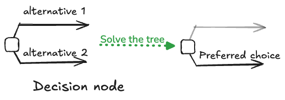
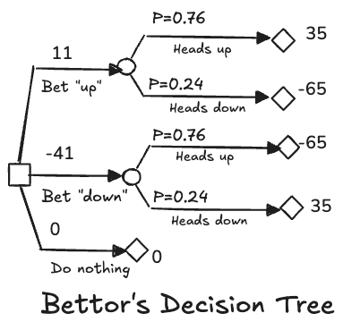
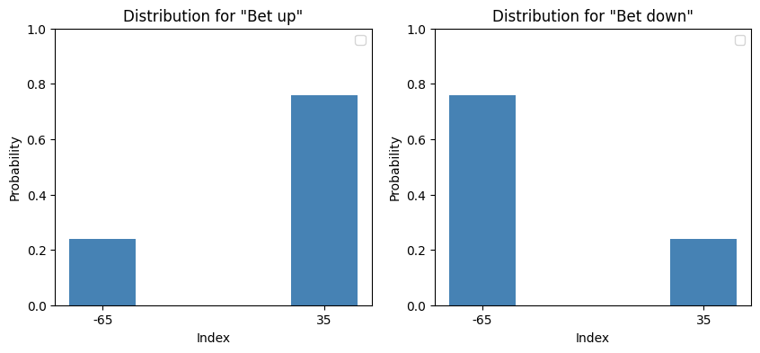

Course: MS&E 152 summer 2026
Sequence: Week 3, Lecture 1
Date: Monday, July 6th 2026
Topic: Introduction to Decision Analysis
#### Links:
Course website: https://stanford-msande152.github.io/summer26/
Canvas: https://canvas.stanford.edu/courses/228284

-----

# Title:  Lecture 5: Making decisions with trees

### What you will learn

How to determine the best choice for a decision in a decision tree.

## Class schedule
- Lecture: How to solve a decision tree
- Demonstration: Eliciting utilities 
- Short break
- Lecture continued
- Class activity: Using a probability wheel to elicit utilities. 
- ----
# How to solve a decision-probability tree

In this lecture we add decision and value nodes to probability trees. We complete the operations needed to determine the best alternatives at the decision nodes in a tree.   We introduce
- *utility:*  Personal values for the terminal node prospects in the tree,
- *expected value:* The criterion for choice among alternatives
- *roll back:* The algorithm for solving a tree for the preferred (best) choice for the decisions in the tree. 

### I. The structure of a tree

As mentioned in previous lectures, a decision problem is built of 3 kinds of variables, each represented by a kind of tree-node. To represent decisions we introduce a branching structure, similar to a probability node, with a branch for each alternative.   When the tree is drawn the preferred choice among the decision's alternatives is not yet known; that will be determined by solving the tree.  Decision nodes *do not* have probabilities assigned to branches.  

#### Converting a Decision Table into a Tree

This is the "Thumbtack" Decision Table from Lecture 3 converted into a decision tree. 

The  numbers labelling terminal nodes are called utilities. Branches of probability nodes are labelled with their probabilities, as in a probability tree. The branches of a decision node are labeled with the certain equivalent value of each alternative. 

### II. Preferences: Assigning values 

Preferences are quantities -- called utilities -- assigned to final outcomes. We quantify preferences using an indifference elicitation method for assessing preferences, much in the way that bidders determined prices for the thumbtack deal, but instead of coming up with a price, we elicit a probability.  Granted that this exercise asks one to consider a hypothetical deal, both exercises use the same idea of comparing a certain with an uncertain deal.  This *preference probability* is as if one was randomly assigned to one of two extreme prospects, as a thought experiment for measuring one's preferences for a third.  As such it is not the probability of a prospect along a path in the tree; it is a utility expresses as if it were a probability by virtue of our ability to make an equivalence. 

We start by setting two reference points that span the range of preferences to be assessed, one $M,$ the most preferred situation we will consider, the other, $m,$ the lease preferred.  Then for each outcome $o_i$ we find a value $p_i$ which makes the deal spanning $M,m$ equivalent to the prospect $u_i.$ 
$$u_i \sim p_iM + (1-p_i)m$$

 We call $u_i$ the *utility* of prospect $i$. Since the scale of the $u$s is arbitrary in any one decision analysis we can set the utility of $m$ to zero, and $M$ to one, so that the utility function becomes $u_i = p_iM.$  

Consider an example of expressing one's preferences among cities to live in.  For my personal purposes (not to demean the sentiments of anyone else), I can use $M=$ San Francisco and $m=$ a refinery town on the Texas Gulf Coast.  Then, for any other location I can assign a $p$ such that I'd be indifferent between that location and randomly being placed in my choice of $M$ versus $m$.
 
 For monetary outcomes, one solution is to just use a $p$ proportional to the difference between the dollar values of the prospects. :  

$$p = \frac{v_{M} - v}{v_{M} - v_{m}}$$
Importantly - this is not the only, or even the most desirable function for $p$!  I may have a premium for avoiding risky deals so that I assign a lower utility that $p$. The only requirement on the utility function is that $p$ be increasing as value increases. 

(Reviewing the meaning of a decision - of facing _deals_ (of uncertain future prospects). A "prospect" - a prospective outcome - entails the entire future as a consequence of your choice (be careful what you wish for). Your future depends on what actions you take now, given what you can know now.

The utility function has the desirable property that more desirable prospects have a higher value of utility, and we have a total ordering (any prospect can be compared to another) over prospects. 
#### Adding utilities  prospects. 

In the tree, each terminal node represents a "prospect"  - the description of one future outcome as a consequence of the decisions and uncertainties that will have been resolved by that point. The description encompasses the future from that point forward -- the effect on the rest of one's life. The utility function assigns to each terminal node a utility - so each terminal node is described by both a value and a probability. 

## III. Expected value 

Once the tree has been labelled with both utilities and probabilities we need a method to use these to "solve the tree" to find which alternatives are preferred.  For this we need a way to compute the equivalent value of the uncertain combination of prospects for each alternative that can be used for a decision rule.   This is fundamental to how a decision-maker should face risks and opportunities.  As a normative theory the rule we derive is known as "maximum expected utility."

To find the tree's preferred alternatives, we work backward from the terminals at the leaves of the tree toward the root. This is because the decisions -- the "means" at the decision maker's disposal -- must align with their "ends" as expressed by utilities.  Thus in decision analysis, the decision model is constructed starting with the present situation, at root of the tree, and modeling forward in time.  In contrast the model is analyzed by starting at the leaves of the tree and working backward. 

#### Probability distributions over deals

Looking back to the Thumbtack tree example, we see that the last nodes of the tree consist of deals  with probabilities and utilities on each branch, forming a probability distribution with utility as the variable:

This is sufficient for us to calculate an equivalent value for the deal. This equivalent value is assigned to the incoming arc to the deal, in this case the one leading back to the decision. By reducing probability nodes sequentially in the tree in this manner the entire tree can be analyzed. 

To derive the equivalent value -- called an expected utility -- we will make use of the law of total probability. 
###  Derivation of the law of total probability (LOTP)

Divide and conquer: Derivation from event and complements 

A distributive law (there are two) in Boolean algebra, for union and intersection is

$$ X \cap (Y \cup Z) = (X \cap Y) \cup (X \cap Z)$$
This gives us the expression of how to partition an event $B$ using another event $A:$

$$ B = B\cap \Omega = B \cap (A \cup A^C) = (B \cap A) \cup (B \cap A^c)$$
Since the two right hand side terms are mutually exclusive, by Finite Additivity , 

$$\textsf{P}(B) = \textsf{P}(B \cap A) +  \textsf{P}(B \cap A^c)$$
which by the definition of conditional probability is
$$\textsf{P}(B) = \textsf{P}(B \ |\  A)\textsf{P}(A)  +  \textsf{P}(B\ |\  A^c)\textsf{P}(A^c)$$
The law of Total Probability generalizes to any number of partitions of the event $A$.

This is just what we did when we assigned conditional probabilities to branches in a tree from the elemental probabilities. 

To construct this with a tree, first compute "horizontally" to get the elemental  probabilities, then sum "vertically" for each state of the last event. 

The LOTP has a story that goes with it. To find any probability, $B$, one can "extend the story" by finding a set of cases of based on the partition of another variable $A.$ Instead of trying to assess $\textsf{P}(B)$ directly, one assesses the arguably easier $\textsf{P}(B\ |\ A_i)$ and then weights them by the probability of each partition $\textsf{P}(A_i)$ to combine them.

### Combining "prospects" of a deal

The principled way to find the equivalence to a probability node's distribution is to apply the law of total probabilities.  We need to find the equivalent preference probability for the entire deal. 
We expand the LOTP for the deal $D$ by setting the $\textsf{P}(A_i)$ to the conditional probabilities of the branches $\textsf{P}(o_i\ |\ D)$. Then to find $p_d$, the preference probability of the deal, we use the elicited preference probabilities at that branch $\textsf{P}(\text{preference}\ |\ o_i D) = u_i/M$ 
 we substitute the conditional probabilities of the outcome $i$ along each branch of the deal.  

$$p_d = \textsf{P}(\text{preference}\ |\ o_1 D)\textsf{P}(o_1\ |\ D) +\textsf{P}(\text{preference}\ |\ o_2 D)\textsf{P}(o_2\ |\ D)$$
$$= (u_1/M)\textsf{P}(o_1\ |\ D) +(u_2/M)\textsf{P}(o_2\ |\ D)$$
The deal's utility is thus $u_d = p_dM$, expressed in relation to the most desired reference prospect, $M$. If the deal has more than two branches, the LOTP expression generalizes to a term for each branch. 

The term "expected value" is used generally to mean an equivalence created by the probability-weighted sum of values.  The origin of the term is obscure, probably referring back to historic questions about games of chance, when the game as interrupted, and it was necessary to calculate what the "expected" division of winnings among players should be. 

This derivation of the "best" equivalence relies on the ability to treat utilities as probabilities, then applying basic probability algebra to them.  This is formally grounded in our understanding of rational choice, as expressed by the rules of "actional" thought, a topic we consider next. 
#### Expected value is just an application of total probability to the preference probs $u$  in a deal. 

**Thus expected utility criterion for making a decision under uncertainty is just an algebraic consequence of the law of total probability.** This is justified from the utility-probability equivalence  pf preference probabilities. It is important to keep clear these preference probabilities are not probabilities of any anticipated event, and are not to be confused with the outcome probabilities . They are hypotheticals by which utilities can be encoded in a way that allows them to be treated computationally as probabilities.

## II.  The tree as a Decision model

In our tree the decision, typically at the root of the tree defines the problem in our decision analysis.  The tree is a framework for the analysis, just as the Decision Table is. Along any path in the tree there can be both decision nodes and probability nodes.  For decision nodes the  reduction analogous to "taking an expected value" is simply to pick the alternative whose branch has the highest utility.  That becomes the utility of the decision, and the choice we picked becomes the "policy" at that node. 

In mathematical terms a decision is a maximization operation over the value of its alternatives. Of course if we are looking at costs, or losses we can minimize instead of maximize by replacing each "dis-utility" with it's negative value. 
### Rolling back a decision tree. 

Now given a method to reduce each node of the tree, the algorithm to analyze the entire tree is to start at the leaves and successively reduce each node, either probability or decision as we've just derived. We are left with the policies at each decision node, and their expected utility.  This algorithm for "backward induction in trees (Smith ch2  section 5)"  is casually known as "rolling back the tree."

In the case of one decision node at the root of the tree, our recommendation as a decision analyst to the decision maker is just the best policy and its expected value, as justified by the explanation provided by the structure and values that make up the tree.  In cases where there are sequences of multiple decisions at points where information is available that reveals the state of uncertain variables, the resulting decision policies can be intricate.  It is sometimes the case that a decision maker will throw up their hands, and just rely on a simple decision rule, such as "chose the path that avoids the largest risk" or "do what one normally does when finding oneself in such cases."

To explain why such rules are not recommended as opposed to the policy determined by the tree may require further examination and analysis as we will cover in upcoming lectures. (Don't fear the tree!)
## Class Activity

Form pairs and devise a utility elicitation problem as an exercise to elicit preference probabilities from each other. 

## Key terms

law of total probability (LOTP)

utility, utility function.

expected value, taking expectation

Maximum expected utility

backward induction,  rolling back a tree.

## Files, references

See the blog https://medium.com/decision-analysis/decision-tables-for-kahnemans-type-ii-decisions-aeed1e18aa60

## Curious?  Things to explore 

© John Mark Agosta & Stanford University