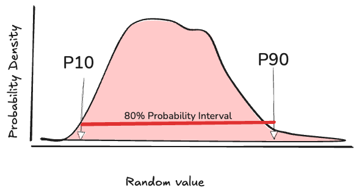

# P10 - P90 interval calibration test

This calibration exercise measures your overconfidence, by asking you to assess an interval for the value of an unknown quantity.  You need to estimate an interval wide enough to contain 80% of the probability density.   

At the end of the exercise we will reveal the true values of the quantities.  If your estimates are well calibrated, then 80% (e.g. 16/20) should fall within your intervals.  If you are overconfident, then the count that fell within the interval will be smaller. 

*Let's see how well you're calibrated! *

#### Defining a P10-P90 Interval

- **P10 (Low Estimate):** A value you claim  there is only a 10% chance the actual value is _lower_. There is only a 90% probability the actual outcome will _exceed_ your estimate.
- **P90 (High Estimate):** A value you claim there is a 90% chance the actual value is _lower_. So there is only a 10% chance the actual outcome will _exceed_ it. 
- **The Target Interval:** Your range should capture the actual outcome **80% of the time** (from the \(10^{th}\) to the \(90^{th}\) percentiles). 

----
#### Fill in your estimateed P10 and P90 values for each of these 20 facts
1.  $_____, _____$  Number of union army casualties in the U.S. Civil War
2. $_____, _____$  Number of constellations in the night sky
3.  $_____, _____$  Average time in minutes for light to travel from the sun to the planet saturn.
4. $_____, _____$  Percent of the world's lakes that are within Canada  
5. $_____, _____$  Number of living cells in the typical human body
6.  $_____, _____$  The number of documented assassination attempts survived by Cuban leader Fidel Castro.
7. $_____, _____$  The number of miles of paved roads built across the Roman Empire at its peak.
8.   $_____, _____$  Estimated population of Rome in 1 AD,
9.  $_____, _____$  Estimated  population of Rome after the Barbarian conquest in the 6th century AD
10.  $_____, _____$  Number of Spartan warriors who held the pass at the Battle of Thermopylae, 480 BC against over 1 million Persian soldiers. 
11. $_____, _____$  Total nominal dollar value of the budge passed by the First US Congress on September 29, 1789,  
12. $_____, _____$  Fraction of Napoleon's Grande Armee who perished from non-battle related causes in the 1812 invasion of Russia. 
13. $_____, _____$  The number of transistors contained in the first commercial computer CPU chip, the **Intel 4004** released in 1971.
14.  $_____, _____$  Number of disintegrations per second that one gram of radium undergoes
15. $_____, _____$  Number of black ships allegedly launched by the Achaeans to avenge the abduction of Helen in the Trojan war
16.  $_____, _____$  Number of days John F. Kennedy served as President of the United States
17.  $_____, _____$  Number years before the Boston Red Sox were able to regain the World Series title in 2004. 
18.  $_____, _____$  The total value of the world's GDP in 2024.
19.  $_____, _____$  Peak monthly inflation rate in percent, in 1923, in Germany's Weimar Republic
20.  $_____, _____$  Height in miles of Olympus Mons, the tallest mountain on Mars. 
-----
*TOTAL NUMBER WITHIN YOUR ESTIMATED INTERVALS*