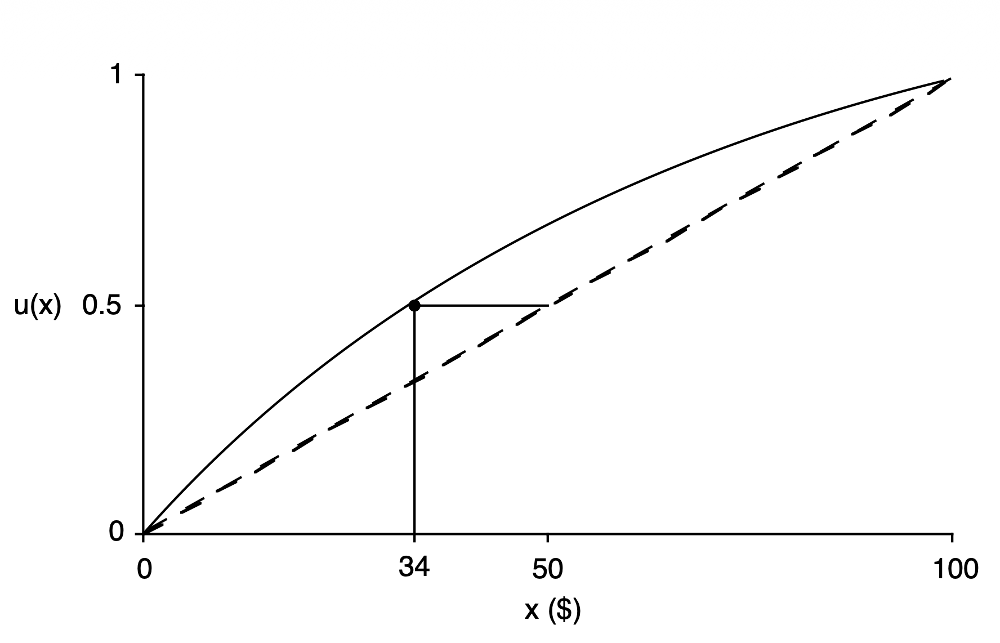
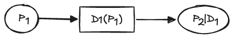
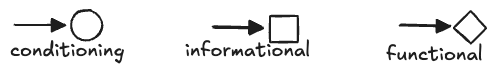
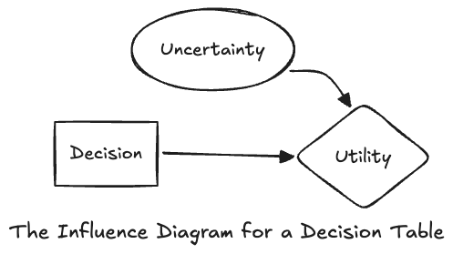
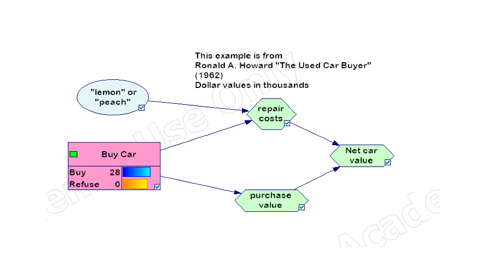

Course: MS&E 152 summer 2026
Sequence: Week 3, Lecture 2
Date: Wednesday, July 8 2026
Topic: Introduction to Decision Analysis
#### Links:
Course website: https://stanford-msande152.github.io/summer26/
Canvas: https://canvas.stanford.edu/courses/228284

-----

# Title:  Theory of choice

### What you will learn
- The conditions to create a utility function. 
- Diagramming dependencies using causal decision networks

## Class schedule
- Lecture: Rational Choice
- Some questions about previous lectures
- Short break
- Lecture: Intro to Causal Decision Networks
- Class activity: Probability Interval Estimation. 
- ----

## I. What is a *rational* choice?

A rational agent - such as a person or organization - follows a set of rules that in combination define exactly what it meant by aligning one's _means_  (what one can do) with one's ends (what one wants to achieve). 

Economic rationality is the assumption that the economy can be explained by assuming people act as rational economic agents who follow a set of rules or _axioms_ of choice.  In contrast in Decision Analysis we look at economic theory normatively, so we treat these rules as *skills* one needs to acquire, and that by using the methods of Decision Analysis that incorporate them, one makes good decisions. 

So decision making becomes a thoughtful exercise, where if these methods are followed then the decision maker can (if one has the courage to) commit to action, knowing it is the best possible course based on the current circumstances.  We can call this "actional thought."

So instead of thinking of the rules as obligatory, each of these rules implies a skill needed to construct one's beliefs and utilities. The rules individually appear to be common sense, but in combination give a path forward for complex situations when the sensible actions are not obvious.  For a decision-maker, rational choice is the process of using the skills associated with each rule, to enable the decision analysis process. 

### Implications of the rules of "actional thought"
1. For the rational decision maker the rules are part of the psychological process of deliberation.
2. As a theory they are the conditions needed to create the utility function that is part of a decision model.
3. By defining *rational choice* they define precisely the criterion for an "intelligent" machine (aka AI agent) to be, or - as is the case - not be rational. 

### The five rules

**1. The Probability Rule**
> Uncertain variables are expressed by probabilities. One relies on the full toolkit of probability computations with event trees. 
 
Implied skills: 
- Constructing one's probabilities as calibrated belief. 
- Manipulation of probabilities consistently, such as by probability tree methods. 
- Ability to adopt new beliefs based on probability based updates.

2. **The Order Rule**
> Preferences over prospects are totally ordered.  Any two  prospects can be compared as either preferred, not preferred, or indifferent. 

Implied skills:
- For any two future prospects , $P, Q$ (Using common attributes, suitable for the clairvoyance test), judge if one is preferred to the other, either $P \succ Q$ or $Q \succ P;$ or if one is indifferent between them $P \sim Q.$   
- Make a complete set of preference judgments so that all prospects are totally ordered. Totally ordered prospects are transitive meaning they are not subject to cycles. 

3. **The Equivalence Rule**
>  There exists a probability $p$ such that for a certain prospect $R$ one is indifferent between $R$ and a deal made of two prospects that bracket it, $P \succ R \succ Q$ 
$$ R \sim pP + (1-p)Q $$
  This $p$ is the _utility_ of $R$ expressed as _preference probability._ The range of preferences defined by the interval $P \rightarrow Q$ defines the *scale* used to measure the utility.  By varying $p$ one can express a continuously variable utility mapping from a deal to a certain prospect.

Implied skills:
- To be able to quantify one's preference for $R$ by constructing  a probability $0 < p< 1$ for such a hypothetical deal. 
- To determine indifference between a certain prospect and an uncertain prospect.

4.  **Substitution Rule**
> If given a choice between two prospects, one is indifferent between receiving any two prospects with the same utility.  The prospects may be certain, or may be (uncertain) deals.  For instance, given indifference between prospects $P \sim Q$ and probability $p$, one would also be indifferent between $pP \sim pQ.$ This works because one considers utilities as preference probabilities, the same as the probabilities of actual events.

Implied skill:
- The Substitution Rule asks the question "do you really mean" using the preference probability as a "real probability?"  One agrees that the substitution itself does not change one's preferences. 
- Also the rule includes substituting a multi-stage deal (think of a multi-node tree) with the same outcome (elemental) probabilities. 
- Another consequence of the substitution rule is that utilities are a function of preference probabilities only, but not of "actual" probabilities.  So there is utility is not a function of any event uncertainty.  Utility applies to certain prospects, and uncertainty is entirely represented by the probability ascribed to events. This, for example means that the act of taking a risk, either the entertainment from gambling, or the thrill from the risk of extreme sports or the fear from taking substantial risks need to clearly distinguish the preference aspect from the sources of uncertainty.  Similarly there is not a utility component in the act of deciding itself, since utility resides entirely in the eventual prospects.  This is the principle that keeps a risk attribute out of the utility function.

5.  **Choice Rule**
> GIven a choice of the identical prospects with different probabilities, one takes the one with the higher probability.  Expected utility is always increasing in probability.  Essentially this rule  requires that you act based on your preferences.  

Implied skill:
- One has the "courage" to take the higher probability deal.  Once the expected utility of alternatives based on their outcomes are worked out every concern that enters into the decision has been considered. There are no additional factors, or stipulations to bring to bear.  Of course this is limited from a complete ethical viewpoint, by the applicability of the rules just to *individual* rationality.  One should consider also if one's action is a good thing. 

**Irrelevant Alternatives**
Another important consequence of the five rules is that when comparing two alternatives, one's choice is determined solely by the expected utility of the alternatives, and not by the presence or absence of other less preferred alternatives.  One can also show that adding some probability of a third alternative to a pair of alternatives will not change the preference over the pair.  

### Utility functions. 

By virtue of one's assessment skills one can construct a utility function by means of the five Rules.  This is convenient because there's no need to refer back to check for adherence to the rules when making a decision  -- applying the utility function says it all.  Alternatively if one can construct a utility function directly one has the benefit of consistency with the Rules without having to go through the assessment task. 

Here's an example of a curved "convex up" utility function to convert dollar value into utility. The diagram shows the computation of an expected utility for a deal with equal probability of an outcome of \$0 or \$100 dollars.  The expected  dollar value is \$50 utility as shown. Mapping this to utility  equals 0.5.  But that has a dollar *certain equivalent* of \$34, less than the expected dollar value.  A utility certain equivalent  less than the expected value is a property of any convex up utility function. The difference in value is the _risk premium_ for that deal, determined by the utility function. 

## II. Dependence in Causal networks

By causal networks I'm referring to networks of probability variables, called _Bayes Networks_, and their extension to include both decision and utility variables, called _Influence Diagrams_, or more descriptively _Causal Decision Networks_. Variables in the networks are drawn as nodes, using our convention of circles, squares, or diamonds for probabilities, decisions or utilities, respectively. Directed arcs between nodes show dependencies.  The networks are _a-cyclic_, meaning by following the direction of the arcs one cannot get back to one's starting point. Neither can nodes have "self dependencies." Influence Diagrams are an equivalent way to diagram Decision-Probability trees. 

#### The problem with trees

Consider a tree containing a sequence of three nodes. We'll label them probability 1 , $P_1$, decision 1, $D_1$ and probability 2, $P_2.$ Drawn as a tree  $D_1$ is downstream of $P_1$, so the tree suggests that it is possible that a different choice can be made depending on the outcome of $P_1.$ Similarly $P_2.$ is downstream of both $D_1$ and $P_1$, so it is possible that its probability is conditioned on both:  $\textsf{P}( P_2 \ |\ P_1 D_1).$  But it is also possible that our decision model does not include the dependency on $P_1$, e.g. $\textsf{P}( P_2 \ |\ P_1 D_1) = \textsf{P}( P_2\ |\ D_1 ).$   We need a way to visualize these different cases that are not evident on the tree diagram. 

We diagram dependencies by drawing arcs where they exist, and, importantly leaving them out where they do not.  So the conditional independence mentioned above is displayed in this graph. This makes it clear that $P_1$ and $P_2$ are independent. The tree diagram is ambiguous whether the dependence exists or not. 

**Dependencies in a causal graph**

Compared to the six possible linear orderings, for three nodes there are many possible causal orderings including the completely un-ordered case. The only two not possible are where the arcs form a closed cycle. 

Independence implies irrelevance among nodes, and it is a symmetric relationship.  Dependence, shown by an arc drawn as an arrow, is directional. Dependence among probabilities is represented by conditional probability. As Bayes rule demonstrates, dependencies among probabilities can be reversed. After reversal the direction of the probabilistic dependency naturally reverses, but the causal interpretation is lost.   Just by inspecting the network diagram one can tell what conditional probabilities are in the model.   Identifying cases where nodes are independent simplifies the model, so are important to identify.

#### Three kinds of dependencies in causal networks

Arcs "belong"  to the nodes they are incident to.  The incoming arcs to a node have different meanings for each of the three kinds of node:  A probability node's arcs indicate the conditioning of it's probability distribution.  A decision node's arcs indicate the variables that will be observed -- called the "information" -- at the time the decision will be made. A utility node's arcs indicate what variables the utility is a function of. Unlike probability and decision nodes, there is often just one utility node at the "end' of an influence diagram.  If the utility function is a sum of multiple "sub-utility" terms,  then all outgoing arcs from sub-utility nodes go to other utility nodes. Just as utility nodes in a tree appear only at the leaves, the final utility node is the "sink" in an influence diagram.  

**Kinds of arcs for different kinds of nodes**

#### Converting a Decision Table into a causal decision network

Recall that a Decision Table consists of one decision and one uncertain variable. The utilities in the table are a function of the decision alternatives and the uncertain outcomes.  The outcome probabilities are independent of the choices made.  Its influence diagram is simply this three node network:

#### The "Used Car Buyer causal decision network"

An example of a Decision Table equivalent model is the Used Car Buyer influence diagram. The decision maker must decide to accept the dealer's offer for sale of the car or refuse it. She doesn't know the quality of the car -- whether it is a "lemon" or a "peach", but only can assess a probability over quality.  Quality affects possible repair costs, that together with the value of the car not including it's quality affect the final net value of the car, on which the decision is made. 

## Class Activity

P10 - P90 probability interval estimation exercise.  

## Key terms

rational economic agent

_axioms_ of choice

Actional Thought

mapping, function

utility function

certain equivalent

a-cyclic

nodes, arcs 

## Homework 3, due 13 July

## Files, references

## Curious?  Things to explore 

© John Mark Agosta & Stanford University