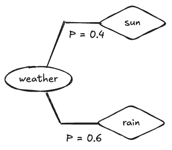
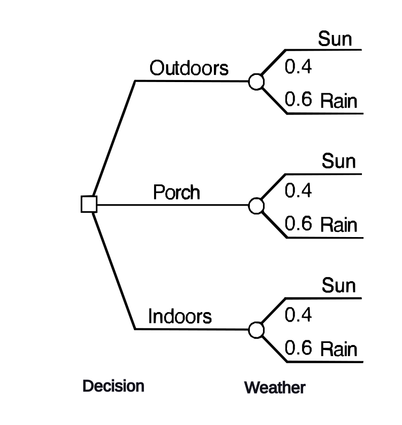
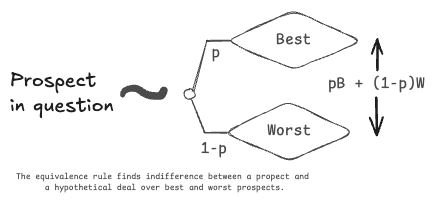
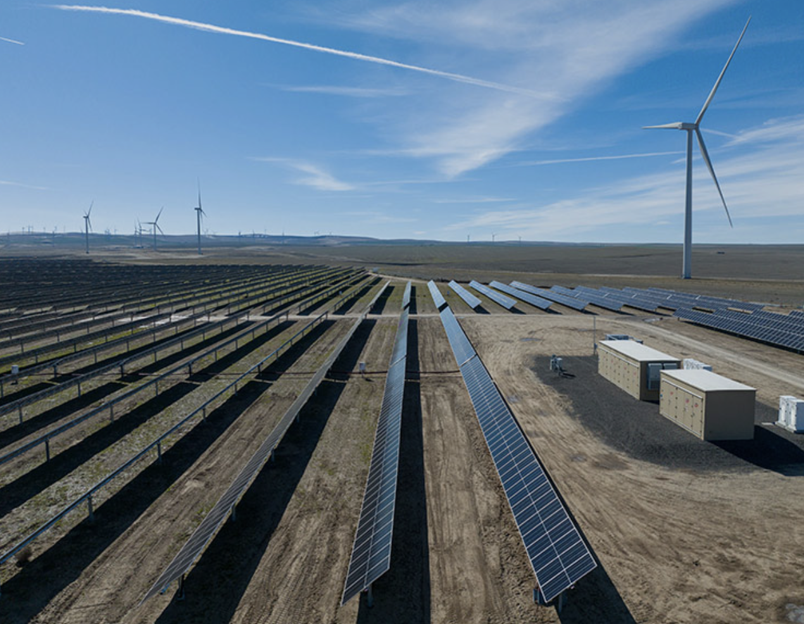
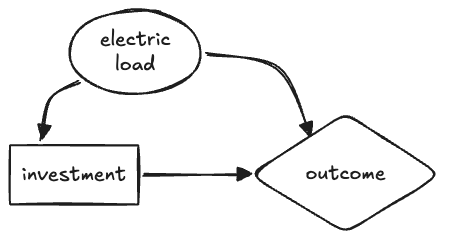

Course: MS&E 152 summer 2026
Sequence: Week 4, Lecture 1
Date: Monday, July 13  2026
Topic: Introduction to Decision Analysis
#### Links:
Course website: https://stanford-msande152.github.io/summer26/
Canvas: https://canvas.stanford.edu/courses/228284

-----

# Title: The Party Problem

### What you will learn
How the rational reasoning - the "5 Rules" apply in an example known as "The Party Problem"

## Class schedule
- Lecture: The Party Problem Decision Problem
- Short break
- Lecture: Dollar valued outcomes and VOI
- Class activity: Your risk attitude
- ----

## I.  The decision

Familiar example - inviting over a large group of friends and family, where you-all live on the East Coast, where the weather is variable and uncertain.  Kim - whose party it is-  would like to hold it outdoors, but if it rains it would spoil the event, so you have to decide whether to hold it indoors or outdoors, or - as a hedge, your other location alternative is to hold it on a covered porch, such as under a tent. 

We'll use this problem to illustrate decision analysis using a causal decision network. By imagining the decision for different decision-makers, it illustrates how one's risk attitude changes the choice of location, and how having better knowledge of what the weather will be is valuable for making one's choice.  In short, most all the aspects of rational choice come up in the analysis of this problem. 

### Framing

As a friend, recently skilling in decision analysis, Kim appears to you to be unsettled with worries about her event.  She explains her eagerness to hold an outdoor party, but says there are so many things that could go wrong.   As you discuss what her concerns about a ruined party, for instance, "what if it rains?"  You ask 'have you considered any alternatives?'    Kim starts to see what you are thinking, asking "such as?"   Referring to your decision analysis training, you point out that to her that she can address her worries by exploring other alternatives.   Now it becomes clear to her that there is an opportunity to frame a decision around her concerns.  You  "declare" yes, there is a decision, and you dive into its analysis, confident that your understanding of how to make choices rationally can help. 

#### The steps to create a model

After some discussion you suggest a rudimentary model, with weather as the key uncertainty, location of the party as the decision, and outcomes that are a combination of the state of the weather and the location chosen. You draw this network to match Kim's understanding of the relevance of the location and weather to the outcome:

At this point Kim may say her choice is obvious  -- she should set up inside to avoid the risk of rain. But you suggest she may do better.  Isn't there another alternative perhaps worth considering? -- A compromise between indoors and outdoors, to hold the party on the porch?  It is worth weighing the options by building the model.

#### 1. Clarifying variables for removing ambiguity

To make it possible to quantify the variables one needs to remove any ambiguity in the decision prospects. You create a distinction between "sun" and "rain" as states of the weather by detailing exactly what the distinction implies for the outcomes -- e.g. how "rainy" a day would prevent enjoying the event.  The exercise of of imagining the services of a "clairvoyant" makes this idea tangible. 

#### 2. Assessing preferences for consistency

The combination of three alternatives and a distinction of two states, there are six prospects to consider. The first skill required of Kim is required by *The order rule* - can she create a ranked list of the six prospects.  The rule assures that her preferences are transitive, and avoids confusion such as cycles in outcome preferences.

| Prospect           | Ordinal  | Order |
| ------------------ | ---------------------- | ------------ |
| Outdoors, Sunshine | 1st                      | Best       |
| Porch, Sunshine    | 2nd                  |         |
| Indoors, Rain      | 3rd                  |         |
| Indoors, Sunshine  | 4th                   |          |
| Porch, Rain        | 5th                  |         |
| Outdoors, Rain     | 6th                     |  Worst        |
_At this stage in the analysis we would be done if we knew for certain if "rain" or "sunshine" will be the case!_  If sunshine, then choosing outdoors is preferred; similarly with "indoors" for "rain." Alas, we don't have this certainty, and fortunately the Rules provide a method to deal with our predicament. 

#### 3. Probability for quantifying uncertainty

Short of complete knowledge of the future, Kim believes that sadly it is  more likely to rain than not.  Fortunately she has the skill to compare her belief in the probability of the distinction between rain and sun on the day of the party by use of a probability wheel.  As we go through the elicitation process with Kim she carefully reviews what she knows about the effects of climate and what she's hearing from weather-forecasters. She takes into account that the her desire for a sunny outcome and recent sunny weather might bias her toward a higher probability for "sun," so she thinks through several diverse scenarios.  Her weather probability tree looks llke this:

Kim then interjects that there will be better information to predict the weather as the event nears.  We tell her that will be part of the model, it develops. 

Her decision tree now looks like this:

#### 3. Equivalence for finding utilities

Having elicited Kim's beliefs we need next to quantify her judgment about her preferences over each terminal prospect, to completely personalize the model.  For this we need her to be comfortable with making comparisons between each of the six certain prospects and a deal between the best prospect (Sunny outdoors) and the worst ( Rainy outdoors).   This depends on her skill use of the "Equivalence Rule" - to express a probability that makes her indifferent between the prospect in question and a  probability of receiving the best versus the worst deal.  These are her *preference probabilities* or in other terms her *utilities.* This is a hypothetical of an imagined "Wizard" who can change the one prospect in question to one of the two extreme prospects with her selected probability.  As a consistency check the numeric values must rank identically to the ordering constructed previously. Of course we get for free the 1 and 0 probabilities for the best and worst prospects, so we only need the remaining four. 

*Figure: An Equivalence Rule comparison to elicit preference probabilities, p,  for prospects.*

#### 4. Substitution to complete the tree

If Kim is comfortable treating the preference probabilities she's expressed as probabilities none the less, we can invoke the Substitution rule, and by indifference, replace each of the prospects at the leaves of the tree with its equivalent "equivalence" deal.  SInce preference probabilties express *utilities* we have effectively converted the entire tree into a probability tree.  It looks like this:

#### 5. Making a choice

GIven the substitutions we can apply the law of total probability to find the equivalent probability as the utility of each alternative branch of the root decision node.  The Substitution rule lets us treat utilities of each alternative as the probability of a hypothetical deal between the best and worst prospect.  Kim should have no reluctance to choose the alternative that has assigned the highest preference probability. 

The computation that applied the law of total probability is a specific case of computing an *expected value,* (also "taking expectation") in this case an expected value of utilities, or just an *expected utility.*  Expected value is a general property of probability to find a equivalent number by computing the probability -weighted sum of the distribution of any value. 

A complete description of Kim's problem can be expressed in this Decision Table;

It turns out the analysis leads to choosing the same alternative as Kim's original intuition - to hold the party indoors. However this is not the end of the story. 
#### Rolling back the tree by expected utility 

Computing expected value is equivalent graphically "rolling back" the tree.  Starting from the leaves, one replaces each probability node with  it's expected value, and each decision node with the maximum value over each of its branches.  The resulting number at the root of the tree is an equivalent expected value for the set of prospects that the tree comprises. 

## II. A decision with dollar-valued outcomes

To illustrate how exactly to treat risk in weighty decision problems, let's consider an analogous decision, with the same causal decision network and decision tree, but in the domain of alternate energy production. (For those of you who are experts in this field, please suspend judgment about this over-simplification.)

#### Where to invest in alternate energy production

Imagine you are working for Quinn the decision-maker on the plan for investing in alternate facilities for providing power to the electricity grid, where the technical options are a wind power farm, a solar array, or a static battery storage facility.  The upfront investment for each facility is the same  -- the major uncertainty is how much revenue they can generate during periods of "peak" or "base" electricity demand. Revenue is measured in millions of dollars per day, as follows:  Wind power generation is more efficient, since it generates the most base power, but it can be sporadic, so it is not dependable.  Solar is a bit less efficient, but its production can depended upon every day.   Battery power is available at all times, but suffers from transmission and storage losses, so its revenue is less, but almost constant as demand periods vary.  This table shows how revenue is assigned for each outcome.

To assist the investment team in this analysis we brought in a team from the Finance Department who using their own models estimated the expected value of each prospect, as shown in this table.  Note for purposes of argument that the ordering of the prospects is the same as in the original Party Problem. 

| Alternative     | Uncertainty | Revenue in Millions $ / day |
| --------------- | ----------- | --------------------------- |
| Wind generation | Base load   | 10                          |
| Wind generation  | Peak load  | 0                           |
| Solar plant     | Base load   | 9                           |
| Solar plant     | Peak load   | 2                           |
| Battery storage | Base load   | 4                           |
| Battery storage | Peak load   | 5                           |

The Decision Table in millions of dollars  a day reveals that the expected values for these prospects suggests a different best alternative  ( recall "Solar Plant" corresponds to "Patio"). There is no reason why changes in the numeric values, even if they respect the same preference ordering, should give the same result:

#### Considering an alternative to resolve uncertainty

In this example, Quinn's team proposes further study to forecast the probability that his facility will face either base and peak electric loads. The team generates numerous study proposals each varying in expense, with the most expensive proposals claiming to essentially eliminate all uncertainty about load. 

Quinn presumes this information to be valuable, and applying his understanding of Decision Analysis he proposes a modified analysis to set a maximum that he would be willing to pay for such a study. This way he can dismiss any study that costs more than he could possibly gain. He uses this causal decision network for his analysis, where the load uncertainty is observed before he has to make his investment decision:

If Quinn will know what load his planned facility will face he may choose to invest in a different alternative than he would without the study.  He will have to decide whether to undertake the forecast study based on his current uncertainty, and the possibility that knowing the study outcome will affect his investment choice.   Even if the study resolves all the load uncertainty, if he would still always go with "solar" then the study information has no value. 

To set an upper limit on how much it would be worth spending on a forecast, Quinn solves two decision models, his original decision model that recommended "solar" with an expected value of $ 4.8 Million, and the model of the new causal decision network with the information arc added from "electric load" to "investment."  The *Value of Information* setting this upper limit is the expected value computed by the model with the arc minus the expected value determined by the original model. 
#### Monetary value of Information (VOI) 

"VOI" is the expected value possibly gained by having an uncertain variable revealed that may affect the decision made.  In effect the uncertainty is removed. 

The computation of VOI in Quinn's  problem can be shown in one combined decision tree.  To understand the hypothetical of removing all uncertainty, we rely on the notion of a clairvoyant. 

His full decision tree has the "observe load" decision node  before his investment node:

#### Clairvoyance about information

To make clear exactly what "observing information" means, we consider a thought experiment using the hypothetical clairvoyant. The clairvoyant knows what the outcome of the uncertain variable in which we are interested, and offers us a service to reveal what it will be to us before we make our decision.  Our VOI analysis reveals what we are willing to pay the clairvoyant for this service. 

To estimate VOI we need to consider two possible paths in the combined tree, one if "sun" is revealed, the other if "rain."  We solve the original problem for those two cases.  As we see in this example, if we were guaranteed "sun" we'd always choose "outdoors", and if guaranteed "rain" we'd always choose "indoors".   So in both cases we'd change our uniformed choice, and receive a higher expected value.  To combine these cases we weight them by the current probabilities of sun versus rain (since at this point in time we have yet to have their value revealed)  to get the expected value of observing what the weather will be.  So $100 (0.4) + 50 (0.6) = 70$  is the "expected value with clairvoyance"  that we can compare to the $48$ that we expect without it, leaving an expected VOI of $70-48 = 21$ dollars.  

Converting this back to Quinn's example he should pay no more that $21$ million dollars for any study forecast. 

## Class Activity

Where does your utility start to "bend"?  Consider a deal for an equal chance to win a large dollar amount. Equate this deal to a fixed dollar amount you would pay to acquire such a deal. 

## Key terms

Eliciting preference, eliciting beliefs
Expected value
"Taking expectation"
Free clairvoyance
Value of Information (VOI)
## Homework, due __ 

## Files, references

## Curious?  Things to explore 

© John Mark Agosta & Stanford University