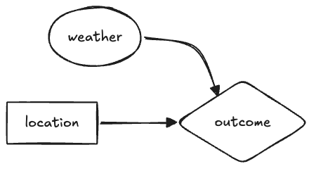

Course: MS&E 152 summer 2026
Sequence: Week 4, Lecture 1
Date: Monday, July 13  2026
Topic: Introduction to Decision Analysis
#### Links:
Course website: https://stanford-msande152.github.io/summer26/
Canvas: https://canvas.stanford.edu/courses/228284

-----

# Title: The Party Problem

### What you will learn
How the rational reasoning - the "5 Rules" apply in an example known as "The Party Problem"

## Class schedule
- Lecture
- About this class
- Short break
- Second lecture
- Class activity
- ----

## I.  The decision

Familiar example - inviting over a large group of friends and family, where you-all live on the East Coast, where the weather is variable and uncertain.  Kim - whose party it is-  would like to hold it outdoors, but if it rains it would spoil the event, so you have to decide whether to hold it indoors or outdoors, or - as a hedge, your other location alternative is to hold it on a covered porch, such as under a tent. 

We'll use this problem to illustrate decision analysis using a causal decision network. By imagining the decision for different decision-makers, it illustrates how one's risk attitude changes the choice of location, and how having better knowledge of what the weather will be is valuable for making one's choice.  In short, most all the aspects of rational choice come up in the analysis of this problem. 

### Framing

As a friend, recently skilling in decision analysis, Kim appears to you to be unsettled with worries about her event.  She explains her eagerness to hold an outdoor party, but says there are so many things that could go wrong.   As you discuss what her concerns about a ruined party, for instance, "what if it rains?"  You ask 'have you considered any alternatives?'    Kim starts to see what you are thinking, asking "such as?"   Referring to your decision analysis training, you point out that to her that she can address her worries by exploring other alternatives.   Now it becomes clear to her that there is an opportunity to frame a decision around her concerns.  You  "declare" yes, there is a decision, and you dive into its analysis, confident that your understanding of how to make choices rationally can help. 

#### The model

After some discussion you suggest a rudimentary model, with weather as the key uncertainty, location of the party as the decision, and outcomes that are a combination of the state of the weather and the location chosen. You draw this network to match Kim's understanding of the relevance of the location and weather to the outcome:

- Could this solve the problem  - why quantify?

The assessment steps. 

- conversion to a Decision Table

(Why is Kim and Jane's utility different - do we need to convert to money to take this into account? Is it possible to assign risk preference to them.  Howard (3-28) : "We thus see that we cannot tell whether a person is risk-neutral or risk averse by observing the decision made in any situation that does not have only money as the value measure of each prospect"."'"

## A decision with dollar-valued outcomes

#### Where to invest in alternate energy production

Imagine you are working on the plan for investing in alternate facilities for providing power to the electricity grid, where the technical options are a wind power farm, a solar array, or a static battery storage facility.  The upfront investment for each facility is the same  -- the major uncertainty is how much revenue they can generate during periods of "peak" or "base" electricity demand. Revenue is measured in millions of dollars per day, as follows:  Wind power generation is more efficient, to it generates the most base power, but it can be sporadic, so it is not dependable.  Solar is a bit less efficient, but its production can depended upon every day.   Battery power is available at all times, but suffers from transmission and storage losses, so its revenue is less, but almost constant as demand periods vary.  This table shows how revenue is assigned for each outcome

| Alternative     | Uncertainty | Revenue in $ |
| --------------- | ----------- | ------------ |
| Wind generation | Base load   | 10           |
| Wind geneation  | Peak load   | 0            |
| Solar plant     | Base load   | 9            |
| Solar plant     | Peak load   | 2            |
| Battery storage | Base load   | 4            |
| Battery storage | Peak load   | 5            |

## Class Activity

## Key terms

## Homework, due __ 

## Files, references

## Curious?  Things to explore 

© John Mark Agosta & Stanford University