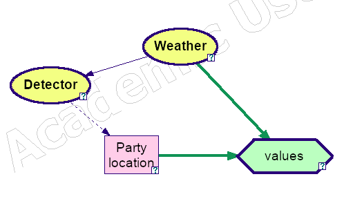
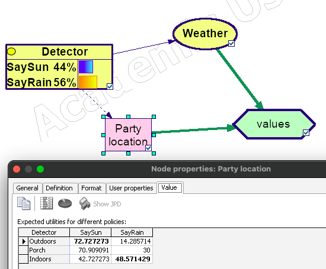
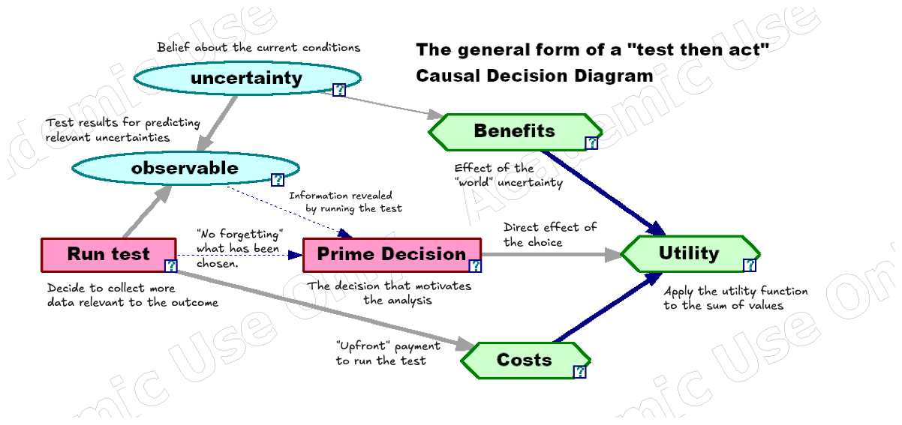
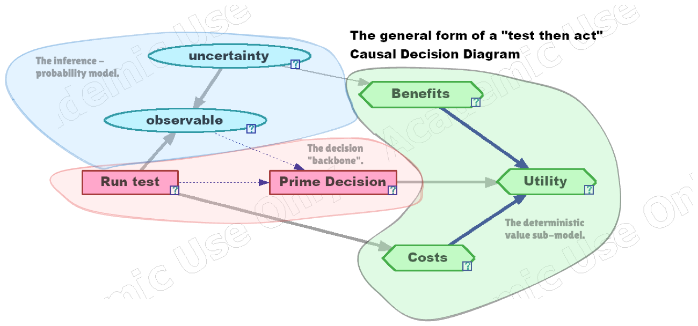

Course: MS&E 152 summer 2026
Sequence: Week 4, Lecture 2
Date: Wednesday, July 15 2026
Topic: Introduction to Decision Analysis
#### Links:
Course website: https://stanford-msande152.github.io/summer26/
Canvas: https://canvas.stanford.edu/courses/228284

-----

# Title:  Party Problem -- value of information 

### What you will learn

- How probability updates work in a Bayes network
- How VOI is calculated for predictors that provide partial information about variables of interest.
- How CDNs are formatted, conventionally. 

## Class schedule
- Demonstration: Bayes network, The Confused Doctor
- Lecture: 
	- Value of Information from a imperfect predictor
	- General structure of Causal Decision Networks
- Short break
- Class activity: Review of current class projects
- ----
## I. Solving for the "rain detector" value

The rain detector is a predictor that has a probability of 0.8 predicting rain or sun correctly, and a 0.2 probability of a "false negative" or "false positive" error. 

We can extend the analysis of VOI to consider the case where given the predictor's accuracy, we can calculate the value of the information provided by observing the detector.  We obtain *partial information* --
short of having complete information in the weather, our variable of interest. 

This analysis is best carried out directly on the CDN:

Knowing the accuracy of the predictor, the dependency goes from "weather" to "detector." *However there is no way to draw a decision tree that respects the direction of the network arrows.*   To solve the network we need to infer 'weather' from the observed value of "Detector", by use of Bayes Rule.  This is shown in the diagram by reversing the direction of the conditioning arrow between the two nodes.  The updated probability on "Detector" and the expected values for each detector observation are shown in this diagram:

Weighting the expected values for the two solutions by the detector "marginal" probabilities obtains the expected value with information:

$$ E[v] = 0.44* 72.72 + 0.56 * 48.57 = 59.2 $$

Therefore the VOI with the detector is 

$$ 59.2 - 48 = 11.2 $$

## II. Structuring information with Causal Decision Networks

The general form of the kinds of models 

The parts of a CDN

### Posterior distributions 

Once we observe uncertain variables in a network, we call them "evidence." We  compute the effect of evidence to update our probability distributions on other variables in the network.  This *inference* conditions the unobserved variables on the observed evidence.  Think of this as a generalization of Bayes Rule. Just as Bayes Rule updates the distribution of one node on the observation of another, the probability update on a Bayes Network updates the distribution of a set of variables on the evidence in another set.  The updated probabilities are called the *posterior* distribution given the evidence. 

### When information has value

The computation of posterior distributions is necessary to compute the distribution of variables of interest given the variables observed at the time a decision is made. If there are cases where the observation changes a decision's choice it can only increase the expected value of the analysis.  This increase is what the clairvoyant would offer as the selling price for information.  
Hence the VOI is never negative in a decision problem. 

## Class Activity

Review of submitted project proposals

## Key terms

Utility sub-model
Probability sub-model
Decision backbone
Incomplete, partial information.
Predictions.
Observations, Evidence
Probability updates
Inference
Posterior Distributions
## Homework, Practice Midterm 

## Files, references

## Curious?  Things to explore 

Try out the Brier fair scoring web application to understand how your midterm will be scored.  You can find the link on the class website as the "Midterm scoring tool."
https://stanford-msande152.github.io/summer26/sw/brier/

© John Mark Agosta & Stanford University