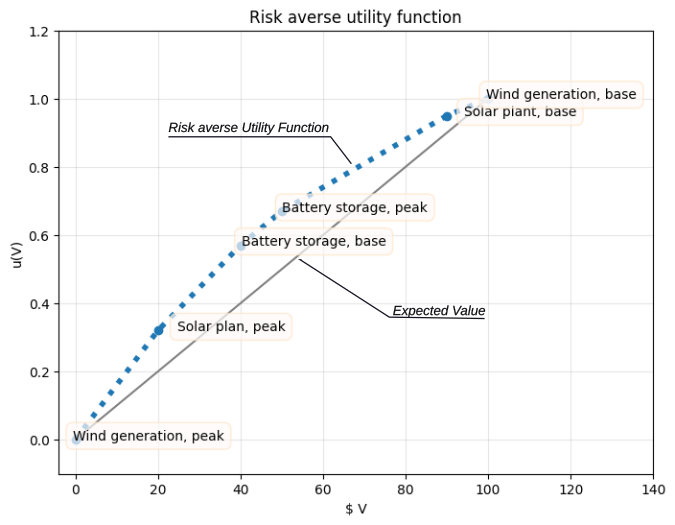
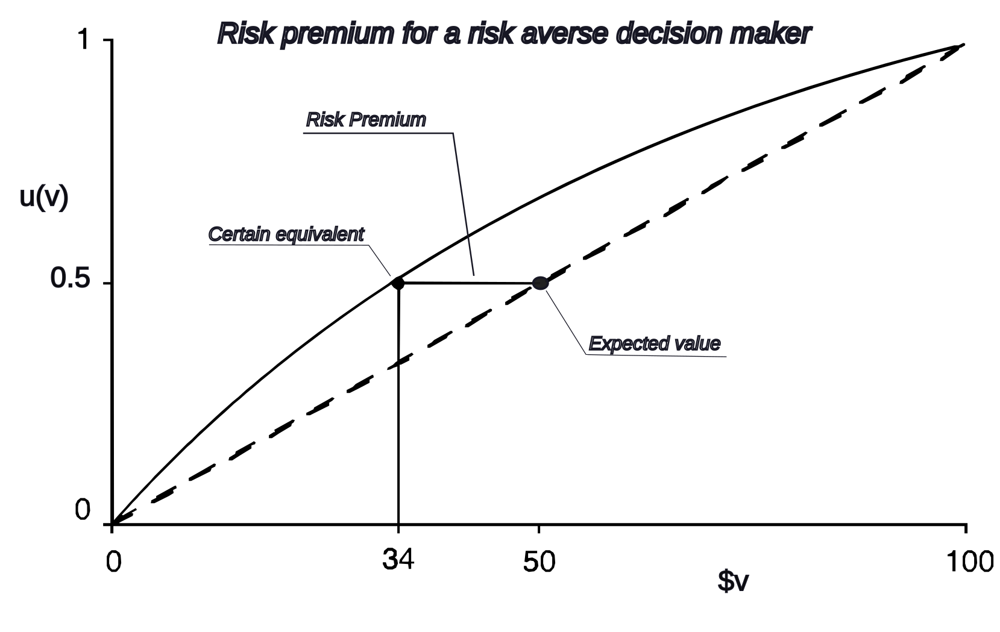
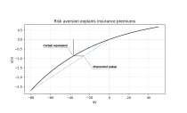
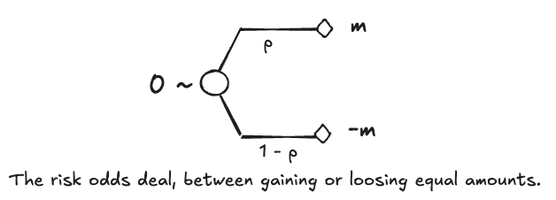

Course: MS&E 152 summer 2026
Sequence: Week 5, Lecture 1
Date: Monday, July 20th 2026
Topic: Introduction to Decision Analysis
#### Links:
Course website: https://stanford-msande152.github.io/summer26/
Canvas: https://canvas.stanford.edu/courses/228284

-----

# Title: Time and risk preference

### What you will learn
How the economics of time and risk apply in Decision Analysis

## Class schedule
- Lecture: Time and RIsk Preference
- Short break
- Update on projects
- Class activity
- ----
# Facing risks and delayed gratitude 

Think of cases where you've had to face delay in gratification or risk of loss.  When these become substantial they can affect our preferences.  Both risk and time preference are intangibles, characteristic of a decision maker's preferences, and not determined directly from monetary analysis.  Since they both have dis-utility these two attributes are sometimes conflated and treated as one. In Decision Analysis our goal is to distinguish their sources, quantify these intangibles, and incorporate them into a single consistent measure of utility used to compare alternatives.  This is a principled method to express intuitive judgments about risk. 

## I.  The confusion of time and risk preference

Both risk and delay decrease the value of a certain prospect. In market economics the same discounting formula can be used for both, however the origins in personal preference are distinct and not to be confused. 
#### TIme preference

If we compare having a prospect of value $V_0$ now at time = 0 compared to receiving it, at time  = 1, say a year from now, and we assume that there would be value to having the prospect during the current year, that incremental value $i$ as a fraction of $V_1$ implies we would prefer to have the prospect now rather than later. Note that uncertainty is not considered. As a deterministic indifference relation:

$$ V_0 \sim V_1 + iV_1 = V_1(1+i) $$
In monetary terms, the decrease  in value over time with $i$ as the time preference rate is:

$$ \frac{V_0}{1+i} = V_1 $$
For instance, if someone has urgent needs they may be willing to take on debt -- valuing the larger sum in the future equivalent to the immediate amount in the present.  If extreme this need can be exploited by unscrupulous lenders. 

An investor has the opposite incentive when faced with an investment opportunity. They will forego consumption of current resources, if the return on setting the amount aside more than offsets their time preference. 

Conversely, someone may prefer to defer consumption of a perishable item, to receive a *smaller* quantity in the future. For example if a shipment of ripe strawberries can't be enjoyed and would go to waste if received now, one may prefer a smaller shipment in the future, when they can be consumed. 

Time discounting applies to attributes that have use over time, so it doesn't make sense to apply it to timeless prospects such as the earth's environment as a whole.  The future of our kids -- our progeny -- or of life itself cannot be discounted. 

#### Compounding

One applies different time-discounts for prospects that occur at different times in the future, usually making the benign assumption that the discount rate is constant per interval.  So if values are received over a sequence of periods, the *Net Present Value* of their sum is

$$ NPV = \sum_{i=0}^n V_i = V_0 + V_0 (1+i)^{-1} + V_0 (1+i)^{-2} \cdots = V_0\sum_{i=0}^n (1+i)^{-i}   $$

In comparison when considering an investment one is looking at a time in the future when value will have increased:  compound growth.   For net present value we are standing in the present and considering how the future is discounted. Given enough years, the results of compounding or correspondingly discounting are substantial.  A 10% per year discount over ten years is equivalent to a reduction of more than half -- to about 35%. 

Decreasing the interval used for compounding proportionally with the rate, increases the total return, but only to a point.  For instance, a  10% per year return compounded monthly is equivalent to a $(1 + 0.1/12)^{12} \approx 10.5\%...$ return.  The returns for finer and finer intervals quickly reach a limit, as shown by this standard equivalence from calculus $(1+x/n)^n = e^x$
#### Interest rate markets

Buying and selling investments in financial markets reveal market interest rates that are not necessarily the same as a decision maker's. There are markets where money and goods can be bought and sold at designated future times,  in addition to immediate ("spot") trades. An example are government bonds that promise to return a fixed amount in the future in exchange for an current investment. As opposed to one's personal discount rate, these bond markets provide a *market rate* for "risk-free"  investment returns.  Similarly within a company the rates the company pays for raising investment funds (the "cost of capital") comes from what investors will pay for them.  When a decision involves either buying or selling investments,in personal or corporate situations, these market rates are appropriate to use as the time discounting rate. 

When using market rates, one needs to distinguish between nominal rates, that are affected by inflation that decreases the value of the dollar. A *rate of return*  in constant value dollars is the nominal rate minus the rate of inflation. 

### II. Attitudes toward Risk

Risk
> An ambiguous term, used at times to indicate uncertainty or just"probability of loss", or "expected value of loss", etc.  For clarity we speak of risk attitude that is a consequence of making distinctions between the probability distribution of a prospect, the utility measure applied to it, and the resulting risk premium.

To clarify what we mean when we speak of risk, we are referring to a decision-maker's risk-attitude. For a risk averse decision-maker their valuation of a deal grows less that proportionally as the size of deals grow large. In Decision Analysis, this diminishing marginal value attributed to a deal is how we understand risk.  Conversely when consequences are small, decision-makers valuation of deals approach the deal's expected monetary value, and we don't see the phenomenon. 

A decision-maker's risk attitude is described entirely by the shape of his utility function for money.  Referring back to the previous example, here are Quinn's utilities elicited for the prospects he faced as decision-maker.

| Prospect              | Preference Probability | Dollar Value, millions |
| --------------------- | ---------------------- | ---------------------- |
| Wind generation, base | 1                      | \$100                  |
| Solar plant, base     | 0.95                   | \$90                   |
| Battery storage, peak | 0.67                   | \$50                   |
| Battery storage, base | 0.57                   | \$40                   |
| Solar plan, peak      | 0.32                   | \$20                   |
| Wind generation, peak | 0                      | \$0                    |
As usual utilities are on a zero-to-one scale.  If we plot utility versus value, we see a characteristic downward sloping "convex up" curve. A "convex - upward" (typically called "concave") utility function expresses risk aversion. 

#### Certainty equivalents

Roughly the certainty-equivalent captures a person's perceived monetary value for an uncertain prospect as compared to the prospect's expected value. Both are in monetary units,  e.g. dollars.  Unlike utility, whose units are relative, certain equivalent is in the same units as expected value.   In the case of risk aversion the certain equivalent of an uncertain prospect is typically lower than the expected value, the difference known as the *risk premium.*

$$\text{Expected Value} - \text{Risk Premium} = \text{Certain Equivalent}$$

 A person whose risk premium for an uncertain prospect is zero is *risk neutral.* Risk neutral decision makers have linear utility functions, so that their expected value and certain equivalents are equal and their risk premiums are zero.  It is possible to be risk preferring.  Our theory of rationality does not dictate one's risk attitude either way.  

#### Computing the certain equivalent

The certain equivalent is a monetary value equivalent to a utility value, used to convert an expected utility into units of comparable monetary value. Fortunately since the utility function is a continuous increasing function, the certain equivalent can be found by applying the inverse of the utility function to the expected utility.   

To see this graphically, consider in this case of a "½ - ½" probability deal between 0 and 100 dollars with utilities of 0  and 1. As shown in this plot, the expected utility falls half-way along the dotted line, at a point where  $E[u]= 0.5.$ Moving horizontally to where this value intersects the utility curve finds the value of utility for that quantity $\$34 = u^{-1}(0.5).$  This differs in this case from the dollar expected value of $\$50$ for a risk premium of $50 - 34 = \$16.$  For a convex-upward function the utility of this difference will always be non-negative.  (This follows from the relation known as Jensen's inequality.) The difference is a consequence of the combination of uncertain deal and the curved utility function.

If we assume a person's utility function is convex-upward everywhere then for uncertain prospects their certain dollar equivalent will be always be less than its expected dollar value. This is true for both probable losses and gains. This explains why insurance companies can price insurance so it is valuable to customers, but less than their expected losses.  The insurance company values insurance at it's expected value because they consolidate a large number of customer contracts together, but even more so because as a business they are risk neutral toward the expected losses over the set of contracts.  In comparison customers' risk aversion lead them to value the possible loss below than it's expected value, by the amount of their risk premium.  Thus an insurance company can price an insurance contract between the customer's certain equivalent for their possible loss, and its expected value for the company, and make money.   The plot that explains this looks similar to the previous example of the certain equivalent. 

#### Effect of wealth on the utility function 

Presumably a decision-maker's wealth should affect their risk attitude.    So their utility function should include their wealth added to any gains or losses of the deals they face. For example "Outside" for either rain or shine for Kim, whose wealth is say \$1 million would be \$0 + 1 million for rain and \$100 + 1 million for sun.  Depending how the curvature of the utility function changes for large values, the person's risk attitude can change. 

Should risk aversion increase or decrease with wealth?  Presumably a wealthy person feels free to take larger risks, and would be less risk averse. Or one could argue otherwise that they'd be more concerned about keeping their wealth, so they should be more risk averse.   In general to put this question aside, we can assume a functional form for the utility function where wealth does not affect risk attitude.  

#### Simplifying the utility function - The "Delta property"

To build a utility function with this wealth-independent property, we elicit a person's *risk odds,* a measure of their risk attitude. 
We pick a convenient dollar amount, adequate to raise concerns about risk, and using the Probability Wheel elicit their value of $p$ in this deal: 

For someone risk averse, $p > ½$ and their risk odds is $r_m = p/(1-p)$ which will be greater than 1.  Of course if the person is risk neutral this is unnecessary and we just declare their risk odds equal to one. 

$$u(x) = a - b\left(r_m\right)^{-x/m}$$
Where the range of the function can be set for convenience by appropriate values of $a,b$. 
Using this function one can show algebraically that any delta change $\Delta$ to a person's wealth leaves their risk premium unchanged.  To abbreviate, we say a utility function with this property has the "delta property."

### What order to apply discounting, risk preference, and expectation? 

There are markets for risk, just as for futures, and in a word, risky investments typically see a higher discount rate than non-risky assets.  Keep in mind however that an individual's utility function determines how the individual should address risk separate from their determination of time preference discounting. 

In a conventional cost-benefit analysis, one's result is a single monetary value. We need to take into consideration time discounting, risk preference and uncertainty, and possibly also the cost of information.  What is the correct order to apply these?

- Any adjustments to value such as the cost of information apply directly to the value of the terminal prospect.  Dollars to dollars. 
- Time preference via discounting applies to certain future prospects, so we apply a risk free discount rate to monetary values when they will occur, and make a risk adjustment using the utility function. 
- The certain discounted monetary amount is the input to the utility function, to express risk preference.
- Uncertainty is applied last, to the certain utility quantities, by taking expectation, assuring that utilities are not a function of the probabilities. 

## Class Activity

Do you pay for insurance?  Estimate the difference between the expected value of the "downside" expected loss you fa

## Key terms

time preference, time value of money
compound rates
rate of return, discount rate
net present value (NPV)

risk premium, risk aversion, risk tolerance, risk preference, risk odds 
certain equivalent
delta property

## Files, references

For a seminal contribution about incorporating intangibles such as risk in decision -making see
C. Spetzler, (1968) "The Development of a Corporate Risk Policy for Capital Investment Decisions" IEEE Transactions on Sys. Sci & Cyber, Vol. SSC-4, No. 3, 
in  1. R. Howard & J. Matheson (1983) [“Readings on Decision Analysis Vol 2.”](https://stanford-msande152.github.io/summer26/lit/pubs/1983-howard-readingsondecisionanalysis-v2.pdf) (“The Blue Book”) SDG.

## Curious?  Things to explore 

See the downloads page on the class website. 

© John Mark Agosta & Stanford University