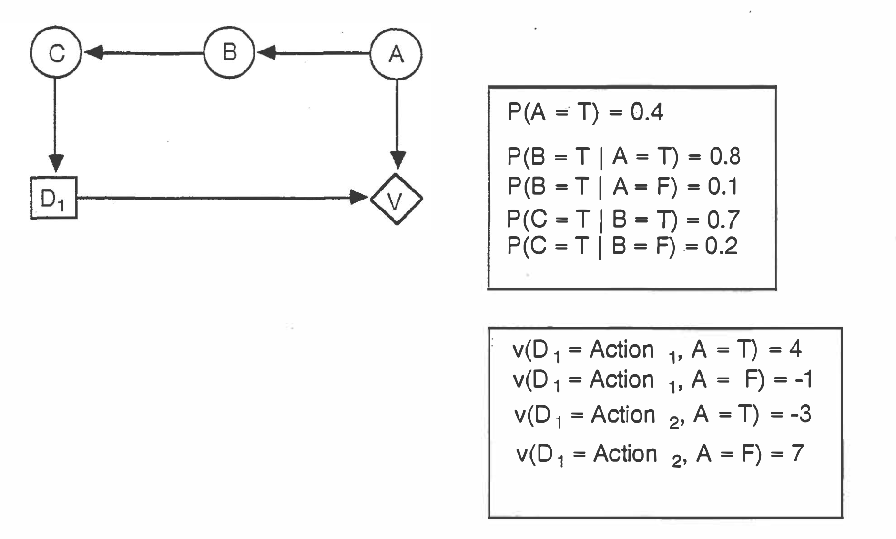
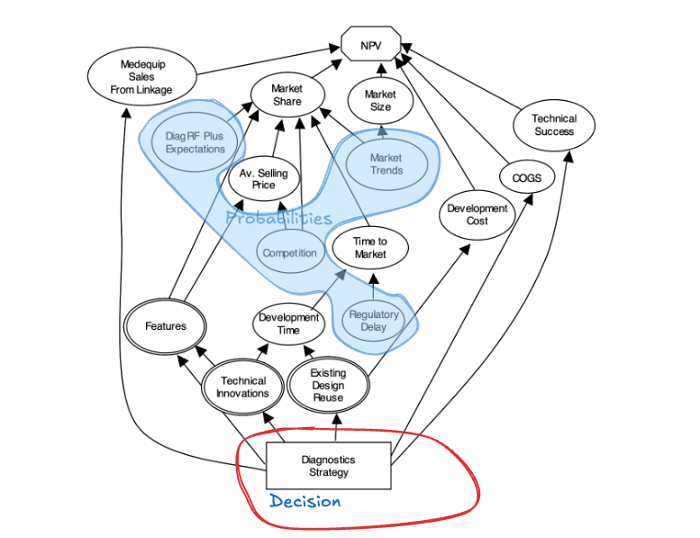

Course: MS&E 152 summer 2026
Sequence: Week 5, Lecture 2
Date: Monday, June 22nd 2026
Topic: Introduction to Decision Analysis
#### Links:
Course website: https://stanford-msande152.github.io/summer26/
Canvas: https://canvas.stanford.edu/courses/228284

-----

# Title:  Creating Causal Networks, continued

### What you will learn

Review of CDNs, a continuation of Week4 class2 lecture.
Mathematical definition of the different nodes in a CDN. 

## Class schedule
- Midterm
- Short break
- CDNs, continued
- Draft project assignment
- ----

## I. Influence Diagrams to Causal Decision Networks

*Influence Diagrams* were developed in the late 1970s as a more concise alternatives to decision-probability trees. Subsequent developments in probabilistic AI extended the networks to include additional aspects such as comprehensive inferential and diagnostic models, and computational approaches to probabilistic reasoning, including causal models derived from data.

### Some early influence diagram examples. 

**A five node inferential model**

*An Example of a simple CDN from Cooper, 1988*

**A model with an extensive value network.**

This model makes a clear distinction betweenm the decision backbone, the one-node value model and the inferential model of three nodes. 

*A complicated CDN from McNamee (2008) Chapter 6.* 

This example of an actual business decision flows from bottom to top rather than from left to right. The problem is to decide on a product strategy for a new medical diagnostics product. The decision structure (backbone) is circled in red.  The alternatives are to -
- Milk existing  products
- Upgrade current product technology
- Develop a completely new design

Studying this diagram, we see the problem was framed as single strategy decision, with consequences for uncertainties that affect the final value of NPV.  Key uncertainties that are not indirect consequences of the decision are outlined in blue. This model does not consider any observables that will inform the decision, however one could compute a complete information VOI on any of the nodes in the blue region.   All other nodes could be considered part of the value function (typically shown in green), however the diagram doesn't break out the functional from the uncertain aspects of these nodes, except for the three direct successors of the decision that have double outlines. .
## Key terms

Influence Diagram
## Homework, due __ 

## Files, references

Ross Shachter, [“Evaluating Influence Diagrams”](https://stanford-msande152.github.io/summer26/lit/bibliography/lit/pubs/shachter_evalluating_IDs_1987.pdf), _Operations Research_, Vol. 34, No. 6. (Nov. - Dec., 1986), pp. 871-882.

Ronald A. Howard and James E. Matheson, "Influence Diagrams," Department of Engineeri ng-Economic Systems, Stanford University, July 1979. in 1. R. Howard & J. Matheson (1983) [“Readings on Decision Analysis Vol 2.”](https://stanford-msande152.github.io/summer26/lit/pubs/1983-howard-readingsondecisionanalysis-v2.pdf) (“The Blue Book”) SDG, p.719

## Curious?  Things to explore 

© John Mark Agosta & Stanford University