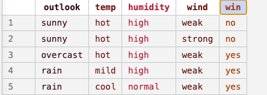
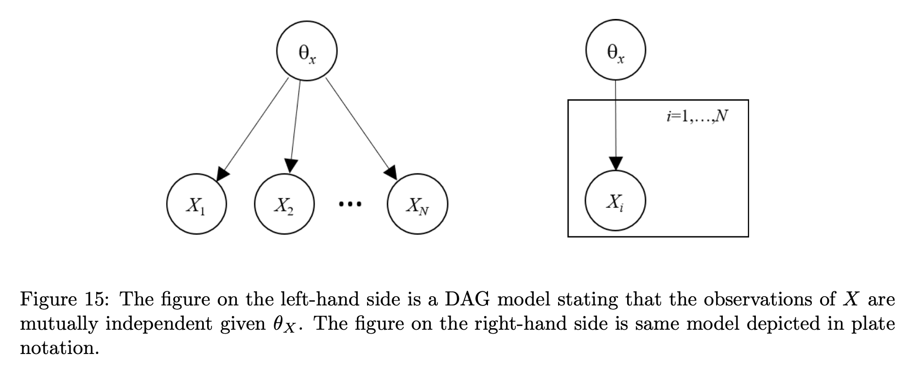

 Course: MS&E 152 summer 2026
Sequence: Week 6, Lecture 1
Date: Monday, July 27 2026
Topic: Introduction to Decision Analysis
#### Links:
Course website: https://stanford-msande152.github.io/summer26/
Canvas: https://canvas.stanford.edu/courses/228284

-----

# Title: Probability Distributions from Data

### What you will learn

How to use a Naive Bayes classifier to learn Conditional Probability Tables from a data set for a variable.

## Class schedule
- Lecture
- About this class
- Short break
- Second lecture
- Class activity
- ----

## I.

The _Bayesian Promise_ is that both probabilities as belief, or those derived from data are _bona fide_ probabilities to which the probability algebra can be applied. This is how sources of data can be  used to update beliefs in Decision Analysis. 

## The Naive Bayes classifier

You can download this code from the couse website: 

[Code download: ](https://github.com/stanford-msande152/summer26/blob/72b3383afe505a291957ddb1bc238bb988f50b7b/sw/naive_bayes.tar.gz)

Strictly a statistical classifier is a function that returns a conditional probability distribution of an outcome (the "target") from a list of known variables. The outcome can be viewed as a prediction from the variables. 

#### An example

We show how this code works with this test data file, to predict a tennis player's probability of winning from the conditions of the match:

The Bayes network structure of a naïve Bayes classifier (from "Heckerthoughts p.22)

### Excel Tools for Decision Analysis

You can download this Excel Workbook from the course website. 

[Workbook download: ](https://github.com/stanford-msande152/summer26/tree/72b3383afe505a291957ddb1bc238bb988f50b7b/sw/excel)

This workbook has three worksheets, shown by the tabs below. They automate  basic calculations for building components for a decision model with binary variables. They are computational tools that you can use instead of hand-calculating the steps needed to analyze nodes in a decision-probability tree, or causal decision network.  You can copy your probability and utilities into spreadsheet, then copy the results into parts of your model, in other diagrams or software for the entire model.

All computations are done using spreadsheet formulas. They compute arithmetic operations on arrays for expected values and maximizations.  There are no "hidden" macros of VBA code used.  You should be able to extend the spreadsheets to suit your needs if you are versed in building spreadsheets.

Each sheet has cells for input values.  Inputs are shared from one sheet to the next, so if you input probabilities in one sheet, they appear in later sheets.   All computed values are "live" -- as soon as you change

These sheets are included as sheets shown on the tabs below.

1. **Bayes Rule**

Convert prior and likelihood probabilities into marginal and posterior distributions.  The "condition" variable holds the prior probability, and the "test" holds the likelihood probability.  The inputs (prior and posterior) and output cells (marginal and posterior) are shaded in orange.

2. **Value of complete Information**

The input cells take the utilities for each termonal node.  The prior probabilities are copied from "Bayes Rule."

The output, shaded in orange is the value of information, of observing the "condition" variable before making the decision.

3. **Value of test (partial) information**

The utilities are copied from the "VOI" sheet, and the prior, marginal, and posterior probabilities are copied from the "Bayes" sheet.

There are no additional inputs.  The output Expected value of test information is shown in the shaded cell.
## Class Activity

## Key terms

classifier
Value of complete information
Value of partial information, value of test information

## Files, references

See "Heckerthoughts", Chapter 4 for advanced ways to learn models from data, and the mention of the original email spam filter in Chapter 5.  

## Curious?  Things to explore 

© John Mark Agosta & Stanford University