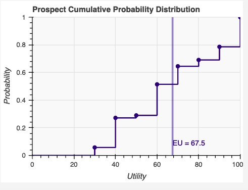
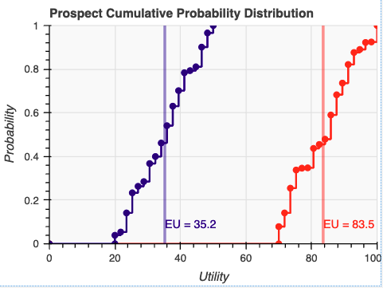
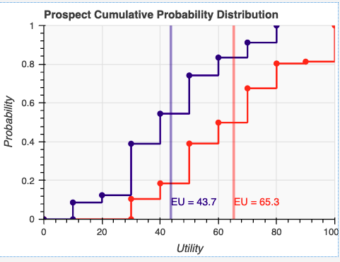
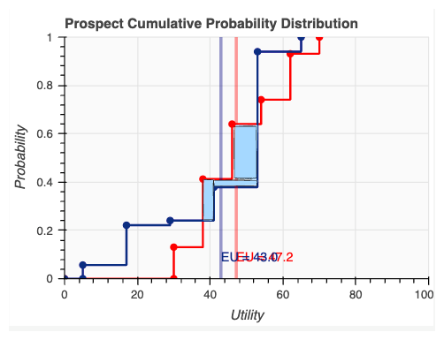
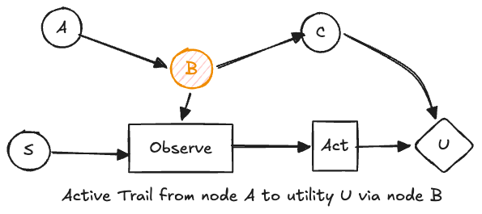

Course: MS&E 152 summer 2026
Sequence: Week 6, Lecture 2
Date: Monday, June 22nd 2026
Topic: Introduction to Decision Analysis
#### Links:
Course website: https://stanford-msande152.github.io/summer26/
Canvas: https://canvas.stanford.edu/courses/228284

-----

# Title:  Ways to simplify the model analysis

### What you will learn

We cover some principles that can simplify a model based on its structure.
- We discover conditions for "Dominance " -- when one alternative is better than another, without the need to calculate utilities. 
- The structure of the CDN can sometimes point out when an uncertainty is irrelevant and can be eliminated from consideration. 

## Class schedule
- Lecture
- Project update
- Short break
- Class activity
- ----

## I. Dominance relationships 

Let's review under some qualitative (e.g. short of taking expectations) conditions when one choice is better than others, respecting the five choice axioms. 

Our choices determine the final outcomes ( prospects) and their associated "elemental" probabilities. Each alternative's consequences terminate in an "outcome deal" that is a probability distribution over prospects, remembering that a prospect describes a future certainty.  Determining the best choice means comparing which deal is preferred. 

Here is an example of the cumulative probability distribution of the outcomes of a deal:

1. **Certain prospects** 
In the case where there is no uncertainty about prospects, by the ordering rule, if the decision maker can assign a total order to all certain prospects, there is no need to assess numeric values for utilities and their best choice is just the most preferred - the one at the top of their list. 

In general under uncertainty, deals for each alternative will be totally ordered by expected utility, from which the best decision follows. 

2. **All prospects preferred for one deal to another's**
Comparing two alternative's deals, if *all* the prospects of one are preferred to all the prospects of another, then the best choice is the deal with the preferred set of prospects, without regard to the probabilities of either deal.  This condition is called **deterministic dominance** and justifies the elimination in the model of the less preferred deal. 

In this figure there is no overlap between the best outcome, 50, of "blue" and the worst outcome, 70 of "red" so the alternative that leads to the "red" deal is always preferred.  In such cases of deterministic dominance, the less preferred alternative can be removed from the model. 

3. **probabilistic dominance**

There are cases where the prospects of two deals overlap, but when considering the probabilties assigned to their prospects, one deal is always preferred to the other.  This can be seen by noticing if their cumulative probability distributions do not overlap.  *In that case, for any value of utility, its expected value of one deal is always greater than the other* and by our axioms of choice, should any of the outcomes occur, only one of the deals would ever be chosen. 

So as with deterministic dominance, the "probabilistically dominated" alternative can be eliminated.  This is true whatever the decision-maker's risk attitude is. 

We see in this diagram that the red deal dominates the blue deal, at each individual outcome, despite an overlap in the ranges of utilities of the outcomes of the two deals. 

4. **Lack of Dominance**

Here's a counter example of probabilistic dominance.  

In this diagram, the CDF for the "blue" deal crosses over the "red" deal in the area shaded in pale blue. In that circumstance should those outcomes for blue occur the the "blue" deal is  preferred, and overall we cannot make a determination which deal is preferred without calculating their certain equivalents.

For purposes of possibly improving the analysis, the decision analyst might go back to the decision-maker and re-visit the elicitation of the probabilities and utilities for the offending outcomes to see if dominance might be established. 

*Thus, in cases where we find dominance, we can remove dominated alternatives without having to calculate expectations.* 

### II. When can uncertainties be eliminated 

#### "Sure Thing Principle"

If one makes the same choice at a decision no matter what the outcome of an uncertainty is, then the decision is a "sure thing" for that uncertainty, and the uncertainty can be removed from the CDN.  

For example in the CDN shown above, although the node S's outcome is known when the observation is made, it has no effect on the outcome U, since it has no path to U.  It can be ignored by the decision maker and removed from the CDN as irrelevant. 

Other applications of the "sure thing" principle can be determined by computing the effect on decision policies by setting an uncertainty to its different outcomes and observing if this changes any decisions.  The simplification is that no assignment of probability to the node is needed to do this -- if there is no effect when the node is "observed" in any of it's outcomes, then it will have no effect for any probability assignment made to it. 

#### **"Active trails"** 

More generally, we can determine if a node is irrelevant and can be eliminated from a CDN by tracing it's trail to the utility node,  If the node does not have an "active trail" to the utility node, then it can be ignored, and removed from the network.  If the node is part of an active trail, then it is a candidate for computing its value of information. 

In the diagram above, the node S has no active trail, since it's only connection to the utility node is via the decision backbone, and hence can have no effect on outcomes.  

The nodes A, B, C do form an active trail, *but only if node B is not observed.*  When B is observed, it's value becomes known, and the outcome of A is no longer relevant to node U. Thus there is no value in observing it (it's VOI is zero) and any decision that manipulated it would have no value. 

Note that node B is still on an active trail even when it is observed.  It's observed value, as a test is clearly relevant to both node C and indirectly to the utility U. 

## Class Activity

Review of some project teams draft models.  

## Key terms

outcome deal
Dominance, Deterministic Dominance, Stochastic Dominance
Sure Thing principle
Active Trails
## Homework, continue working on project.
Variable distinctions and elicitation work should be completed this week. 

## Files, references

More detail about dominance and active trails can be found in FODA and in R. Shachter's paper on Active Trails. 

## Curious?  Things to explore 

Experiment with ways to compute the outcome CDFs with software such as Genie. 

© John Mark Agosta & Stanford University