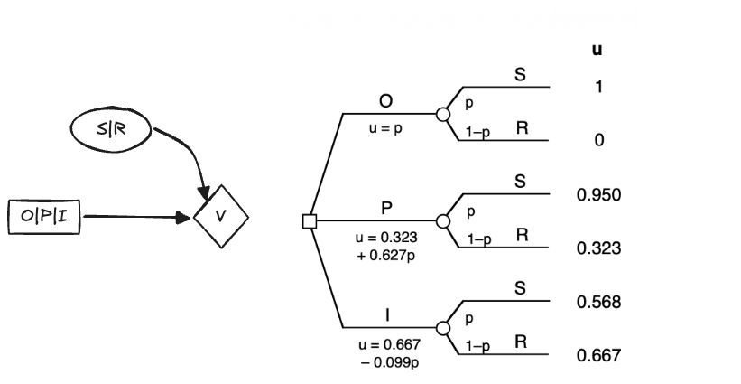
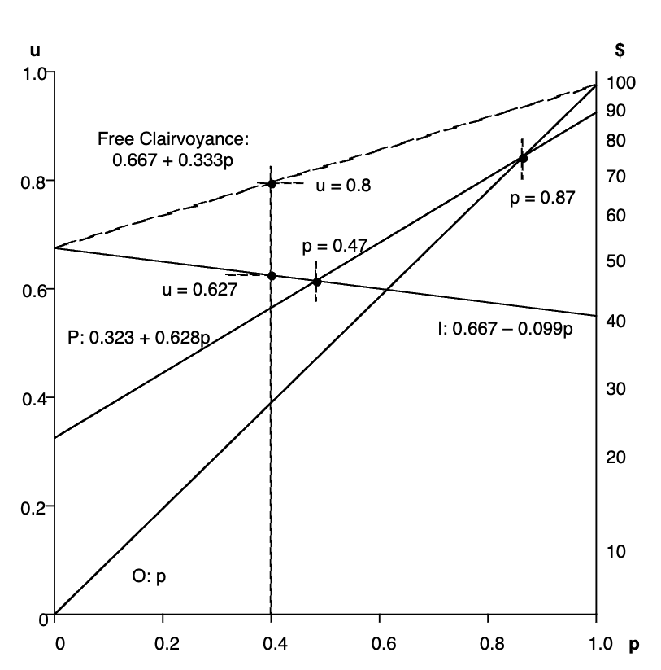
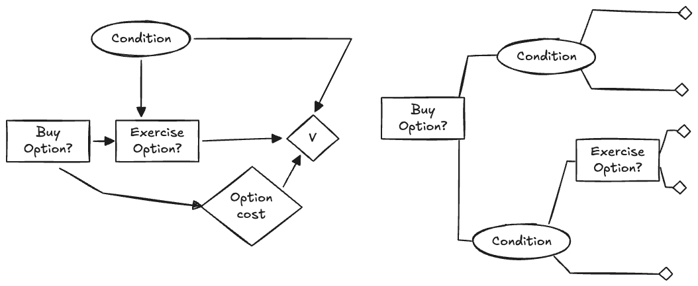
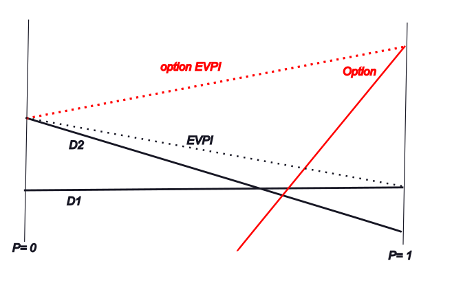

Course: MS&E 152 summer 2026
Sequence: Week 1, Lecture 1
Date: Monday, June 22nd 2026
Topic: Introduction to Decision Analysis
#### Links:
Course website: https://stanford-msande152.github.io/summer26/
Canvas: https://canvas.stanford.edu/courses/228284

-----

# Title: VOI, information,  flexibility, and options

### What you will learn

## Class schedule
- Lecture EVPI
- In class - draft cleanup. 
- Lecture: Flexibility and options
- Class activity  review of project CDNs
- ----
## What is Information

Information means a message or observation of something unknown.  In *Information Theory* attributed to Claude Shannon, information is described just by the probabilities of the observed *messages* or outcomes. For any uncertainty, the number of distinctions and their  probability is all that matters; whether it is about the weather, word counts, or marbles doesn't matter. 
### Expected Utility and Value of Information plots

We can solve some decision problems and find VOI of a variable by plotting each alternative's expected value as a function of the outcome probability. A "utility of choices" plot of the outcome probability versus the expected utility for each alternative shows how the choice of alternative changes as beliefs change. For convenience we consider one binary outcome variable for all decisions, in this example, the weather and the three alternatives, "outdoor", "porch", and "indoor" from the Party Problem. Here is her CDN and its decision-probability tree. 

The expression of the expected utility of each alternative is shown for each branch. 
Note that the *expected utility is linear in probability,* so that if we plot the utility of each alternative for the probability of "sun",  each alternative appears as a straight line. At any probability the top-most line is the alternative with the highest expected value and hence the preferred choice. 

(An expected utility of choices plot.  From Howard Figure 5-2.)

We can also tell from the plot, what is the value of complete information -- what clairvoyance is worth for us if free.   Upon receiving information our belief will be at one or the other extremes of the x axis; at 0 for "rain", and 1 for "sun." Thus, since our expected value in that case will be a linear combination of the two extremes, it will line along the line between them. Our expected VOI is just the value along that line at our current belief.  

For example, in Kim's case, her expected value with information is at u = 0.8 along the top-most line. Her expected value otherwise is on the upper solid line at u = 0.627.  The difference is the expected utility of receiving that information. 

By changing her belief in P("sun") the plot shows how her decision would change, and how VOI changes. At either extreme the outcome is certain, so we see that the VOI line and the best decision lines meet.   Starting at her current value of p = 0.4, her decision "I" will swith to "P" once p exceeds 0.47, the switch again to "S" when p exceeds 0.87.  The plot shows the sensitivity of her choice to her belief in the weather. 

For risk neutral decision-makers, VOI decomposes into the difference between the value with and without observing the information.  In Kim's risk averse case, this doesn't apply. To compute the certain equivalent for her expected utility VOI we need to apply her convex upward utility function. Due to the transformation, the certain equivalent is no longer the difference between the certain equivalent without information and the certain equivalent with information. Likewise, a risk averse decision maker's VOI can be greater or less than a risk neutral's  VOI for the same set of alternatives, depending on the decision-maker's beliefs. 

The "decision surface" of the preferred choice is constructed from the maximum expected value at any belief over the set of alternatives, which is provably a convex downward surface. Obviously if the surface consists of just one straight line, then the VOI line and the best choice lines coincide and that choice is preferred for all beliefs.  

This shows that when receiving information does not change the best choice, its value is zero.  
### Value of Information = Value of Flexibility 

As shown by this plot, VOI depends on the convexity of the decision surface, and the current belief. The more the current belief sits at the "pit" of the decision surface, the greater the VOI.  
Thus "VOI" may change either by changing either the current belief or by changing alternatives in the decision surface.  Consider changing the utilities of a not preferred alternative that increases VOI.  Such changes to VOI by changing the utilities of alternatives rather than beliefs 
are attributed to the *flexibility* of the alternatives.  Similarly adding alternatives that increase or decrease VOI for a given belief offer greater or less flexibility to the decision-maker.  Thus we may use the same calculation used for VOI in circumstances where alternatives change to speak of the "value of flexibility."
### Real Options

To further expand on the idea of a decision-maker's flexibility, we consider a model that include  *options* that may be available after a the primary decision is made.  One of the initial alternatives could be to create an option that can be selected when some additional information becomes available. We reserve the term "option" for choices that are contingent on a previous alternative and 

An option affords us the ability to adjust a previous decision's choice in response to new information.  We will reserve the term *option* specifically to refer to the situation of a contingent decision, not to be confused with the *alternatives* of our primary decision. 

On the left is the CDN for an option model. On the right is the equivalent decision-probability tree. The primary decision includes the "Buy option" alternative, and the "Exercise Option" decision follows, when the condition is known to which the exercise decision responds. The standard CDN for a real option looks similar to the CDN for test information, where instead of the primary decision affecting the availability of a test, it creates the availability of an alternative. As we've seen the VOI computation takes into account both the properties of the information model and the alternatives' values as shown in the VOI plot. We can use similar analysis to understand option valuation. Option valuation expresses a decision-makers flexibility to adapt to changes. 

The study of options has it's own vocabulary.  The expense that initial decision incurs is the cost to "buy" the option.  Choosing to take the option is called its "exercise."  The option includes a future date when the condition will be known or when the right to exercise it is possible.  Some options have a fixed duration after which they are no longer exercisable; likewise some options cannot be exercised until a future date. 

Complementary to the purchase of an option, an owner of an asset -- typically a financial asset -- may *sell an option* to fix a future price or term for the sale of the option.  The purchaser of an option owns a *futures contract* that itself may be re-sellable in an options market. 

The purchasers and sellers of an option are effectively buying and selling risk. 

*Purchasing the option, shown in red increases the EVPI and thus the expected value if the option will be exercised*

Examples of options are: 
- An insurance contract.  The insurance premium is the option cost, and the condition is the risk which is being insured against. The exercise of the option is making a claim against the insurance contract, for which there may be an added expense, in the form of a deductible, which may also be an uncertain quantity.
- Futures contracts on commodities.  Producers and consumers of quantities whose market prices vary may avoid future price variation by buying contracts that fix a future transaction price.  The purchaser of the contract is reducing their risk in exchange for the cost of the futures contract. 
- Financial options on underlying assets such as corporate stocks. Option traders take on different levels of risk, much as insurance and futures contracts are used.
- "real" options by which a corporation can expand, defer ,or abandon strategic choices made previously, by incurring an additional expense at the time of the choice. 

A CDN model can be expanded to analyze custom option configurations, such as sequences of option decisions spaced out over time. 

## Class Activity

## Key terms

Information
Value of Information
"Utility of Choices Plot"
EVPI "Expected Value of Perfect Information"
Value of Flexibility
Real Options. 
Option Price, Option Exercise

## Homework, due __ 

## Files, references

## Curious?  Things to explore 

© John Mark Agosta & Stanford University