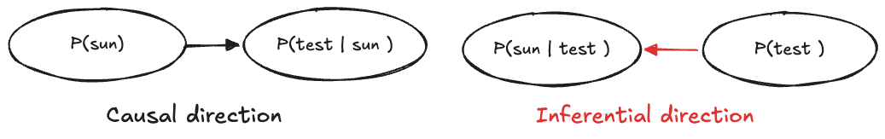
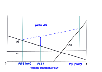
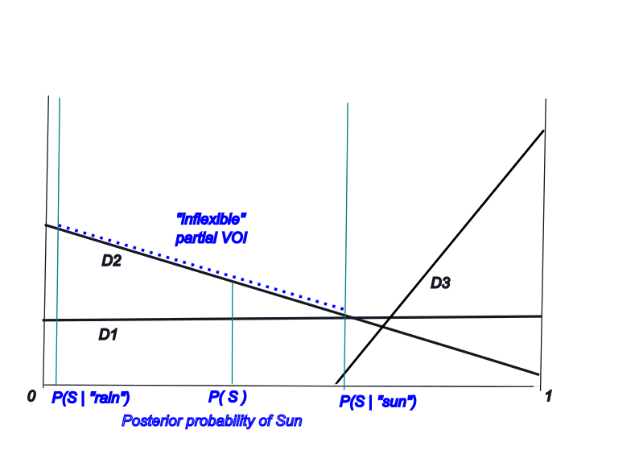

Course: MS&E 152 summer 2026
Sequence: Week 1, Lecture 1
Date: Monday, June 22nd 2026
Topic: Introduction to Decision Analysis
#### Links:
Course website: https://stanford-msande152.github.io/summer26/
Canvas: https://canvas.stanford.edu/courses/228284

-----

# Title:  Topics in Analyzing model results: Partial VOI, Expected Utility 

### What you will learn

How to extend VOI to test information.
How to extend expected value solutions to expected utility

## Class schedule
- Lecture: Expected VOI for partial or incomplete information
- Short break
- Second lecture: Value and Utility functions
- Catalog of software for class projects
- ----

## I. Expected VOI for partial or incomplete information

We can extend the graphical analysis of expected value of perfect information to consider imperfect test information.

To recall, one observes "test information" from which one can infer an updated probability of the unobserved condition.  In the Party Problem example the rain detector test updates one's probability of the weather.  

To solve for the expected value of test information, Bayes rule is applied to compute the probability of "sun given test" by "flipping" the arc from sun to test.  The likelihood in the causal direction is converted to the posterior probability for purposes of inference.  

The test posterior probability is a *garbled* version of the information available were the weather condition known with certainty. We call this "incomplete" or "partial" information.  The expected value of partial information (partial VOI) --- what the decision maker would be willing to pay the clairvoyant for it, is bounded above by the expected value of knowing the condition -- the expected value of perfect information. 

The partial VOI's relation to complete VOI can be shown on the plot of the expected utility of choices.  Just as in the complete case partial VOI is shown by a linear segment connecting the two outcomes of the observation, the partial case is shown by a segment over a shorter interval. The interval is delimited by the posterior probabilities of the test observation plotted along the x axis. 

Belief in the condition, here the distinction of "sun or rain", is changed when the test result is observed, and moves either to the left or right of the prior, forming an interval that spans part of the range of belief. 

In other respects, the analysis of partial VOI resembles the complete VOI case.  VOI is the difference between the decision expected value with information minus that without information, in the risk neutral case. This difference depends on the available alternatives, for the *flexibility* the alternatives provide for the information available

#### Partial VOI in the "inflexible case"

It is possible that partial VOI goes to zero as the message posterior is more garbled, depending on the span of the posterior probabilities. This surprising result occurs when the set of decision alternatives cannot exploit the partial information.  We see that when the span of the posterior probabilities only cover one alternative.  In this example the alternative "D2" is always chosen whatever message is received. If  the posterior probabilities lie entirely within the span of one decision, then knowing the observation from the test has no value and cannot change the choice.  The convexity of the decision structure cannot be exploited; in other words the decision is inflexible for this test. 

## II. Value and Utility functions. 

The value and utility functions play similar roles in making the best choice in expected value terms. 

The difference between the value function and the utility function is that the value function works like money, in the sense that the value of two items is the sum of their values. We assume that the items do not combine to form something more valuable than they are individually, much like the items on your grocery bag are worth the sum of their costs. So value is linear, meaning values add. 

Utility is a non-linear transformation of value, to express risk preference. The utility function is a function of value. 

A distribution of utilities over ( certain ) prospects has an expectation we call an *expected utility*. If prospects $v_i$ with utility $u(v_i)$ are distributed as $\textbf{P}(v_i)$, then their expected utility is

$$ E[u] = \sum_i \textbf{P}(v_i)u(v_i) $$

This sum has to be distinguished from just summing the utilities of attributes if we were to assign multiple *attributes* to form the utility of each prospect.  , This is a different kind of summation than the sum over instances of the same distinction.  Summing utilities of attributes makes a strong assumption that the utility of the attributes is separable. An obvious exception is the combined utility of remaining lifetime and wealth.  To see this if either's utility goes to zero, then the total utility is zero.  One needs instead a non-linear function to express the combination. 

#### Utility and certain equivalents

Since the units of utility are arbitrary, and the utility function is assumed monotonic, we can translate the expected utility back into value-units  to recover the *certain equivalent value*, $v_C.$ 

$$ u(v_C) = E[u] \ \text{or} \  v_C = u^{-1}(E[u])$$
This applies when computing expected utility by rolling back a decision-probability tree. One can assign utilities to each prospect at the leaves of the tree, equivalently one can compute a utility as the value of the terminal value node in a CDN.  Rolling back the tree, or solving the CDN gives us the *expected utility* of each decision alternative.  Then, the expected utility can be "inverted" as shown above to put the expected values in certain equivalent value terms. 

If the entire tree is computed in using values at the terminals, then the ability to analyze the effect of risk preference is lost, since rolling back the tree gives us a number in expected value terms. 

#### VOI and utility 
In each case, for a decision with or without clairvoyance, the computation is the same, to assign a certain equivalent value to the tree.  When working with a utility function, first values at terminals are converted to utilities, then the tree is rolled back to determine an expected utility which can then be "inverted" to get the certain equivalent value.  In the case of working with terminal values, then the expected value for the tree is a certain equivalent.  

In the case with or without clairvoyance to determine VOI, the comparison is between two certain equivalent values. Don't think of VOI as a choice between two alternatives (if that were the case one would always choose  "with clairvoyance") but of a comparison of two different models. 
## Key terms

partial VOI
conditional likelihood
test posterior
Inflexible decision alternatives
## Homework - completion of Class projects. 

## Files, references

## Curious?  Things to explore 

© John Mark Agosta & Stanford University