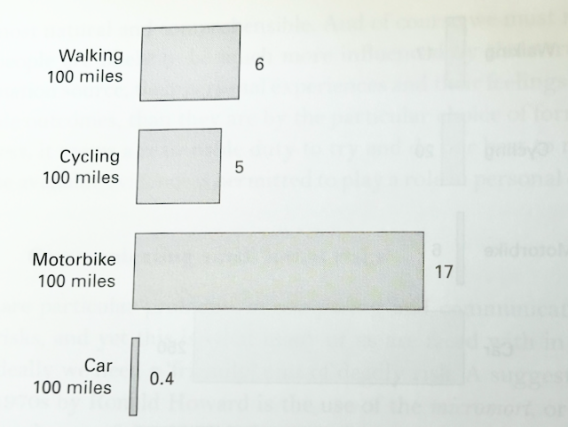
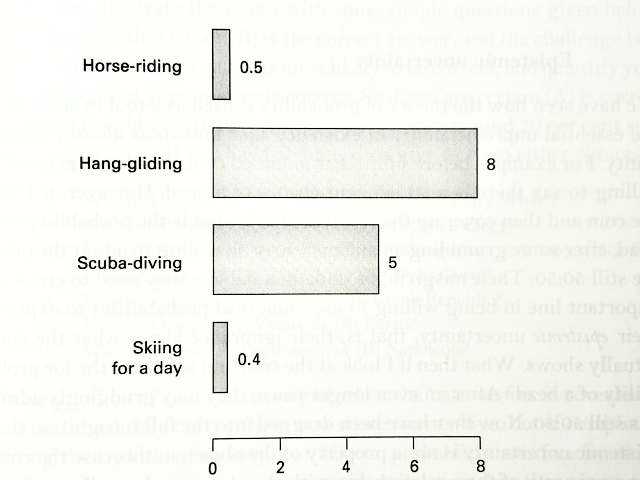
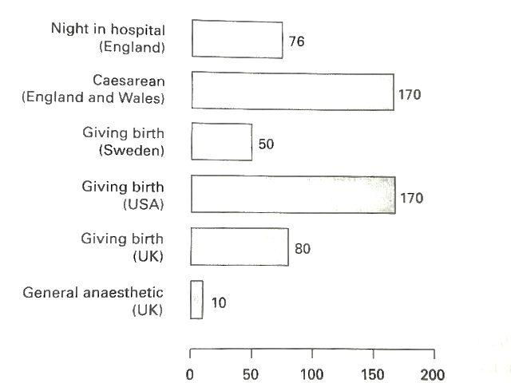

Course: MS&E 152 summer 2026
Sequence: Week 8 Lecture 1
Date: Monday, August 10, 2026
Topic: Decision Analysis in Practice - Framing the Problem.
#### Links:
Course website: https://stanford-msande152.github.io/summer26/
Canvas: https://canvas.stanford.edu/courses/228284

-----

## Class schedule
- Lecture: 
- About this class
- Short break
- Second lecture
- Class activity
# Title: Viewpoints on Decision Analysis

### What you will learn

We cover on some current topics about decision making as a theory and practice.
A review of how we got here, how organizational and psychological aspects of bias affect decision making., and when it is and is not appropriate. 

## Review of our approach to  rationality

The origins of what we mean by rational, as it is put in the terms of "actional thought" have a history that goes back to early ideas in European thought. 

#### I. The origins of probability
In European thinking the idea of mathematical probability arises relatively late. A "probable" opinion in classical literature connoted a "popular" or "mainstream" idea
As the Medieval philosopher Thomas Aquinas argued, 
> The primary sense of the word *probabilitas* is not evidential support but support from respected people (I. Hacking, (1975) "The Emergence of Probability" Cambridge, p.23)

A mathematical approach had to wait for better computational tools. 
- 1200s - Fibonacci: Introduced Hindu/Arabic numerals to the West, to replace Roman numerals, making arithmetic practical.  
- 1500s - Cardano:  in "games of chance" counted desirable events as a fraction of outcomes  using what Laplace later labeled the "principle of indifference." This is the first numeric expression using fractions of occurrences to estimate outcomes. 
- 1700s - Pascal, Galileo and Fermat laid the foundation for current theory
- 1713 - But it was Bernoulli's *Ars Conjectandi* that made the first use of the term _probability_ to as a numeric quantity
(In D. Speigelhalter, (2011) "The Art of Uncertainty")

The current techniques to quantify belief using probability were not developed until Ramsey, Cox, de Finetti, and Savage worked them out in the 20th century. 

The idea of knowledge as "justified true belief", that is belief supported by evidence, has been argued for a long time, but making a precise quantified science is relatively recent.  This is the source of our first rule of actional thought: 

> "Probability Rule:"  Implies the skill to quantify reasoning to update belief.   
> 
#### II. Invention of the "Economic person"
At the turn of the last century, economists such at Pareto, developed utility to explain individual's behavior.  This is the origin of the ordinal rankings of preferences: 

> "Order Rule"  The skill to rank prospects by preference 

It wasn't until after WWII that von Neumann and Morgenstern showed that preferences can be quantified by a utility function.  This requires two more rules: 

> Equivalence rule: The skill to equate a certain prospect with a by assessing probabilities in a deal

> Substitution rule: To combine utilities expressed as "preference probabilities " with belief as probability, resulting in expected utility.

### III. Systems Engineering thinking

"Systems Engineering" refers generally to the art of creating mathematical models for engineering problems of large scope and complexity. This is when the quantification of economic rationality is worthwhile applying "normatively", as a discipline for organizational decision making, and as a personal guide.  The theory applies the quantitative methods derived from the rules into a technique for modeling decisions. This is a creative activity, that cannot be determined just by reference to existing knowledge, as with an AI LLM. 

To turn analysis into action we need the final rule:

> "Choice rule:" Act on the alternative with the higher probability of desired outcome. 

Thus we have a means to define of a Good Decision, when outcomes are uncertain and not available to justify the decision. 

### IV. Understanding of heuristics and biases

The skills required to exercise the five rules must overcome psychological limitations about how a person't beliefs are constructed.  Elicitation of a person's judgment is inhibited by built-in limitations of psychological tendencies, as brought to light by the work of Kahneman and Tversky. Knowing how these ideas work reveals strategies to limit them. Rational decision making is like how cats swim: They can do it if necessary, but don't take to it naturally. 

- ----
## The practice: Working with Decision-Makers and Stakeholders

### I. Structuring and scoping to frame a decision problem

The initial structuring phase of decision analysis is called "framing," as mentioned in our first lecture on "what is Decision Analysis."  Ron Howard wrote that framing is uniquely human. (D. Skinner, Ch.6) It captures what is unique to the problem at hand and cannot be duplicated by a software tool, or a generative AI model.  _The goal of the framing phase is to make the problem clear and understood for all participants._ This involves 

- Identifying the different parties to engage in the problem, 
- Scoping the problem to encompass the issues surrounding the decision context.
- Creating possibly novel alternatives that fully address the decision-maker's values.  

The initial phase to define the problem is arguably the most important determinant of success, and the least amenable to formulaic approaches. 

Our current economy is more and more automated, due to the widespread adoption of software infrastructure.  A decision made by software is non-the-less a decision, however the considerations going into framing the decision must match the nature of decision-making delegated to partially or fully autonomous agents. 

When relegating parts of the process to software, the initial design phases become more critical as the primary place where concepts of decision analysis can make a difference.  Automation necessarily raises the "meta-decision" of whether and to what degree operational decisions should be automated. 

### Creating a Shared Understanding of the Problem

A key value of the methods used in Decision Analysis is the transparency in the approach, starting from how the problem is framed and continuing throughout the process in how recommendations are explained. 

### Who participates. Different roles in the analysis

- Decision maker
- Decision facilitator / analyst
- Subject matter experts 
- Implementors, Execution

These roles are fluid, and one person, possibly with the assistance of AI "agents" may participate in more than one. 

### The organizational or personal situation

Solving the right problem.  Often the scope of the problem must be re-examined. A narrow scope limits the efficacy of the analysis, and at worst has a pre-conceived conclusion baked into the formulation.  What is the point of analysis if it only serves to enforce one's presumption about what should be done? 

## Why bias affects Decision making, and how to ameliorate this. 

Perception of probabilities: Psychological sources of bias  (all three are different aspects of the same thing. )

- Representation  ( probability is not similarity)
- Availability.  What comes to mind
- Anchoring.  What is the estimate relative to (how is it framed)

#### What kinds of "decisions" is an LLM capable of? 

Current commercial AI tools invite one to address questions of a personal nature. An AI system has a web-search backend and training on extensive web content, making it a source of codified human knowledge, a kind of "instant, automated" librarian.  It can discourse about any known subject, and, by compiling multiple attempts in sequence, assemble an argument from multiple sources. 

However an LLM does not make decisions in the sense we mean in this course.  This is clearest by asking how well does an LLM do on each of the five rules of "actional thought?"  
* It does not naturally update beliefs based on probability
* Certainly it cannot order our personal preferences, beyond suggesting what a "reasonable" person would do.
* An LLM's designed-in personality to endorse the your ideas makes it unsuitable to avoid bias in your beliefs and utilities. 
* It fails to make a clean distinction between beliefs about the world and values to be achieved.
* It's method of reasoning has no recourse to finding the best alternative by expected utility.
The LLM's ability is limited to researching relevant information and reflecting on what others have done in similar circumstances. 

## Limits of rationality.  

Economic rationality - aka "actional thought"  grounds the ideals of prudence and moderation in analytic methods of decision analysis. It is a necessary part of every decision. Reasoning about what you have in your power to control, and how that influences your consequences is part of every decision. As I've just reviewed, these methods have a long intellectual history, and have been only recently made precise and practical.   But the ideal of a *good decision* goes beyond that.  

#### Limits of Decision Analysis

For every powerful tool, one needs to know both exactly what it is capable of, and what not.
What kinds of problems are *not appropriate* for Decision Analysis?  These are often the really important choices that transform one's life. 

#### I. The problem of setting terminal prospects
- Decision horizon: How far into the future is far enough?  Each prospect should capture the entire future starting with the last event in the event tree. 
- Effects of reputation, signalling, and promise-keeping. These are social consequences, about the meaning of one's actions themselves, and the perception of "what kind of person you are" that they offer to other people.  Is there a price for which you'd sell your wedding ring? 
- Transformative Decisions: Is it possible to conceive of the future that is predicted?  Can you know what something is like, if you've no experience of anything similar? If the purpose of the decision is learn from a new experience, how can you evaluate the experience before you've had it?  Consider a choice you make solely for it's transformative experience, such as choosing a partner, or getting an education. 
- "infinite resources"  Capacity for love, compassion, and understanding are unbounded, and do not need to be allocated.
Your most consequential decisions in life are like this. 

#### II. Are there "rational" desires?

Our theory does not extend to a theory to determine one's values.  For this reason it has sometimes been called amoral -- having no moral content. 

Is it irrational to have inconsistent - so called "transactional" -values?  If so when is it rational to change one's values? One can speak of a hierarchy of desires, "preferences of preferences" where one reflects on whether one's immediate desires can be judged as bad habits, ones that give immediate gratification but at a larger cost. For instance having a preference not to have a preference for smoking. What stands at the top of our preference hierarchy - a notion of personhood, freedom, social cohesion? 

#### III. The value of optimism 

Humans as a species have a natural tendency to bias optimistically toward the future.  We value having hopeful attitude, and having faith that in our future.  The attitude captured in the "serenity prayer:" *Grant me the serenity to accept the things I cannot change, courage to change the things I can, and wisdom to know the difference.* as is reflected in some religious thought is an example.  This does not arise from individual rationality, but as a necessary constituent of society. 

The philosophical problem known as the "prisoner's dilemma", where individual rationality advises one to betray one's partner as opposed to beneficial collective action contradicts most people's idea of preferred behavior.

#### IV. Who is affected by your decision? 

Perhaps most importantly individual rationality offers  no solution for collective action and setting social values. *Fairness* is the core of justice, defined as  "giving each person what is due them." This raises substantial ethical questions that arise in decision -making. 

## Another view of utility - value of life

Many personal decisions take on physical or health risks.  In everyday life these are minuscule,  but not immaterial.   We must distinguish
- The value you place on your life for purposes of your decisions not to be confused with what others, such as what insurers, policy makers, and legal settlements value.
- That just like with utility, we cannot extrapolate from small to large risks -- the relationship is not linear. 

To assess these, a useful concept is the concept of an infinitesimal probability of death, called a "micromort."  The term has now entered into general use in medical and public health and environment discussions. For p

A micromort is measure of a hazard as the value of a one-in-a-million chance of death.  Statistical actuarial analysis can be used for purposes of comparison with some common activities in one's life.  

Micromort equivalents for some typical recreational activities, per session: 

The adverse consequences of some medical procedures:

*From p. 24 D. Spiegelhalter, "Quantifying uncertainty", in L.Skinns, M. Scott, T, Cox, "Risk: 24th Darwin College Lecture Series" (2011) Cambridge.*

What is the "background level" of risk in one's life expressed in micromorts?  Depending on one's age this varies greatly, diminishing to just a few per day for a healthy person in their 20s-30s, to numbers in the 10s per day, in risky circumstances and in later years.   It is telling that the kinds of societal risks that attract newsworthy attention, such as terrorist attacks, serial killings, and extreme weather, or an annual average hardly raise the background micromort rate.

#### Assessing micromorts

We can use micromorts as an assessment of value in a decision analysis, in place of a monetary unit.   Or, in a more involved analysis one could assess a dollar equivalent for accepting or avoiding a micromort.  For purposes of assessment, consider the offer of a "black pill" - how much would you need to receive to avoid one micromort of risk, and a white pill - how much would would  you pay to avoid that ris k.

---

## Final project and slide presentation, due Wednesday.  

© John Mark Agosta & Stanford University