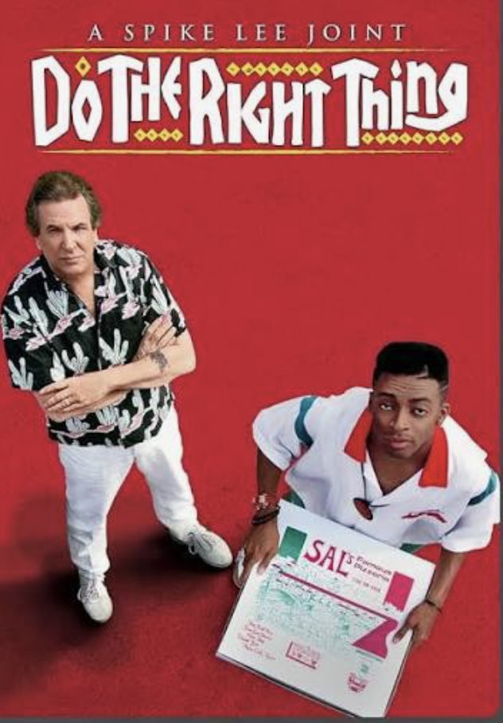

# What is Ethics?

### The question: Doing the *right* thing.  Is what we are doing *good*? 

We started off this class with the question"What is a *good* decision." Our answer has been to apply the five tenets of actional thought.  

What is a consequence of the tenets we started with?   Is there "rationality" that is not just *individual* rationality? What about a choice that might lead to harm to others? Most glaringly because in our work we are just one member of a group, within society, with different values, we need to consider the social aspect of our action. 

The question "What is good" opens the door to a question people have pondered for some time:

> It is sometimes said, either irritably or with some satisfaction, that philosophy makes no progress. ... this is an abiding and not a regrettable characteristic of the discipline, that philosophy has... to keep trying to return to the beginning.  (Murdoch, p. 1)

To further paraphrase Murdoch, echoing themes from classical virtue ethics, -- our philosophy should inform us what "as moral agents, we have got to do because of logic (i.e. rational thought) what we have to do because of human nature, and what we can choose to do" (ibid p.3)

(Break down each of these three?  - rational - prudence, nature - our humanity, choice - applied to what is in our power )

***What we will cover in this class***

Our goal, as practicing engineers (Decision Analysts) is how do we devise a method that we can apply in our professional practice?  One should think about it, so that you have the ethical skills so that when situations arise you have your framework to fall back on. We treat the terms "moral" and "ethical" as synonyms 

**In this lecture we can only define the question -- what is ethics.  There's a full course on "The Ethical Analyst" that follows this course.** 

#### What ethics is  and is not - a comprehensive view 

If the ethics is relegated to rules that we look up just in situations that are called "ethical", it begs the question - when to we switch from a "normal" decision making mode to one that requires an ethical consideration?  We've just kicked the can down the road.  Ethics does not consist of having a set of guardrails that we reach for and apply when we need them.  

The first point I want to make is that ethics turns on the question of just what is an ethical situation, and the answer is that all decisions are to a greater or lesser degree "ethical". 

Decision Analysis is a way to make prudent choices. To distinguish "prudential" choices as one kind of ethical choice leaves open how all aspects should apply.  

Spoilier: Decision Analysis has been called "a-moral", meaning having no moral content.  It is argued that decision analysis can be applied to how most efficiently to achieve evil.  *I want to show that Decision Analysis has some moral content, and by clarifying this, considering the full range of ethical thought, we come to understand ethics.* 

### What are useful ways of thinking about ethics?  What are known frameworks?

**Consequentialisim** (Utilitarianism)  The good is in the outcome.  When applied as an individual, decision theory is consequentialist. Specifically utilitarianism is intended to apply to social issues, where the distribution of consequences, the "greater good" should prevail over the "moral" content.  E.g. Increase in child-birth mortality and poverty from abortion bans vs/ disapproval of out-of-wedlock births. 
**Rule based methods** (Deontological ethics, Kant) The good is in the rule.  No help when rules conflict, as they will in any significant moral act. 
**Virtue ethics** (Aristotle, Stoicism) The good is in the act.  But what distinguishes a purely mental act from one that has consequences?

Can we dispense with the idea of trying to define "the good" and come up with a working framework? 

## A point of comparison - Classical Virtue Ethics - Stoicism

Stoicism is a branch of Greco-Roman philosophy that sees ethics as an aspect of personal virtue.  Its notion of a life well lived is to live in agreement with nature. Particular to our human nature is "the ability to reason and the fact that we are highly social." ( Pigliucci & Lopez, p. 84) From these follow four principal virtues: Wisdom, Temperance, Courage and Justice, . Let's interpret these in turn, in current Decision Analysis terms, to see how it matches up. 

##### What is the ethical content of DA?  
Lets start with some ethical concepts (the Stoic's virtues) -- how one should act in one's life (a broader concept than rules of right and wrong.)
For sake of argument, consider how DA stacks up to these four "cardinal virtues".

- **Wisdom**.  (Reason) The term encompasses appeal to reason from principles. Thinking through the aspects of how to act, including longer term and indirect consequences. DA offers a principled basis for reasoning So the derivation of decision theory and its application from basic tenets would consider Decision Analysis to be wise, but wisdom may draw upon a wider basis of first principles. 
- **Temperance**. (Moderation) Matching one’s actions to the situation at hand.  Here Decision Analysis is a major advance over classical thinking, specifically Aristotle's notion of that an ethical action sits at the mean between extremes.  He gives an example from medicine and health. To paraphrase -- what is appropriate is destroyed by either deficiency or excess as in the case exercise or nutrition, however proportionate amounts create and preserve health. (my version Book 2, Ch 3, 1104a15.) The ancients did not have the benefit of quantifiable probability that was only developed relatively recently, by which Aristotle's idea of "proportionate" is made precise. 
  However temperance implies more than just the "prudential" pursuit of ends via means. 
- **Courage** (commitment)The term is better understood nowadays as "commitment" or "orientation to action."   Acting on what one determines is good. Having the will to realize what is good. DA removes regret via "clarity of action", so to remove any restraints on making the best choice. Without a willingness to act all other aspects are vacuous.  
- **Justice** (fairness) Giving each person what is due them. Do no harm to others. A person whose wisdom I respect said that the first question to ask of any action is *whom does it affect?* and on this criterion Decision Analysis is mute.  In this area we need a way to advance beyond  individual economic rationality as derived from the five tenets.  Individual rationality was never intended as a solution for group decision making.

So there's a good case for Decision Analysis. But the way Stoic thought understands virtue is that any act includes all four aspects. So the idea that in some situations some aspects apply and others at other times is not how virtue is understood.  

