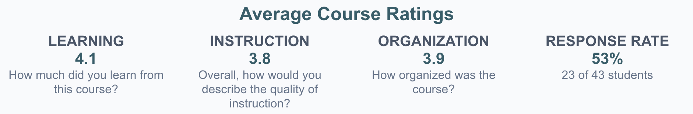
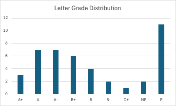
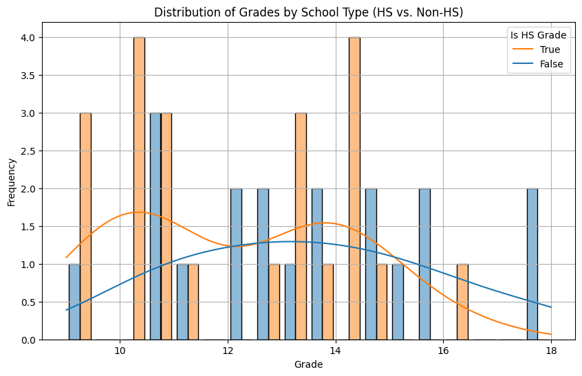

# Intro to Decision Analysis Class Evaluation

August 2026

John Mark Agosta

## Executive Summary
Take-aways from teaching MS&E 152 Decision Analysis, summer quarter 2026

#### Grades

* The summer quarter *Introduction to Decision Analysis* MS&E 152 consisted of 43 students, 29 of them summer high school registrants, another two who are in MS&E degree programs.
* Student evaluations highlighted the course as well organized, and intellectually rewarding, with praise for the instructor, TA support, clear, curated lecture materials, and the usefulness of class and office-hours discussions. (See the summary student evaluation below.)
* Students showed a good grasp of topics covered on axioms of choice, expected utility, subjective probability elicitation, risk aversion, and value of information. 
* Students demonstrated skills in decision model framing, elicitation, and analysis as evidenced by several ambitious, novel team projects. 
* *Introduction to probability* occupied the first 2 weeks of the course, background most students lacked.  In general student math and language skills were uniformly adequate for the demands of the material.  
* Subject enrichment included introduction to Influence Diagrams and Bayes Networks as appropriate for students of different levels, and mention of current topics in causal reasoning, machine learning, and real options. 
* Inexperienced high school students struggled with the sequence of final project team assignments, not building on previous drafts, but attempting each as a separate assignment. 
* As for the use of AI, reliance solely on "pencil and paper" graded quizzes and midterm avoided students' temptation to go online to look up answers. Otherwise AI was used by both faculty and students for creating presentations and visualizations.

In short, I found it an exhilarating experience as a Lecturer in MS&E, assembling and teaching the class.

The full report covers 1) the course material presented, 2) the class, 3)grades, and 4) recommendations for future curricula on Decision Analysis. 

---

## I. Decision Analysis -  subject matter

Decision analysis applies economic decision theory to making better decisions under uncertainty applied to engineering, organizations, and even to one's personal life.  Advances in the 1960's, in large part at Stanford, created this normative field of study, derived from quantitative approaches to individual rationality that blossomed mid-century.

Here are my learnings from first-time teaching [Introduction to Decision Analysis MS&E 152](https://stanford-msande152.github.io/summer26/syllabus/)
for the 2026 summer session. 
### Course primary sources 
The primary sources for the course are the published papers and class notes of Ron Howard as  a member of the Department.  The papers appear in the compilation published by *Strategic Decisions Group (1983).*  Howard's recent *Foundations of Decision Analysis (2015)* co-authored with Ali Abbas was used as an optional text and was supplemented by sources and texts in elementary probability.  I tried to adopt a conventional use of economic terms compared to the texts, e.g. "rational" vs "actional", "expectation" vs "e-value", "variable" vs "distinction," believing this serves students better to be able to recognize these concepts when coming across them in the future. 
### Curriculum Material covered

The [posted syllabus](https://stanford-msande152.github.io/summer26/syllabus/) was followed, starting with an intensive review of elementary axiomatic probability, followed by lectures on the axioms of choice, as illustrated by the celebrated "Party Problem" to illustrate how subjective utility, risk aversion, and value of information can be quantified. To instill practical skills most sessions concluded with a class exercise, on e.g. elicitation skills. 

Models were presented preferably as Influence Diagrams or Bayes Networks, and mention was made of current topics in causal reasoning, machine learning, and real options. 

By the 5th week, after the Midterm, the class included a sequence of progressive assignments leading up to the final class project.  Each assignment gave detailed instructions, using the six components of *Decision Quality* as an outline, on the steps toward creating the project, starting with a group proposal. Students made amazing progress formulating comprehensive and correct influence diagram models, in part with help of modeling software. 

Due to the abbreviated 8 week summer quarter we only lightly touched on wealth effects on utility, value of information interaction with risk aversion, and similar advanced topics  The last week briefly introduced psychological biases, limits of rationality, and decision ethics, as follow- on areas for study. 

## II. How the class went

#### Student Reactions

Here is the experimental AI summary Stanford's course evaluation tool generated: 

|     | AI-generated Summary of Student Comments                                                                                          |
| --- | --------------------------------------------------------------------------------------------------------------------------------- |
| •   | Students found the course interesting, useful, and highly recommended for its practical application to real-world decisions       |
| •   | The instructor was described as supportive and helpful, and the TA received high praise for being extremely helpful and organized |
| •   | The course was consistently noted as being well-organized, with clear lecture notes and a helpful schedule                        |
| •   | Class discussions were highlighted as a useful tool for better understanding the material                                         |
| •   | While some found the course challenging, students felt the skills they learned were extremely valuable                            |

#### Class organization

The entire course content was made available as a [class website](https://stanford-msande152.github.io/summer26/), including written lecture notes for each class, and downloadable articles plus required readings. Consequently students were not required to purchase texts, although optional texts were put on library reserve. Today one doubts how widespread students' use of written sources are: In the most extreme example one student complained that by just depending on AI search it was difficult to find answers  about the course subjects, oblivious to the extensive on-line written course content specifically made available for that  purpose. 

##### Lectures

Each lecture began with a required 10 minute graded quiz on the past lecture material.  This had the additional purpose of assuring class attendance. As for lectures, my choice is to draft lecture notes to present in preference to summary slides, then distribute them online after class as study guides. As mentioned, all class notes, readings and other materials are distributed via a  website hosted on github.  

For mathematical topics, especially where diagrams or plots are involved, the use of a tablet to project hand drawn notes,  e.g. a Remarkable, or just use of the whiteboard is preferable. Math is still about writing things out. 

I did attend problem sessions regularly to clarify questions that came up about lecture topics. 

##### Participation

I came to the class with infectious enthusiasm for the topic, which was picked up by the students.  Extensive office hours meant that there was ample opportunity for students to meet one-on-one (which was requested of all students) or as project groups.  The class TA took pains to get to know each student individually, and although not previously familiar with the subject, was a great help given his familiarity of Stanford course conventions.  Both he and I spent time after lectures with students. 

Online discussion using *Ed Discussion* was limited and served mainly as an alternative to email for class announcements.

#### Students

A majority of the class were summer registration (non-Stanford) students, a slight majority of them high-schoolers, many of them international.  Of the 56 on the initial roster, 43 completed the course of which 2 MS&E students. 

As mentioned many students took advantage multiple times of making office hour appointments. Surprisingly it was the upper level Stanford students who tended not to. There is a tension between organizing a class suitable for young summer students (some as young as 15!) and more mature students.  Perhaps mature students found unnecessary the hand-holding and rigid structure offered to junior students.  Regardless, attrition of mature students was small.

As for academic ability, there was a large range. Not a few of the HS students were on a par with mature students in terms of mathematical ability and tested well. The difference came to pursuing and completing a multi-week project, where some less mature students' competence with an assignment created in multiple steps was beyond them, laboring under the illusion that anything not understood could be overcome by searching with AI. They treated each incremental assignment as a fresh exercise, not comprehending how it built on the previous, and not realizing that the quality of their final project would largely determine their course grade. 

A common lack among students at all levels was competence with probability algebra adequate for Decision Analysis, hence much time was spent initially on what should be a pre-requisite for the class. 

#### The project assignment

The course is designed so that the project grade takes the place of a final exam, and makes up the largest fraction of the total grade.  As alluded to, to perform well, in addition to testing well, students needed to synthesize what they learned, work creatively as a team, and successively build their final project by a series of assignments over 3 weeks . Much to the credit of the TA, students were given detailed instructions and checklists at each stage of the project assignment to calibrate their progress toward completion. 

By and large this curriculum was a success, producing novel and advanced results that can be used to showcase the course.  Project team dynamics worked out well in almost all cases.

#### Enrichment for Stanford & advanced students

Occasional extra-credit or optional problems were addressed at more advanced students, and one-on-one discussions were an opportunity for students to discuss topics outside of class. Students were encouraged to push boundaries by taking on challenging group projects, which resulted in some outstanding novel project work. 

It can appear counterintuitive to students that the larger, more vague the uncertainty, the more it deserves to be included in their model. In Decision Analysis lack of knowledge is exactly what needs to be modelled and not ignored.  Another challenge students found was modelling values spanning multi-attributes, a topic that was not emphasized in class, but to which many projects gravitated. 

Here is a list of the project decision topics:

1. Emergency medical response
2. Career choice options
3. Organ transplant
4. Microsoft - copilot integration
5. Fashion Choice
6. Off track betting policy
7. Biotech startup VC investment
8. NFL draft pick
9. Fast food kiosk automation
10. FIFA fan: "book now or wait"
11. Formula1 pit stop strategy
12. Cafe Location
13. Stock Validation
14. New Bakery Product
15. Startup vs stable job

#### Use of AI

AI tools were used productively both by students and teacher, excluding their use for any graded assignments, by recourse to "old school paper and pencil" methods. 

As mentioned, all graded quizzes and midterm were on paper without access to electronic media.  Homework was graded only for completion. Because of the specific and  unique nature of the material, online AI tools had limited value in solving topics specific to the class.  In the current milieu one is teaching in competition with internet sources. Students search out concepts covered in class, and are confused when results do not necessarily agree with course material. 

Students were encouraged to use AI tools to generate slide decks from their written presentations for their optional talks.  The presentation  quality of student presentations showcased clear improvement by use of AI.  

In their assignments students were required to cite use of AI tools, but their overall citation and credit acknowledgments were sloppy. 

#### Software

Limitation of available software tools constrained some student modeling efforts, notably for final projects.  Consequently some projects took unnecessary computational shortcuts. 
- About a quarter of the students were capable of using the academic version of the provided Bayes network software application's influence diagram solving features.  These students used the application to build and solve models of impressive scale. 
- Disappointingly I did not locate any up-to-date open-source decision tree spreadsheet software. Fortunately for some projects students were able to solve decision trees by hand. 
- AI code generation tools made it quick and easy to generate some customize scripts and web visualizations (e.g.  an online probability wheel) as examples for the class, but only two projects did custom coding for their projects. 

### III. Grade distributions, by cohort

An outstanding challenge of the course was to teach to a mix of never-been-to-college HS students, and matriculated Stanford students. One teaches to the needs of the class. Perhaps some advanced students felt amount of course structure unnecessary. 
### Midterm

The grade distribution shows a bi-modal distribution for high school student midterm performance, for which I have no clear explanation. The median university student grade was incrementally greater than the overall high school grade, but less than the upper mode of the high school grade distribution. Similar variation was seen in quiz scores. 

Final course grades were distributed from A+ to C+ with a median grade of B+. 17 of 43 students earned As. 

## IV. Reflections on the future evolution of the field

### Decision Analysis' place academically within MS&E

The fundamentals of maximum expected utility (MEU) decision making apply across the Department's mathematical modeling disciplines.  Anecdotally, MS&E students seem to be more or less familiar with the subject, and the mathematical approach to uncertainty-prediction, decision-control, outcome-value aspects it implies, but they cannot reference what subject or course they acquired it from. My impression is that a decision-based modelling course that includes utility maximization and Bayesian inference would be foundational to a wide range of fields of study.
### The course's relation to the Decision Analysis profession

There is a small but active contingent of Decision Analysis practitioners that blend textbook Decision Analysis with broader approaches to management consulting. A few - me included - are working on melding the fundamentals of the field with Data Science, for the which we've borrowed the existing label "decision intelligence."   Data Science would benefit from better alignment between prediction and objectives, and Decision Analysis from a wider field of applicability to software automation.

---

## V. Proposal to adapt the curriculum, at 3 different levels 

One take-away from teaching the course is the varying needs among student cohorts. I can envision three courses, taught at different levels. In addition to these three proposals, a decision ethics course is popular among students and can be concurrent or following any of the three. 

### A.  An "all in one" Summer session

This is how I'd teach the summer version of the course. If Decision Analysis will be taught without a probability pre-requisite, then the course becomes roughly half and half probability fundamentals and decision analysis.  The course objective is for students to gain basic skills in the subjective and quantitative approaches of the field of study.  The curriculum would cover axioms of choice, risk aversion and value of information, and use a template for a limited class project. 

The curricular challenges are:
- Assuring the unique aspects of subjective  uncertainty and utility are understood as not merely a kind of cost - benefit comparison. 
- Using a common software modelling tool for all class exercises and projects.  
- Adding to the curriculum an explicit multi-attribute utility model. (Otherwise students tend to invent one from fragmentary sources found online.)

#### B. MS&E Introduction to Decision Modelling

This is the "Decision Analysis in the Modern World" course. The fundamentals of Decision Analysis remain the same, with added context for current data-driven Bayesian methods, and application to program management and autonomous decision-making.  
The course would be aimed at MS&E and other Engineering students with pre-requisites:  A Probability course and an ML tools (statistics) course. 

The course covers: 
* Emphasis is on generally applicable creative model definition and problem framing skills. 
- In depth study of MEU fundamentals and their application. 
- Adopt Influence Diagram / Bayes network representation and computational methods.
- Include intersection with current Bayesian machine learning and Information theory. 
- Explore how current AI fits (or does not) with mature approaches to automated reasoning. 

#### C. Advanced applied Decision Theory
Direct successor to the current MS&E 252 Decision Analysis, 
* Professional level technical background to qualify as a Decision Analyst, including a rigorous curriculum with full coverage of Decision Analysis
- Emphasis on Decision Analysis practice - organizational 
- aspects, innovation, portfolio management, ethics. 
- Project requirement with 'external' client

