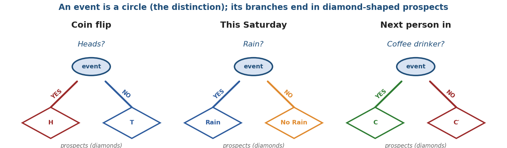
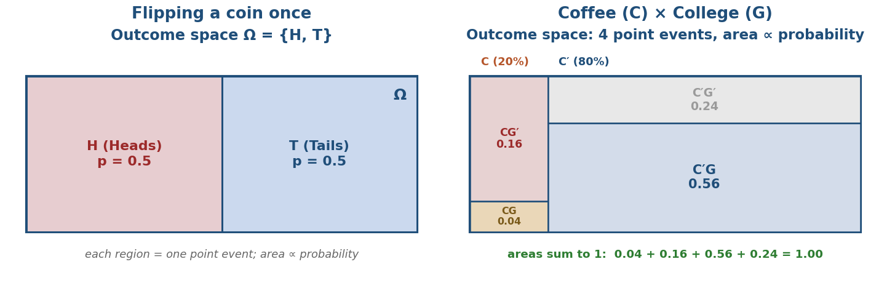
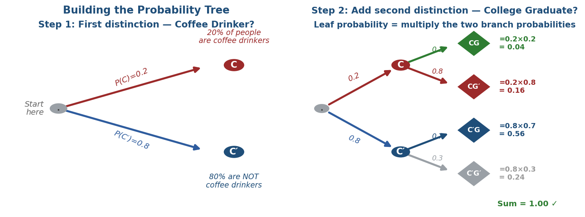
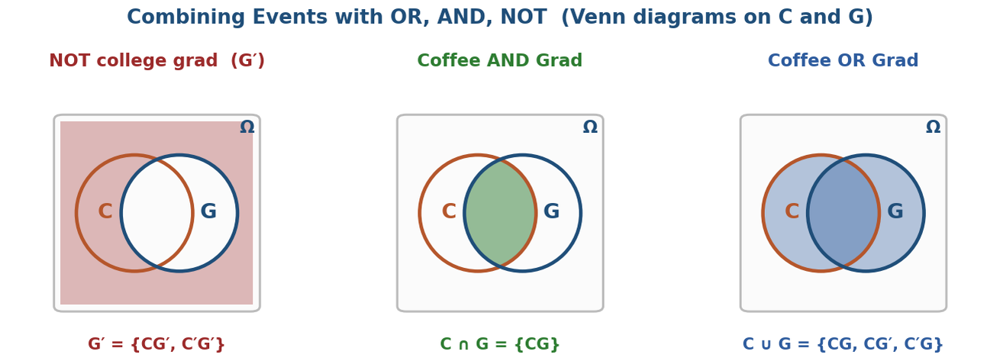
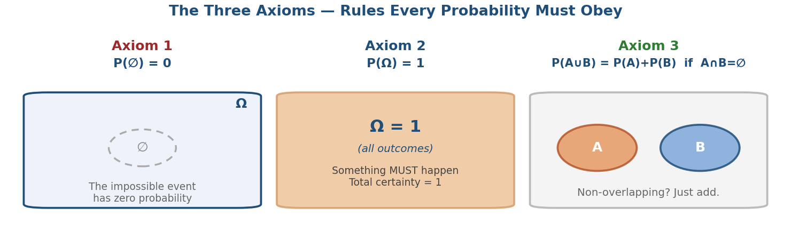
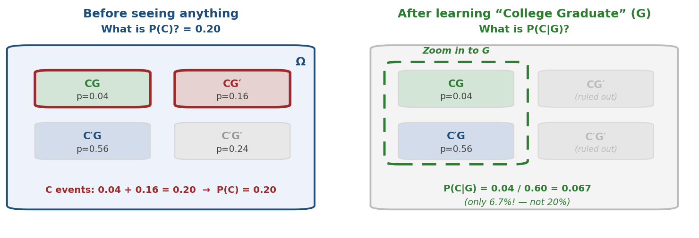
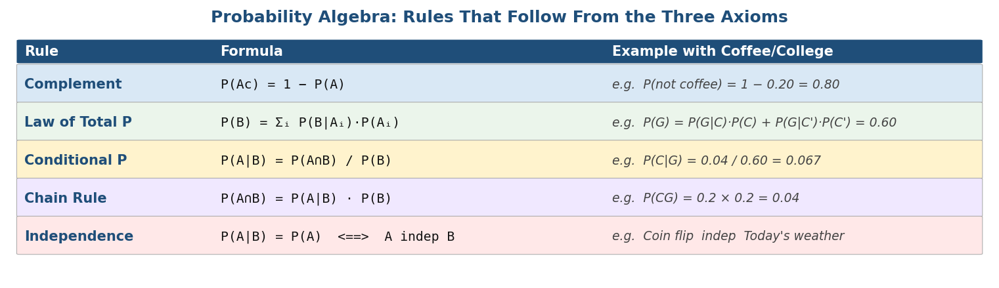
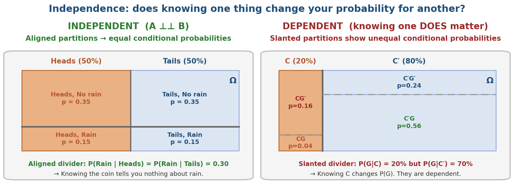

# Probability Refresher

**Stanford University · MS&E 152 · Decision Analysis · Summer 2026**

*Everything You Need Before the Probability Lecture*

> **What this guide is.** The class lecture on probability will move fast and assume you are comfortable with certain ideas. This guide builds those ideas from scratch — starting from the question *"what even is a probability?"* and ending at the rules you will use every day in MS&E 152. No calculus, no prior probability course required. Work through each section in order; every concept leads into the next.

**The one idea that runs through everything:** probability is how you express **uncertainty**. It is a number between 0 and 1 that says how likely you think something is, given everything you currently know. When you learn something new, those numbers update. That updating is what MS&E 152 is built on.

**Your learning path**

> **§1.** Events — what exactly are we talking about?
>
> **§2.** The outcome space — listing all possibilities
>
> **§3.** Combining events — OR, AND, NOT
>
> **§4.** Probability as a measure — the three rules
>
> **§5.** Computing with probabilities — computed from counts, conditioning on events
>
> **§6.** Independence — when does one thing tell you about another?
>

## §1. Events — What Exactly Are We Talking About?

**Start here: what is an event?**

Before we can assign a number to something uncertain, we need to be precise about what that "something" is. In probability, we call it an

**event** — a **statement** (a **proposition**) that is either true or false at a specific point in time. Events are defined by **distinctions**: a 'crisp' yes/no question about the world. An event has two possible outcomes.

> **Definition (Drake §1.2): event** — a statement, a proposition — that includes a distinction at a point & time. 'Point event' means an elemental outcome.

Three examples, going from simple to the kind you'll use all course:

*Figure 1. Each event is drawn as a small tree: a circle (the distinction) whose branches end in diamond-shaped prospects. When the moment arrives, exactly one branch is true.*

**Why be so precise?**

In everyday speech, "something might happen" is vague. Probability requires precision:

-   **Which** thing? (the distinction)

-   **When?** (the point in time)

-   *How sure am I?* (the number we'll assign) — this is a **probability measure**.

> **Intuition:** Think of an event as *something you can bet on.* "It will rain this Saturday" is a clear bet — on Sunday morning you know who won. "The weather will be bad" is not clear enough: bad by whose standard? By when? A well-defined event always has a crisp answer when the moment arrives.

**Two symbols to keep apart: ∅ and ε**

The symbol ∅ is the **empty set** — the impossible event, which can never be true (you'll see it in the axioms in §4). Do not confuse it with ε (epsilon), which stands for your background knowledge: the state of information every probability is conditioned on. That is why P(A) always means P(A \| ε).

## §2. The Outcome Space — Listing All Possibilities

**Point events and the outcome space**

The most basic events are **point events** (Drake's term) — also called **outcomes** or **elemental outcomes**. These are the most specific things that could happen: you cannot break them down further.

> **"point event"** → elemental outcomes of the outcome space. **outcome space**: the complete set of all possible point events. **compound event** → a combination of elemental events (point events).

Two notations for the same idea:

-   **Drake / B&H:** "outcome space" — denoted Ω (capital omega)

-   **Standard:** "sample space" — same symbol Ω

*Figure 3. The outcome space as Howard's area diagram: Ω is a rectangle partitioned into point events whose areas are proportional to their probabilities. Left: one coin, Ω = {H, T}. Right: Coffee (C) × College (G) — four point events whose areas sum to 1.*

**Venn diagrams**

> **Venn diagrams** represent the outcome space visually. Each region is a set of point events; its **area is proportional to its probability**.

Venn diagrams are useful for seeing OR, AND, and NOT geometrically. But for problems with many distinctions, they get crowded. That's why we use probability trees instead.

**Probability trees — the main tool of MS&E 152**

> **Probability trees** take the place of experiments (Drake §1.2). **Each node is an event** — a distinction at a point in time. **Each leaf is a point event** — a complete, specific outcome.

How to build one:

**Step 1:** Start from a root node. Ask the first yes/no question (distinction). Draw two or more branches. (A variable may have multiple degrees of distinction, not just binary.)

**Step 2:** At the end of each branch, ask the next question. Draw two more branches. Repeat.

**Step 3:** The probability on each branch is a conditional probability (see §5). Multiply all branch probabilities along a path to get the leaf probability.

*Figure 4. Building the Coffee / College Graduate tree in two steps. Left: first distinction (Coffee Drinker?). Right: second distinction added (College Graduate?). Each leaf probability = product of the two branch probabilities.*

**Discrete variable:** A variable that contains a finite list of possible outcomes. Drake notes:

-   A **"binary"** variable has exactly 2 branches ≡ 2 events (e.g. C vs. C′)

-   A variable with 3 outcomes has 3 branches, and so on

> **Why trees beat Venn diagrams for this course:** Venn diagrams get messy with more than two distinctions. Probability trees scale cleanly to 3, 4, or 10 outcomes. Every problem you solve in MS&E 152 will involve a tree.
>

## §3. Combining Events — OR, AND, NOT

Once you have individual events, you can build more complex ones using three operations. Drake calls this

**event algebra** — just like algebra lets you combine numbers with +, ×, etc., event algebra lets you combine events with OR, AND, NOT.

> **Event algebra — OR, AND, NOT Set algebra:** ∨ (OR = union ∪) ∧ (AND = intersection ∩) Xᶜ or A′ (NOT = complement)

**The three operations in plain English**

**NOT (complement, written Aᶜ):** Everything that is *not* A. If A = "it rains," then Aᶜ = "it does not rain." The complement is the flip side.

**AND (intersection, written A ∩ B):** Both A and B are true. If A = "coffee drinker" and B = "college graduate," then A ∩ B = "coffee drinker who is also a college graduate."

**OR (union, written A ∪ B):** At least one of A or B is true. "Coffee drinker or college graduate (or both)."

*Figure 2. The three event-algebra operations as Venn diagrams on circles C and G inside Ω. The shaded region is the event: NOT — everything outside G (G′); AND — the overlap (C ∩ G); OR — both circles (C ∪ G).*

**Two important special cases**

**Mutually exclusive:** A and B cannot both be true. A ∩ B = ∅ (empty set). Example: "raining" and "not raining".

**Exhaustive:** A and Aᶜ together cover everything. A ∪ Aᶜ = Ω (the whole outcome space). One of them must be true.

**The events that make up a probability are necessarily mutually exclusive and collectively exhaustive.**

> **Example:** A and its complement Aᶜ are always both mutually exclusive and exhaustive. So P(A) + P(Aᶜ) = 1 — if you know the probability of one, you know the other.

**All states (possible outcomes) of a variable must be mutually exclusive & exhaustive.** Every variable in a probability tree must be set up so its branches cover all possibilities without overlap.

## §4. Probability as a Measure — The Three Rules

**What is a probability measure?**

We've been using the word "probability" informally. Now we pin it down. A

**probability measure** is a function that assigns a number to every event in the outcome space. Think of it as giving each region of the Venn diagram a **weight** (or "area"). The rules it must follow are simple:

> **Probability measure** — a "measure" applied to events. Assigns a weight P(A) to every event A, satisfying three axioms. **Everything else in probability — the probability algebra — follows from these three rules alone.**

**The Three Axioms of Probability Algebra**

**Axiom 1:** P(∅) = 0 — The **impossible event** has probability zero. "Something that can never happen has no weight."

**Axiom 2:** P(Ω) = 1 i.e. P(outcome space) = 1 — **Something must happen**. The total weight of the certain event = 1. Your certainty has to go somewhere. The outcome space itself is called **the certain event**.

**Axiom 3:** P(A ∪ B) = P(A) + P(B) if A ∩ B = ∅ — **Non-overlapping events add**. If A and B cannot both happen, the probability of one or the other is just the sum. This is called **finite additivity**.

*Figure 5. The three axioms visualized. Axiom 1: ∅ has no weight. Axiom 2: Ω has total weight 1. Axiom 3: non-overlapping events simply add.*

> **Why only three?** These three rules are the *minimum* needed to make probability coherent. Every formula you'll use — the complement rule, the Law of Total Probability, Bayes' theorem, the chain rule — is a **theorem** derived from these three alone. You don't need to memorize more rules if you understand these.

**What follows immediately from the axioms**

**Complement rule:** Since A and Aᶜ are mutually exclusive (Axiom 3) and together fill Ω (Axiom 2):

> P(Aᶜ) = 1 − P(A)

*Example:* P(not coffee drinker) = 1 − P(coffee drinker) = 1 − 0.20 = 0.80

**General OR rule:** When A and B *do* overlap:

> P(A ∪ B) = P(A) + P(B) − P(A ∩ B)

*Example:* P(C ∪ G) = 0.20 + 0.60 − 0.04 = 0.76

## §5. Computing Probabilities — Conditioning on Events

**Conditional Probability — the counting definition**

When all point events are equally likely (fair coin, fair die, well-shuffled deck), computing probability is just counting:

> **Counting definition:** P(A\|B) = ♯(point events in A∩B) / ♯(point events in B) and P(A∩B) = P(A\|B) · P(B)
>
> **Example:** Roll a fair die. Ω = {1,2,3,4,5,6}, all equally likely. P(even) = ♯{2,4,6} / ♯{1,2,3,4,5,6} = 3/6 = **1/2** P(even \| greater than 3) = ♯{4,6} / ♯{4,5,6} = 2/3

**Conditional probability — zooming in**

The counting formula works when all outcomes are equally likely. All probabilities, in concept, are conditioned on ε — P(A) means P(A \| ε). But in our Coffee/College example the four outcomes have different probabilities (0.04, 0.16, 0.56, 0.24), because they are made of compound events — each one is a conjunction of two distinctions. We need a definition that works always:

**Conditional probability** P(A\|B) — read: "the probability of A **given** that B has occurred" — is the most important single idea in this course. Here is the intuition:

**Before** you know anything: P(A) is your probability for A given only your background knowledge.

**After** learning B happened: P(A\|B) is your **updated** probability for A. Learning B rules out everything outside B, and you re-distribute your certainty only among the point events inside B.

> **Definition:** P(A\|B) = P(A∩B) / P(B) (whenever P(B) \> 0)

*Figure 6. Left: before conditioning — P(C) = 0.20, using all 4 cells. Right: after learning \"College Graduate\" — we zoom into the G column only, and P(C\|G) = 0.04/0.60 = 0.067. Learning G dramatically changed our belief about C.*

> **Note — all probabilities are conditional:** When we write P(A), we really mean P(A\|&) — the probability of A given your current background knowledge (the '&' in Howard's notation). Probability never exists in a vacuum.
>
> **Coffee / College example:** P(C\|G) = P(CG) / P(G) = 0.04 / 0.60 = **0.067** Knowing someone is a college graduate drops your probability they drink coffee from 20% to 6.7%. The two events are **not independent**.

**The chain rule — how leaf probabilities are computed**

Rearrange the conditional probability definition and you get the chain rule:

> **Chain rule:** P(A∩B) = P(A\|B) · P(B) This is how you compute **each leaf probability in a tree**: multiply the branch probabilities along the path.
>
> **Example:** P(CG) = P(G\|C) · P(C) = 0.2 × 0.2 = **0.04** P(C′G) = P(G\|C′) · P(C′) = 0.7 × 0.8 = **0.56**

**The Law of Total Probability**

Sometimes you want P(B) but you only know the conditional probabilities P(B\|Aᵢ). The Law of Total Probability tells you how to combine them:

> **Law of Total Probability:** P(B) = P(B\|A₁)P(A₁) + P(B\|A₂)P(A₂) + ... where the Aᵢ form a **partition** of Ω: mutually exclusive (Aᵢ∩Aⱼ=∅) and exhaustive (∪Aᵢ=Ω).

In a probability tree, this is simply: **sum all the leaf probabilities that lead to event B**. The Aᵢ are the first-level branches — the partition of Ω is provided by the Aᵢ.

> **Example:** P(G) = P(G\|C)·P(C) + P(G\|C′)·P(C′) = 0.2×0.2 + 0.7×0.8 = 0.04 + 0.56 = **0.60**

*Figure 7. Summary of all probability algebra rules, each with a concrete Coffee/College example.*

## §6. Independence — Does One Thing Tell You About Another?

**The intuition**

Suppose you flip a coin and also check whether it will rain today. Does the coin result tell you anything about rain? Of course not — they have nothing to do with each other. We say they are

**independent**.

Now suppose you learn that the next person who walks in is a college graduate. Does that change your probability they drink coffee? From the numbers in our example: yes, it drops from 20% to 6.7%. Coffee drinking and college graduation are

**dependent**.

**The formal definition**

> **Independence (A ⊥⊥ B):** P(A\|B) = P(A) ⟺ A ⊥⊥ B or equivalently: P(A) · P(B) = P(A∩B) Events A and B are independent if knowing B gives you **no new information** about A — your probability for A is exactly the same whether or not you know B occurred.

*Figure 8. The outcome space drawn as a partitioned Ω. Left: independent events (coin flip and rain) — the Rain divider sits at the same height whichever way the coin lands (aligned partitions), so P(Rain\|Heads) = P(Rain\|Tails) and knowing one tells you nothing about the other. Right: dependent events (Coffee C and College Graduate G) — the divider is slanted (different heights under C and C′), so P(C\|G) = 0.067 ≠ P(C) = 0.20.*

**Two equivalent forms**

**Form 1:** P(A\|B) = P(A) — the conditional probability equals the unconditional probability. Learning B doesn't move your needle on A.

**Form 2:** P(A∩B) = P(A) · P(B) — the joint probability factors into a product. This is often easier to check numerically.

> **Important: Independence ≠ mutual exclusivity.** If A and B are mutually exclusive and both have positive probability, they are actually *dependent*: learning A tells you immediately that B did *not* happen. Mutual exclusivity is a statement about whether events can *co-occur*; independence is a statement about whether they carry *information* about each other.

**Symmetry**

Independence is **symmetric**: if A is independent of B, then B is independent of A. Knowing A gives you no information about B, and knowing B gives you no information about A. You cannot have one-way independence.

## Quick Reference — All the Key Terms

**event** — a statement / proposition that includes a distinction at a point & time (true or false when that moment arrives), comprising two possible outcomes

**point event** = **elemental outcome** — the most specific possible event; a leaf in the tree

**outcome space** = **sample space Ω** — the complete set of all possible point events

**event algebra** — OR (∪), AND (∩), NOT (complement) operations on events

**probability measure** — a function that assigns weights to events, satisfying the three axioms

**Axiom 1**: P(∅) = 0 \| **Axiom 2**: P(Ω) = 1 \| **Axiom 3**: P(A∪B) = P(A)+P(B) if A∩B=∅

**complement:** P(Aᶜ) = 1 − P(A) (also written P(A′) = 1 − P(A))

**counting definition**: P(A\|B) = ♯(A∩B) / ♯(B) — when all outcomes are equally likely

**conditional probability**: P(A\|B) = P(A∩B) / P(B) — probability of A given B is known

**chain rule**: P(A∩B) = P(A\|B) · P(B) — multiply branch probabilities along a path in the tree

**Law of Total Probability**: P(B) = Σᵢ P(B\|Aᵢ)·P(Aᵢ) — sum over a partition of Ω provided by A

**independence (A ⊥⊥ B)**: P(A\|B) = P(A), or equivalently P(A∩B) = P(A)·P(B)

**distinction** — a description, such as a property, that partitions all possible point events in the outcome space into 'crisp' subsets that are mutually exclusive and exhaustive

**variable** — the symbol, e.g. a letter, used to represent an event, or a measurable quantity

**probability tree** — a tree with events as nodes and leaves as outcomes, showing the dependence of outcomes on events

*Based on Alvin W. Drake, Fundamentals of Applied Probability Theory, §1.2--1.3 \| J. Blitzstein & J. Hwang, Introduction to Probability (Chapman & Hall / CRC, 2nd ed., 2019)*
